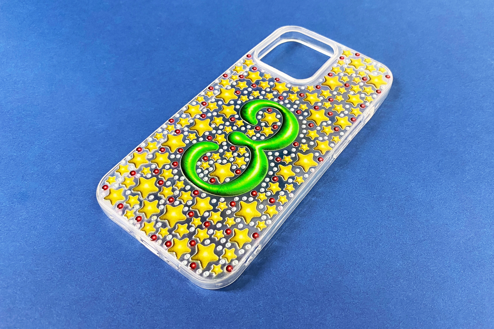
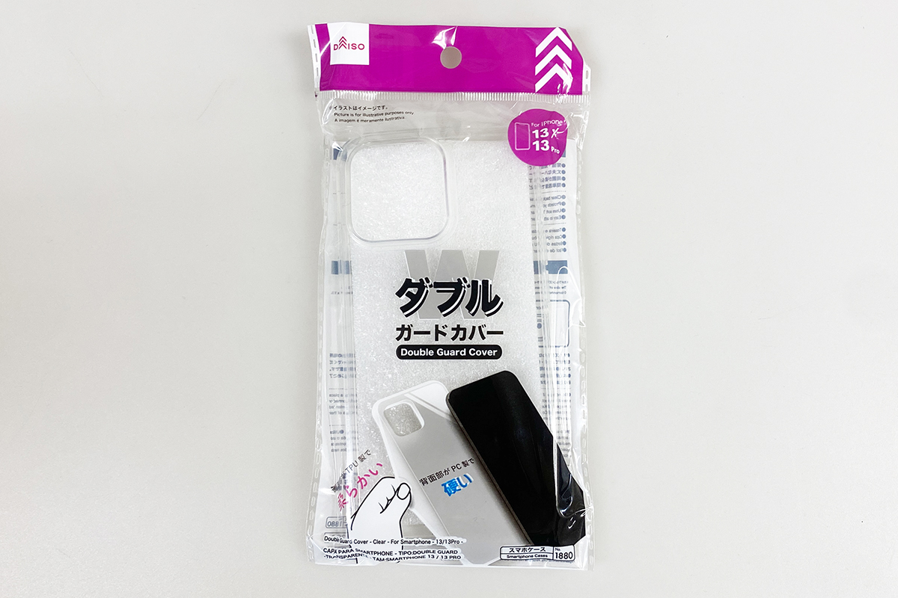
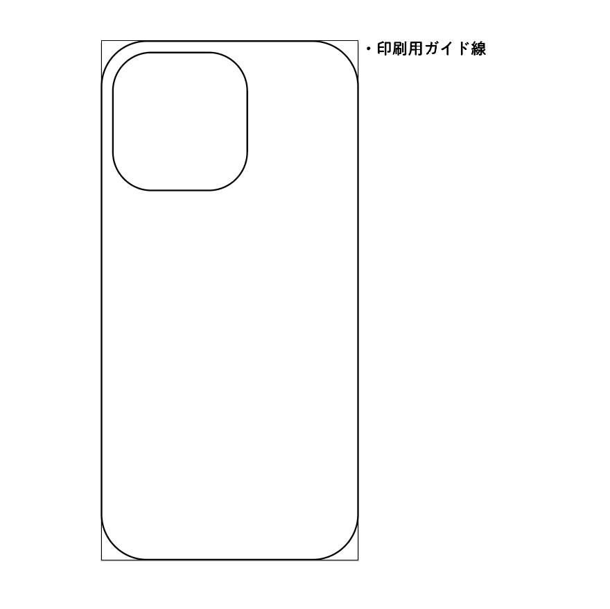
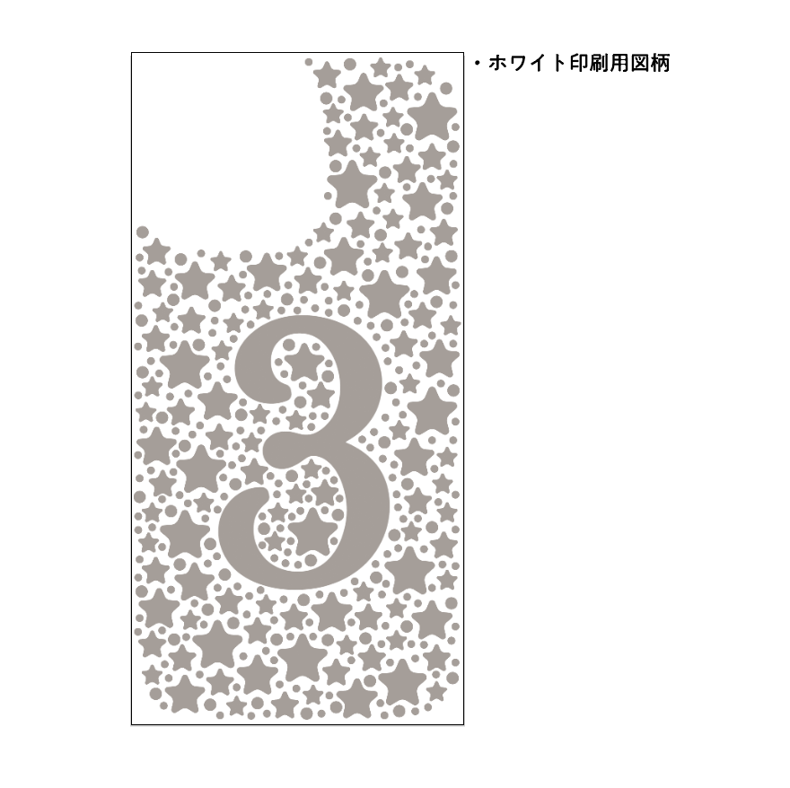
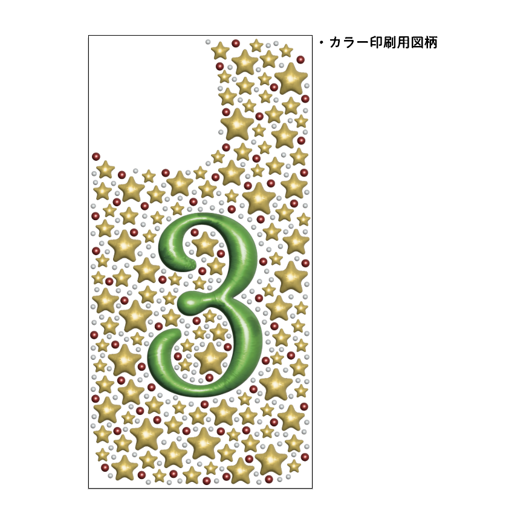
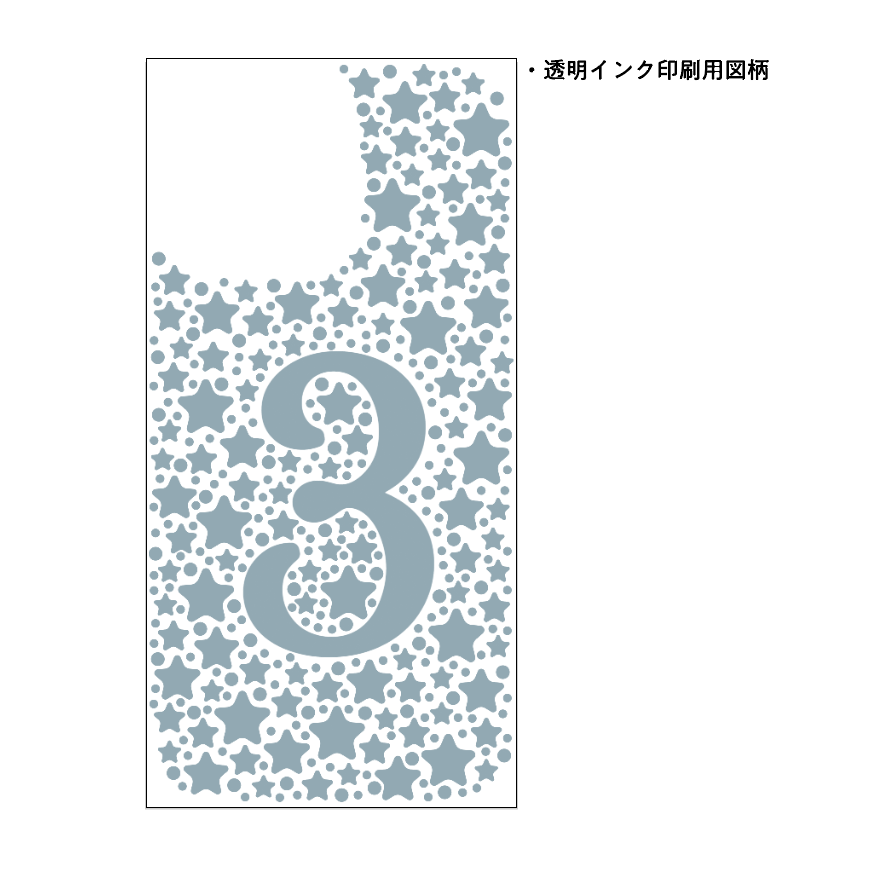
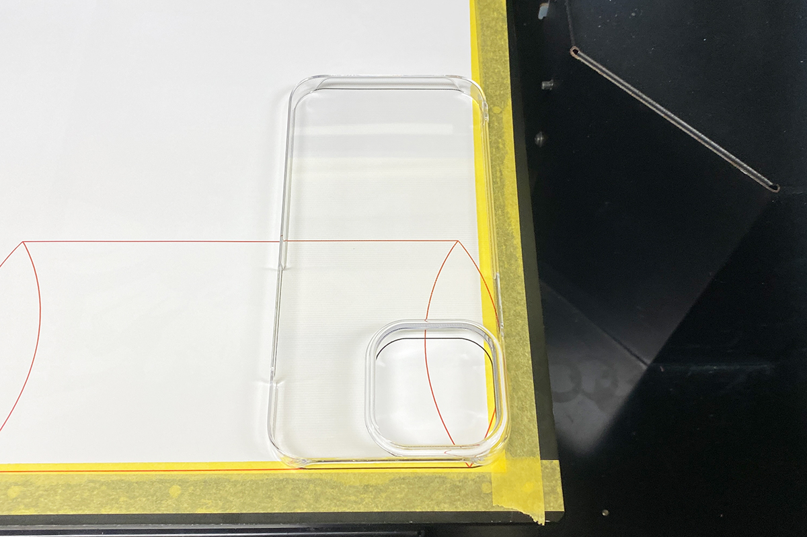
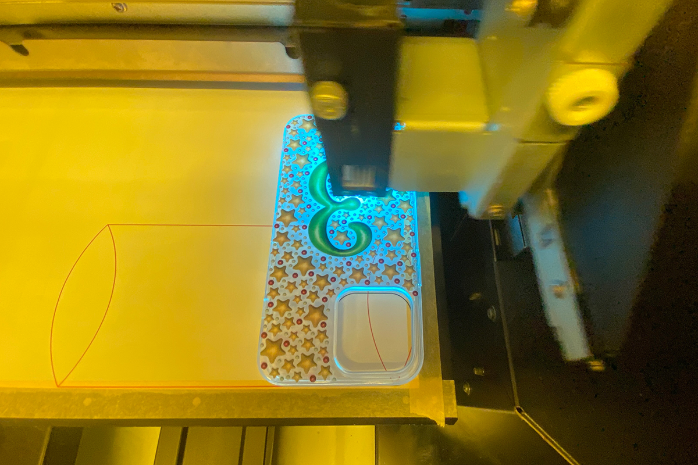
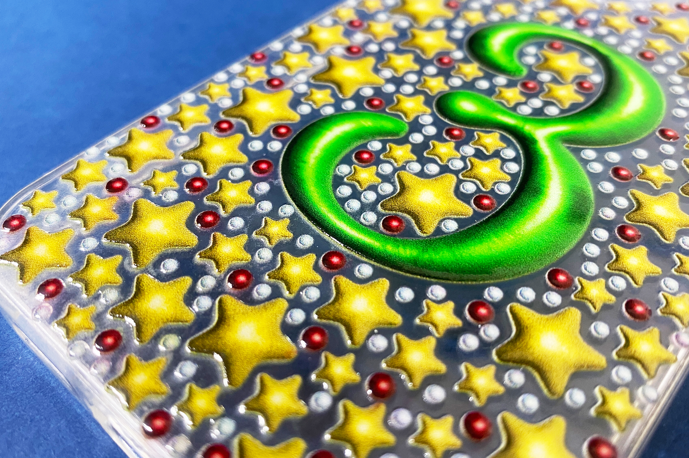

 

## **#03/25 [ 2024/12/03 ]** 
### by Shino ONODERA (FabLab SENDAI - FLAT)
  

  

### **材料**
* ダブルガードカバー（アイフォーン用、13/13Pro、クリア）（DAISO）
* 材質：本体背面部 ポリカーボネート／本体周囲 TPU
* 組み立て時サイズ：74mm × 149mm × 10mm
* JANコード：4550480031880

  

  

### **技術**
* データ作成：Adobe Illustrator
* UVプリント：Roland LEF-12

  

### **作り方**
 

### **1.** 
今回は、カラー、ホワイト、グロス印刷を行うため、以下のように4種類のデータをレイヤーを分けて作成しました。 

    
    

    
    

  

### **2.** 
UVプリンタに設置された捨て紙に、1.の「印刷ガイド線」を印刷したら、そこに合わせてスマートフォンケースをセットします。このスマートフォンケースは、カメラレンズ用の穴の周囲が2mm程度盛り上がっているため、そこに合わせてプリントテーブルの高さを調整します。 

  

### **3.** 
印刷時の様子です。カラー2回→ホワイト2回→透明（グロス）3回、という順番で印刷を行いました。更に、印刷面とプリントノズルの距離が離れているため、カラーとホワイトは“ディスタンスモード”で印刷しました。 

  

### **4.** 
印刷が完了したら完成！ 

  

写真では分かりにくいですが、特に数字の周りの星や円は、まるでラインストーンを貼ったかのように盛り上がって見えます。 

  

今回のグラフィックは、Illustratorの”膨張”という機能を使用して作成しました。透明インクを重ねることで、よりリアルな質感を表現できるのがUVプリンタの面白いところです。  

（Last Updated: 2025.11.13）
