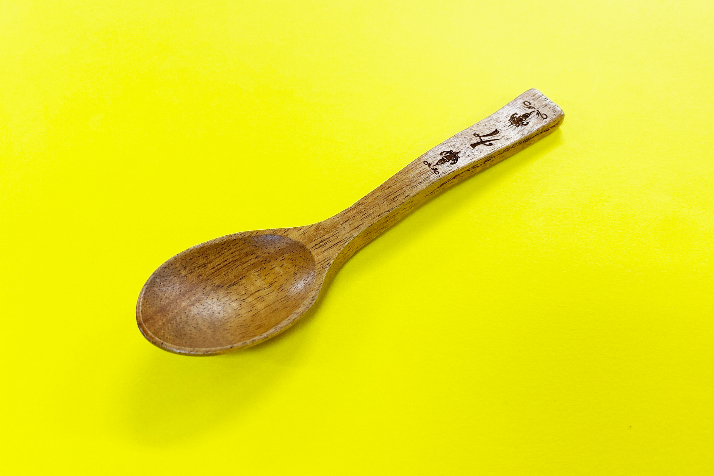
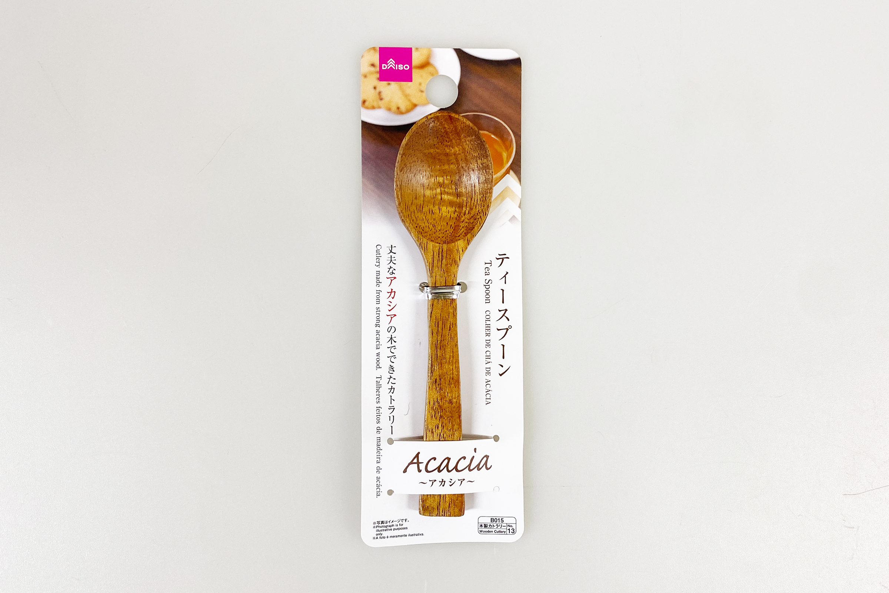
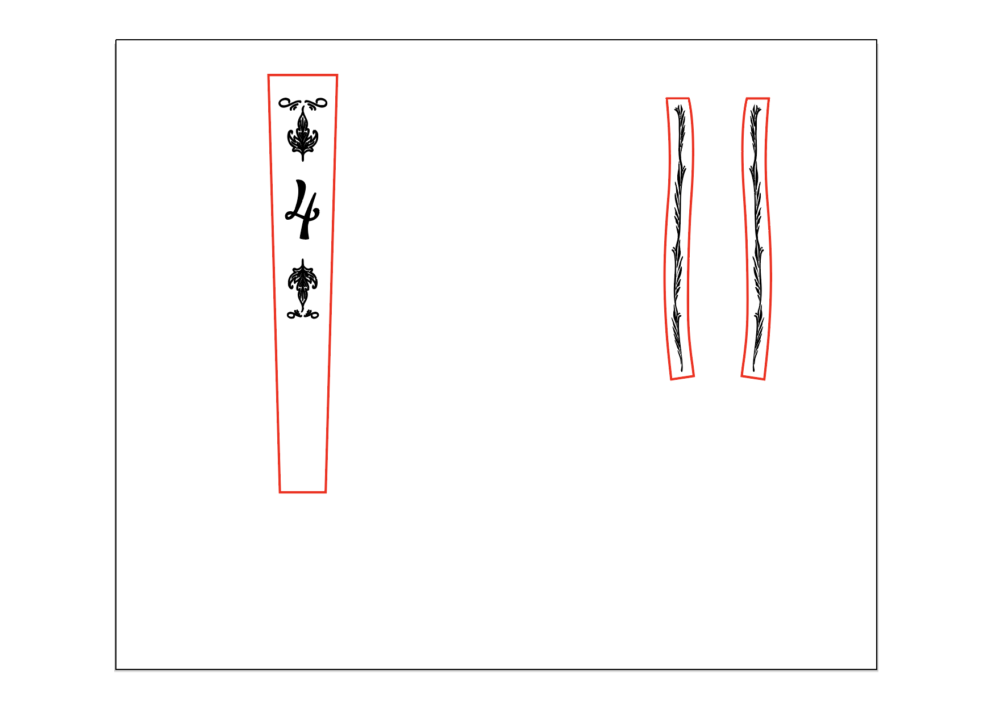
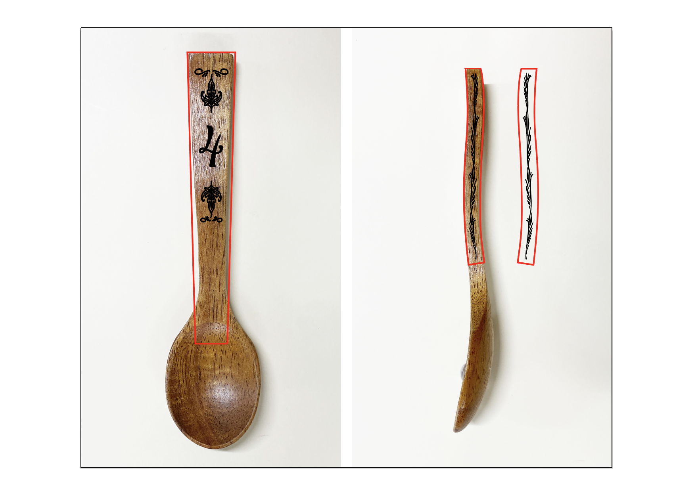
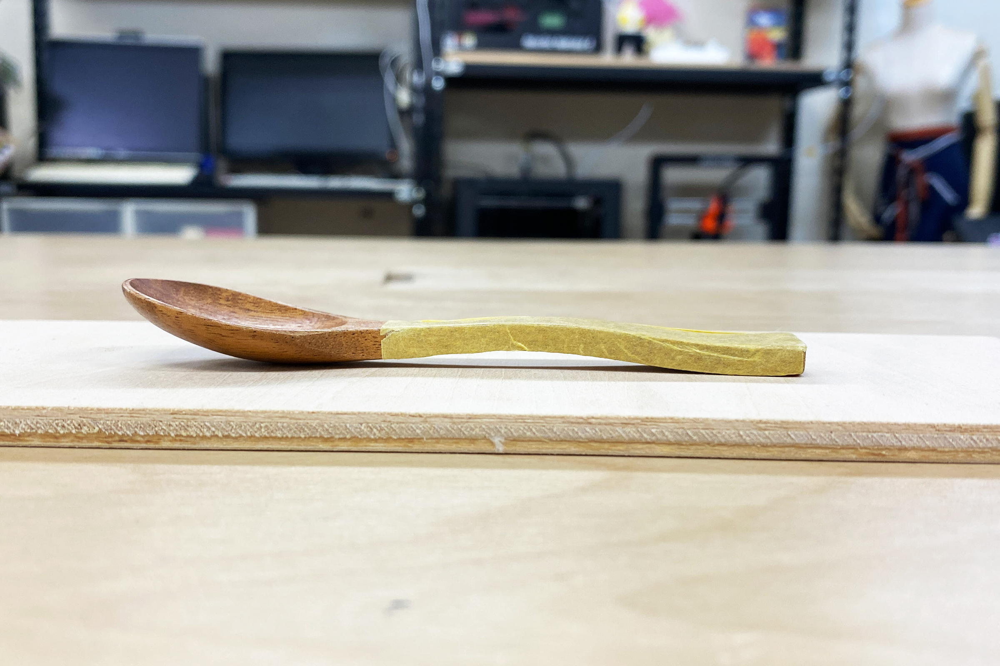
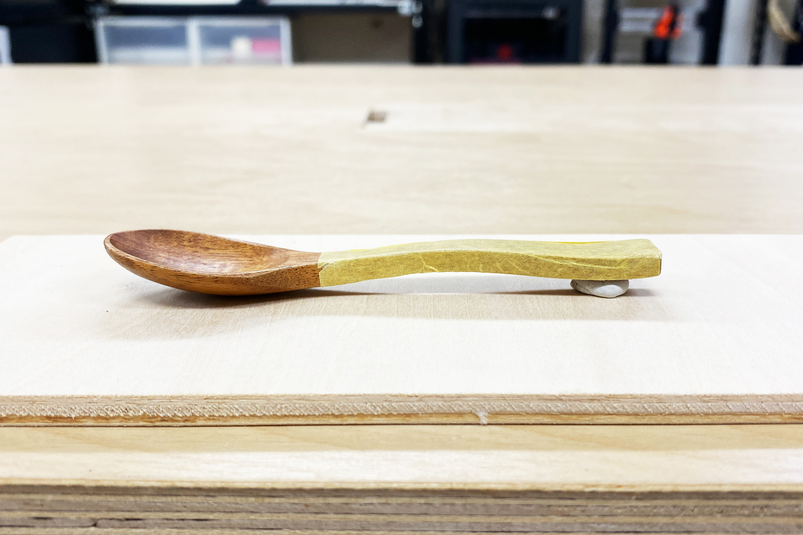
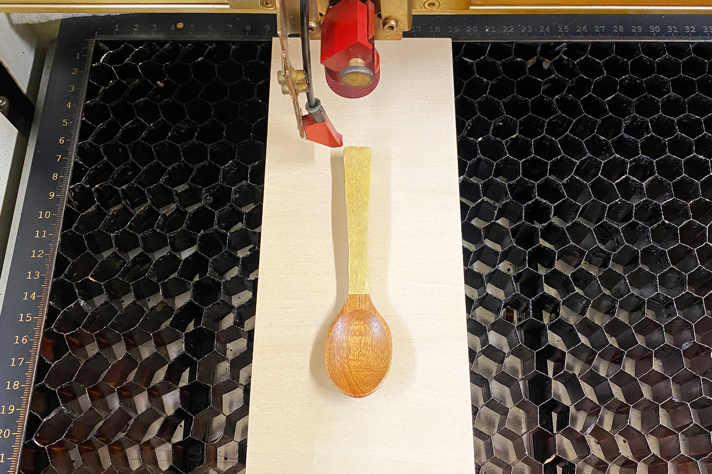
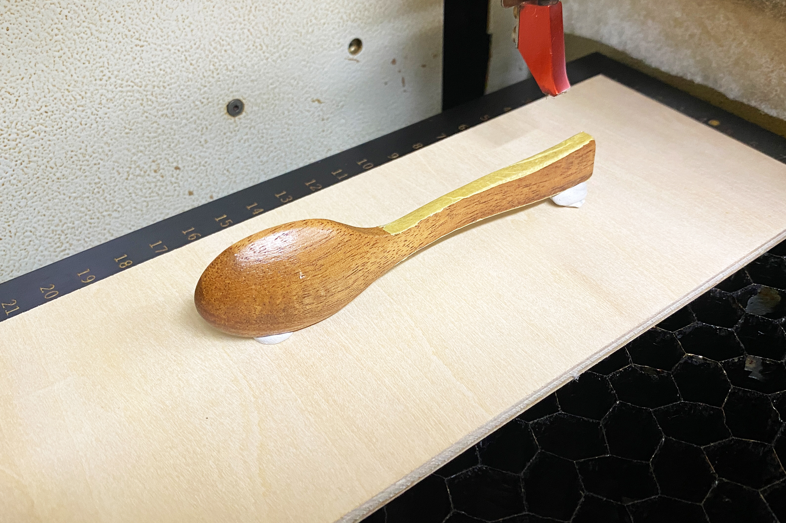

 

## **#04/25 [ 2024/12/04 ]** 
### by Shino ONODERA (FabLab SENDAI - FLAT)
  

  

### **材料**
* ティースプーン（DAISO）
* 材質：素地 アカシア／表面塗装 ニトロセルロース塗装（合成漆器）
* サイズ：約29mm × 119mm × 14mm
* JANコード：4994163289944

  

  

### **技術**
* データ作成：Adobe Illustrator
* レーザー彫刻：trotec Speedy100

  

### **作り方**
 

### **1.** 
今回は彫刻加工のみを行うため、位置合わせ用のガイド線（赤線）と、彫刻加工の模様（黒色）を作成しました。 

  

今回使用したスプーンの持ち手は湾曲しています。このように採寸が難しい形状に加工を行う場合、以下の画像のように実物大の写真を使ってデザインの細かい調整を行うという方法もおすすめです。 

  

### **2.** 
スプーンの彫刻加工範囲にマスキングテープを貼ります。 

  

また、持ち手の形状の都合上、そのまま台に置いて加工を行うとレーザーの焦点距離を合わせにくいため、持ち手上部を上にあげて、彫刻をしようとしている箇所ができるだけ平らになるようにします。ここでは「コクヨ ひっつき虫」を使用しています。 （練り消しのようなものです。） 

  

### **3.** 
レーザーカッターにスプーンをセットしたところです。レーザーカッターの加工台は蜂の巣状になっており安定しにくいため、スプーンは板にのせて加工を行います。 
レーザー加工のパラメータは以下の通りです。 
・黒（R0 G0 B0）：パワー30／スピード15 
（赤は加工用ガイド線のため加工は行なっていません。） 

  

### **4.** 
前面の加工が完了したら、側面に加工を行ないます。こちらもできるだけ加工面が平らになるよう「ひっつき虫」で高さを調整しました。 

  

### **5.** 
加工が完了し、表面のマスキングテープをはがしたら完成！ 

  

ぴったり狙った位置に加工を行うのは難しいですが、今回のように多少のズレであれば許容されるような図柄であれば、比較的加工がしやすいかなと思います。 

  

今回のように、表面が湾曲していたり凹凸がある場合、高低差が±2mm程度であれば比較的綺麗に彫刻加工を行うことが可能です。ただ、材料によっては加工のムラが大きく出る場合もあるため、できるだけ平らな材料を使用することをおすすめします。  

（Last Updated: 2025.11.13）
