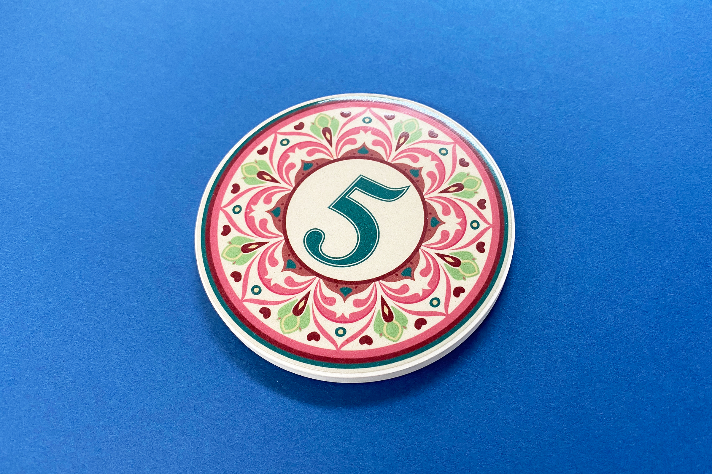
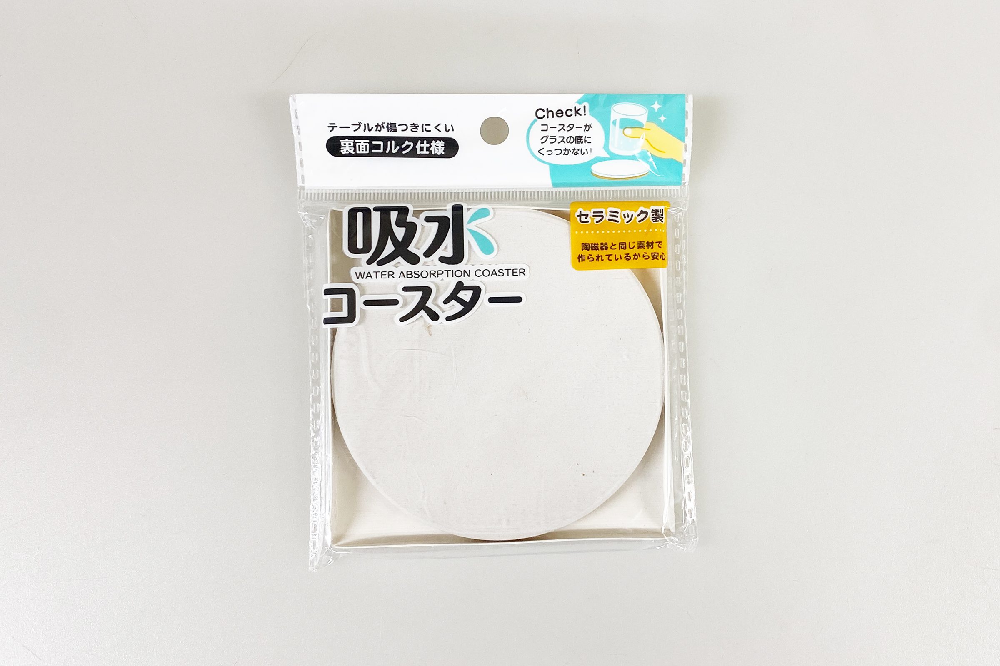
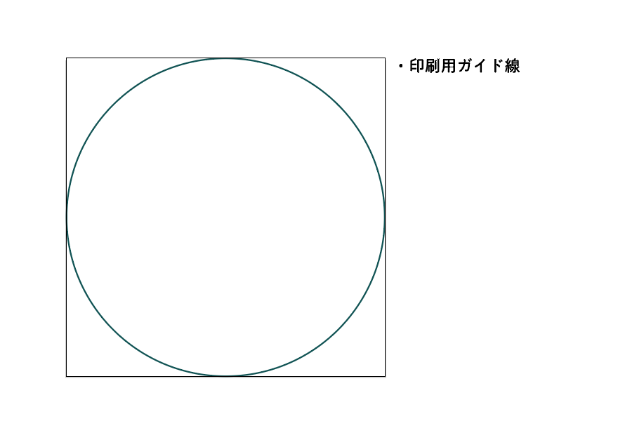
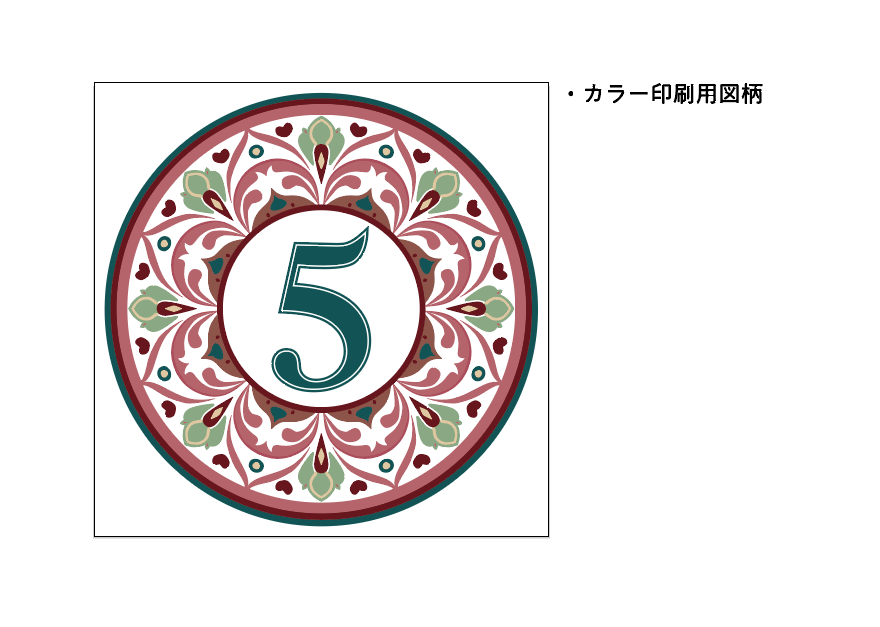
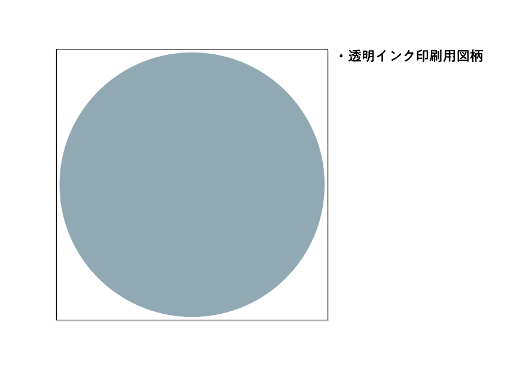
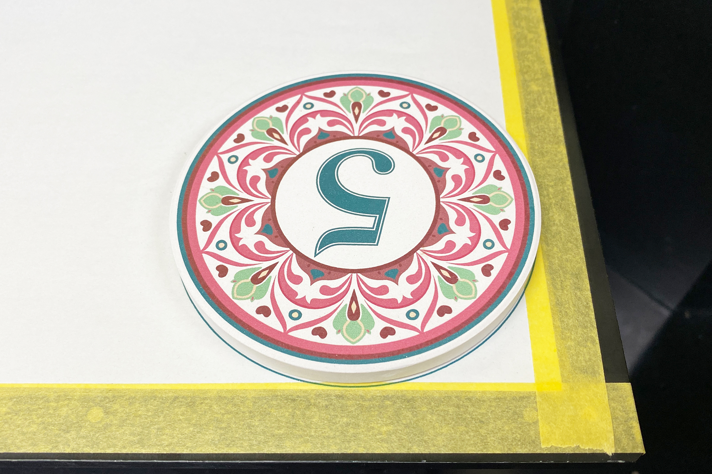
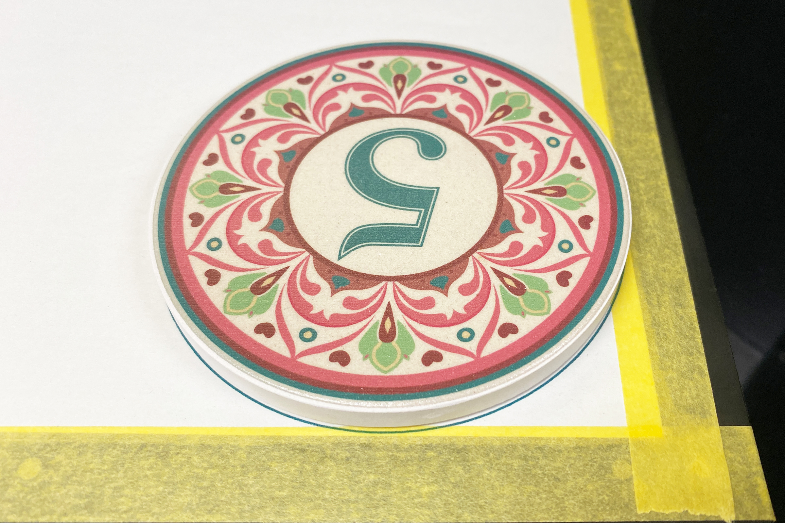
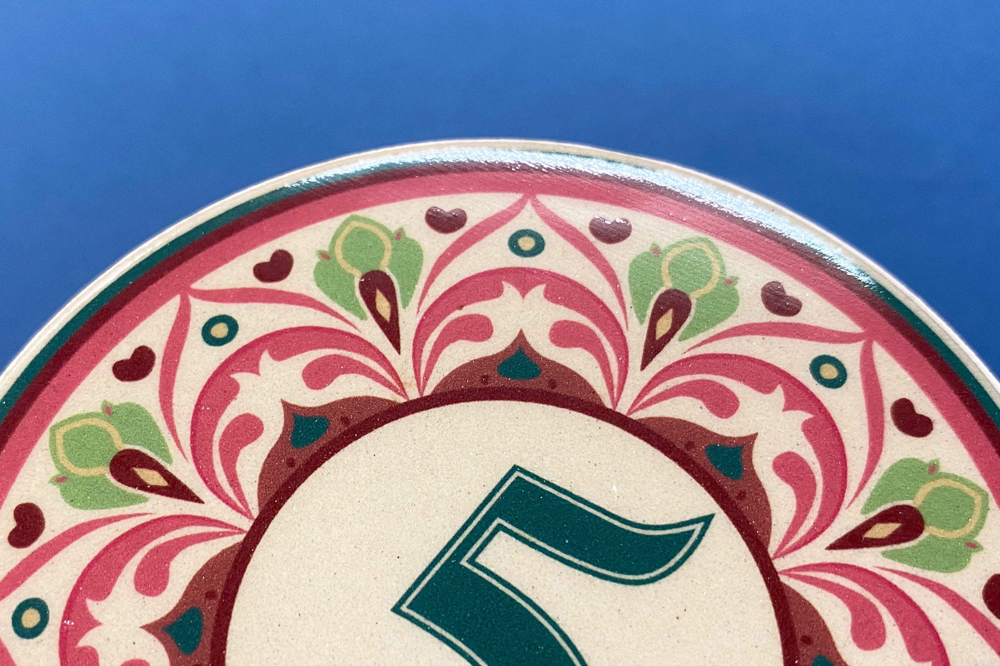

 

## **#05/25 [ 2024/12/05 ]** 
### by Shino ONODERA (FabLab SENDAI - FLAT)
  

  

### **材料**
* 吸水コースター（セリア）
* 材質：本体 セラミック／底面 コルク材
* サイズ：約直径90mm × 厚み7mm
* JANコード：4982494320603

  

  

### **技術**
* データ作成：Adobe Illustrator
* UVプリント：roland LEF-12

  

### **作り方**

### **1.** 
今回は印刷を行う材料が白いため、ホワイトインク用のデータは作成していません。 

  

  

  

### **2.** 
カラーのデータから印刷します。印刷時の位置ズレが目立たないように、コースターの上面よりも図柄はやや小さめにデザインしています。 
（コースター上面：約90mm／図柄：直径86mm） 

  

### **3.** 
続いてグロス（透明）インクでの印刷です。今回はグロス面に厚みを持たせるために、マット（ツヤなし）印刷を2回、グロス（ツヤあり）印刷を1回行いました。 
以下の画像は、マット印刷までが完了した状態ですが、インクがコースターに染み込んだためやや沈んだ色合いになっています。このときにホワイトを綺麗に発色させたい場合は、カラー印刷の前にホワイト印刷を行う必要があります。 

  

### **4.** 
加工が完了したら完成！ 

  

吸水コースターにUVプリントをしているので吸水効果はなくなってしまいましたが、図柄の縁はにじむことなく綺麗に印刷されました。 

  

今回はグロス（ツヤあり）印刷を1回しか行っていないため表面にボーダー状の凹凸が見えていますが、印刷回数を重ねるほどより滑らかな仕上がりになっていきます。ただし、印刷途中に気泡が発生したりホコリが入る可能性も高くなるので注意が必要です。

  

（Last Updated: 2025.11.13）
