 

## **#06/25 [ 2024/12/06 ]** 
### by Shino ONODERA (FabLab SENDAI - FLAT)
  

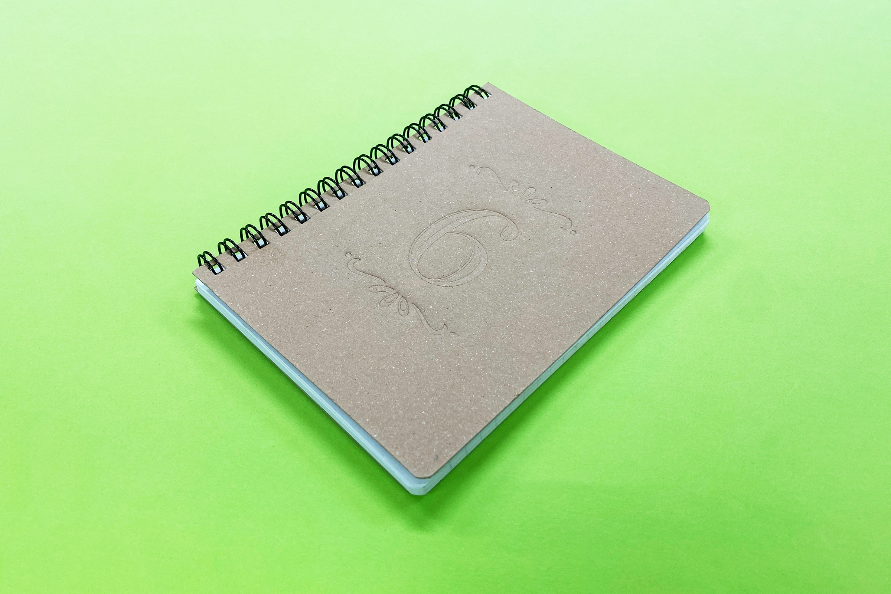

  

### **材料**
* クラフトツインリングノート セミA6・50枚（セリア）
* 材質：本体：紙／リング：スチール
* サイズ：約104 × 140mm
* JANコード：4969757159279

  

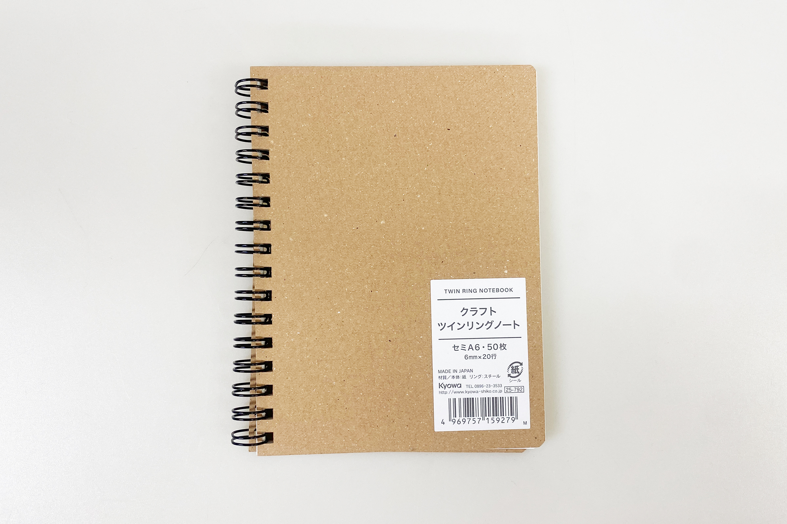

  

### **技術**
* データ作成：Adobe Illustrator
* レーザー加工：trotec Speedy100

  

### **道具**
* 捺印マット
* 捺印マットと同サイズ程度の板
* ウェットティッシュ
* クランプ

  

### **作り方**

### **1.** 
今回はスタンプのような凸型を使用するため、以下のデータを作成しました。1枚の板から凸柄データを削り出ししても良いのですが、彫刻時間を短縮するために凸型は別途土台に貼り付けることにしました。 
凸型データの黒色部分はレーザーの彫刻加工で削り、白い部分のみが出っ張っている状態にし、赤線部分で切り抜きます。また、土台データの赤線は凸型の貼り付け位置の目印で、緑線部分が切り抜き箇所です。 

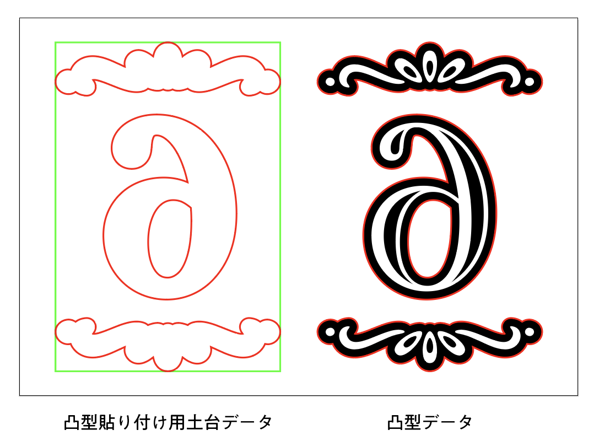

  

### **2.** 
凸型には厚さ3mmのアクリル板を使用し、約1mmの深さになるよう彫刻加工を行いました。 

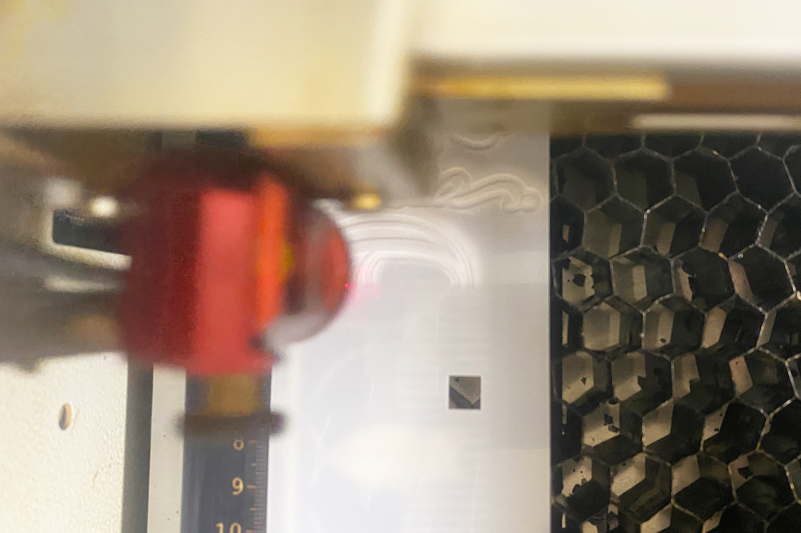

  

### **3.** 
パーツのレーザー加工が完了したら、両面テープで貼り付けます。これを、クランプを使ってノートの表紙に強く押し当てて模様をつけていきます。 

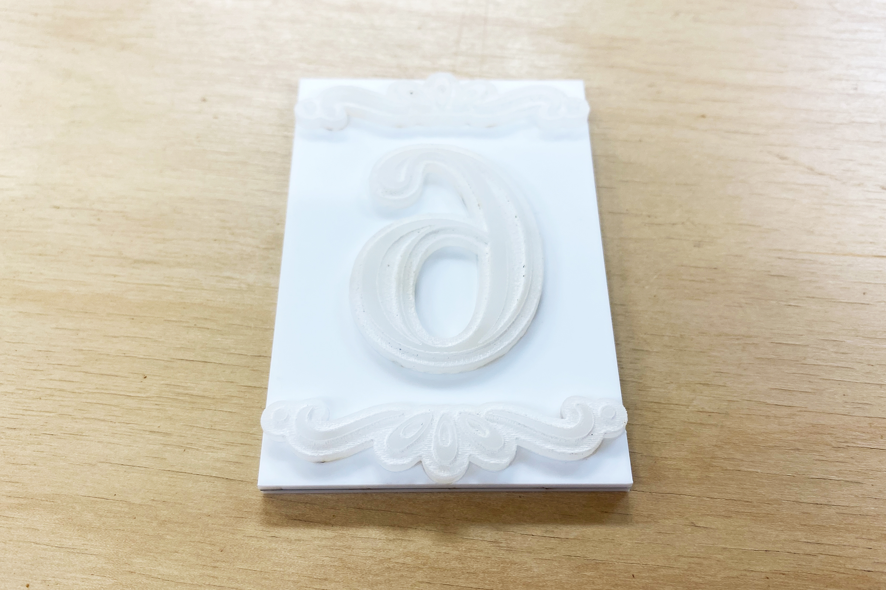

  

### **4.** 
模様をはっきり付けるために、凸型の他に捺印マットを使用しました。また、余計なクランプの跡が付くのを防ぐために、捺印マットと同サイズ程度の板材も使用します。 

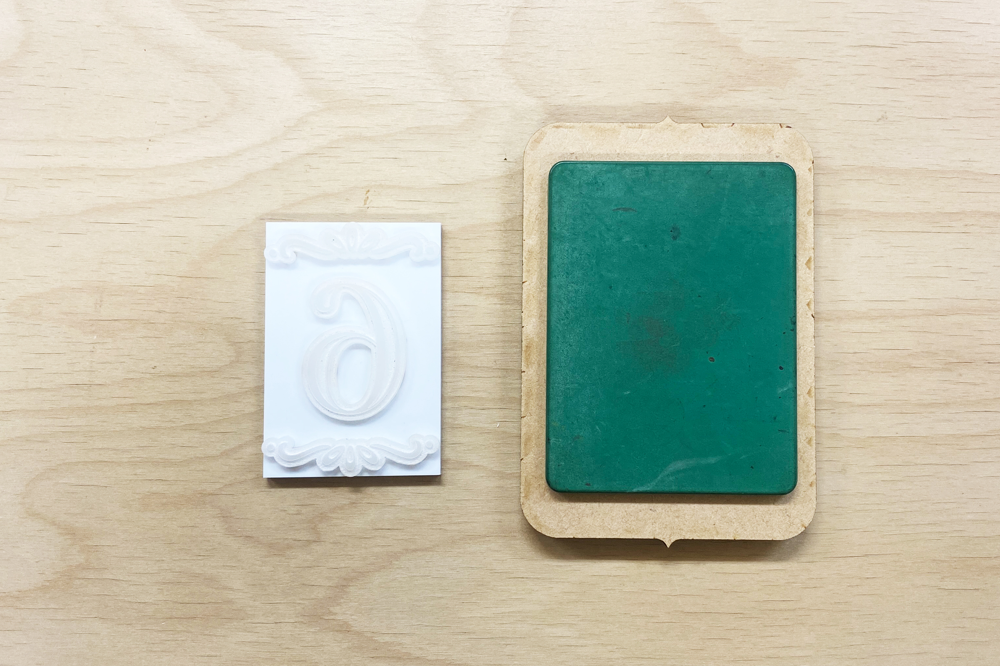

  

### **5.** 
更に模様が付きやすくなるように、ノートの表紙をウェットティッシュで軽く湿らせます。このとき強く擦ってしまうと紙が剥がれてしまうため、ギュッと押すように水分を染み込ませると良いでしょう。 

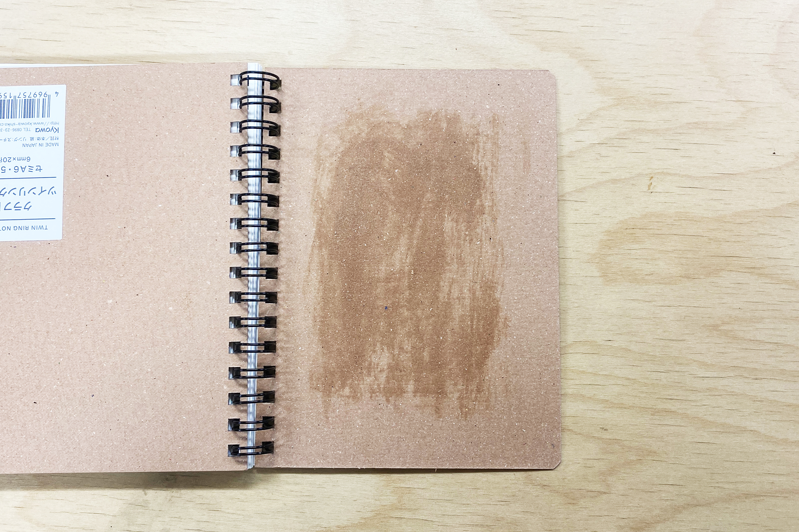

  

### **6.** 
凸型→ノートの表紙→捺印マット→板の順に重ね、型全体にまんべんなく力が掛かるようにクランプで強く押さえつけます。今回はだいたい1分ほどこのままの状態にしておきました。 

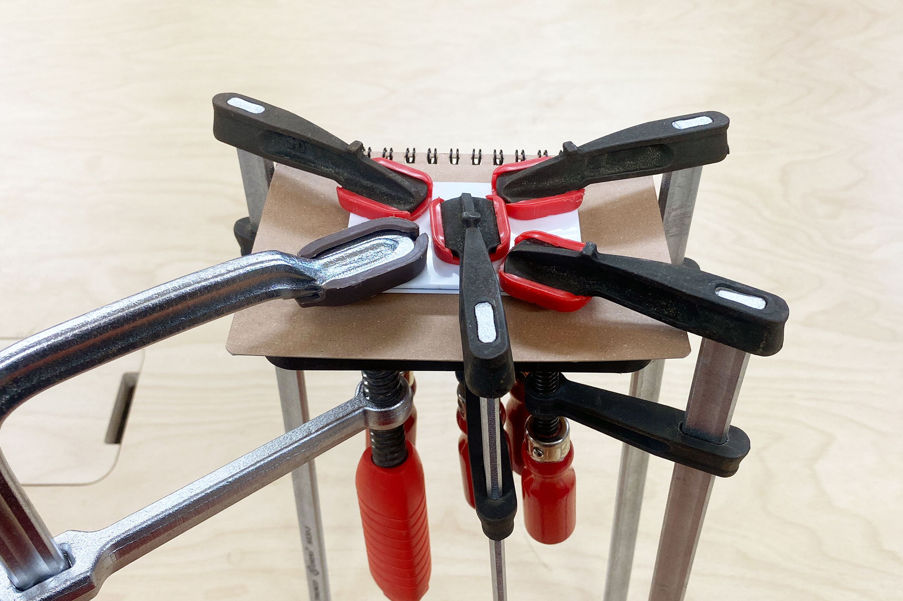

  

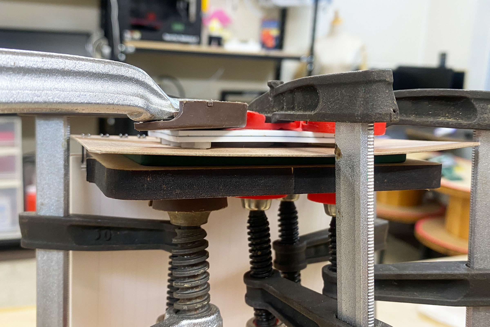

  

### **7.** 
クランプや型を取り外したら完成！ 

  

細かい箇所にやや押しムラが見えますが、しっかり凹凸が出ています。 

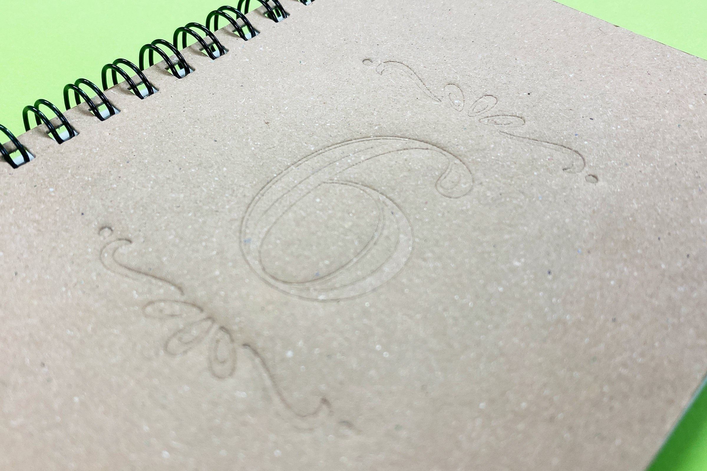

  

表紙の裏側は、反転した模様が盛り上がっています。捺印マットの代わりに凹型を使用すれば、はっきりとしたエンボス加工ができるかもしれません。 

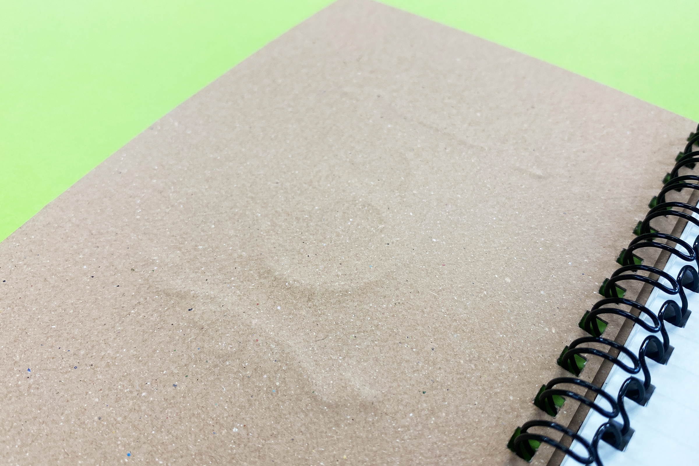

  

今回のような型押し加工は、広い・太い面よりも、小さい・細いもののほうが模様がはっきりと付きやすいので、もしチャレンジしてみたいという場合はそれも念頭に置いてデザインをしていただくのが良いかと思います。

  

（Last Updated: 2025.11.13）
