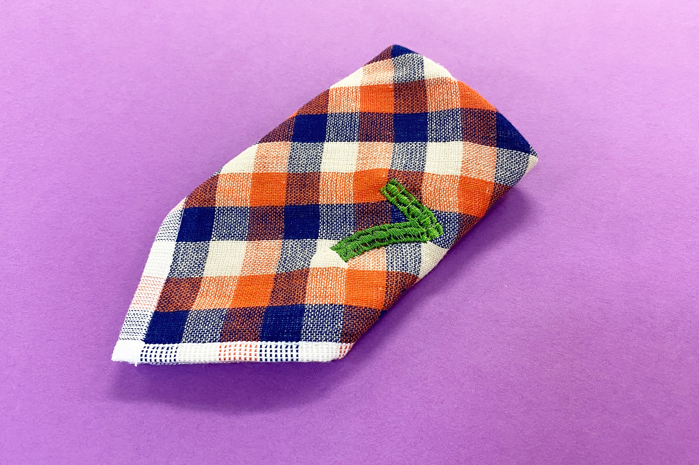
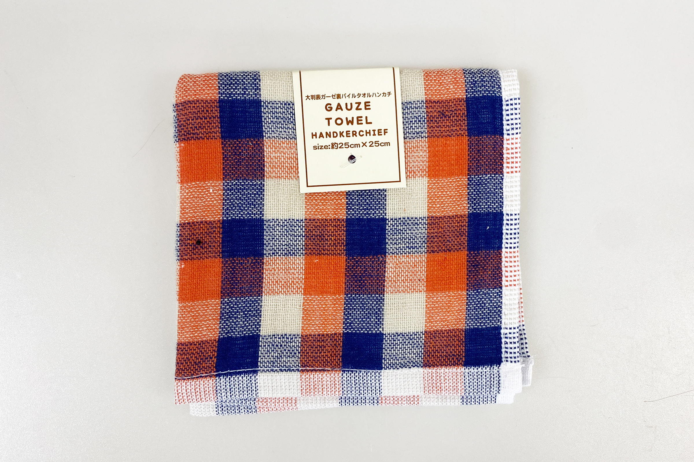
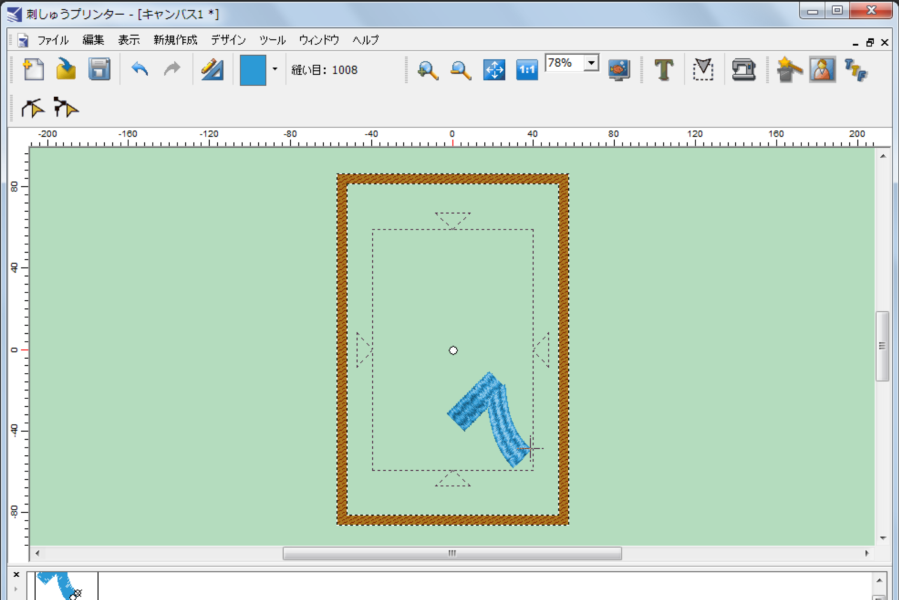
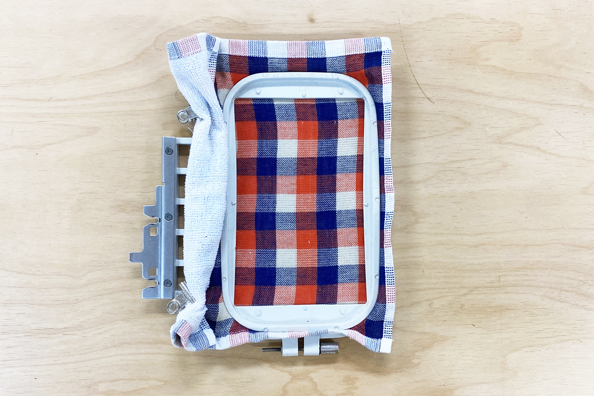
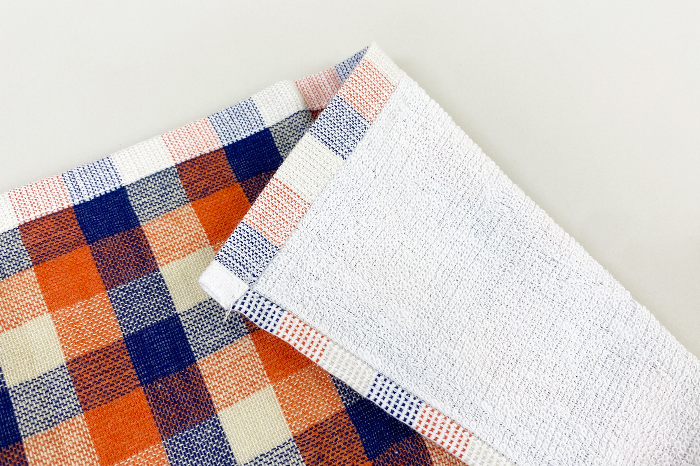
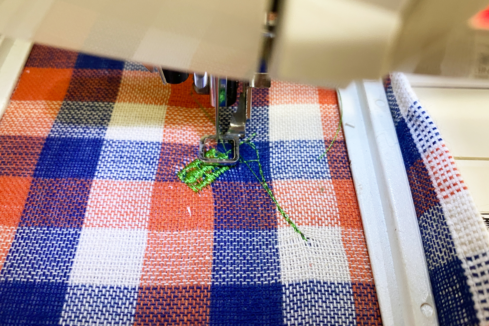
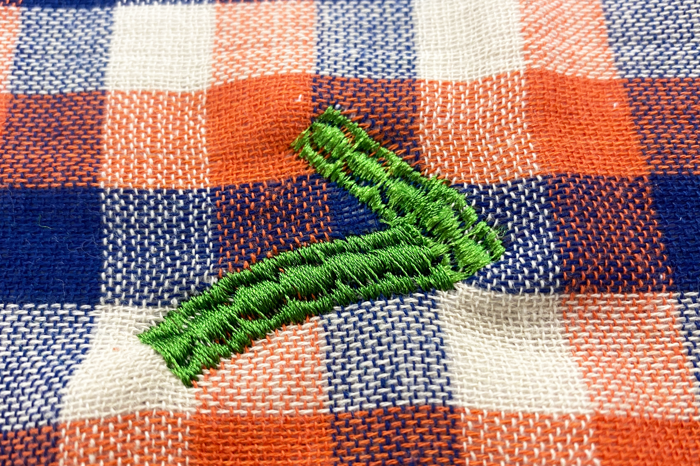

 

## **#07/25 [ 2024/12/07 ]** 
### by Shino ONODERA (FabLab SENDAI - FLAT)
  

  

### **材料**
* 大判表ガーゼ裏パイルタオルハンカチ（セリア）
* 材質：綿100%
* サイズ：約25 × 25cm
* JANコード：4969499783060

  

  

### **技術**
* データ作成：刺しゅうプリンター
* 刺繍：JAGUAR SP4000

  

### **作り方**

### **1.** 
今回は刺しゅうミシン専用ソフト「刺しゅうプリンター」を使用して、刺しゅうデータを作成しました。「刺しゅうプリンター」は、刺しゅう用画像（模様）の作成から、刺しゅう方法の指定まで一貫して行うことが可能です。（JAGUAR専用のソフトウェアです。） 

  

### **2.** 
できるだけハンカチの端のほうに刺繍したかったので、ハンカチは以下のように刺繍枠にセットしました。左の余った部分は作業の邪魔にならないようにクリップでまとめています。 

  

また、今回は裏面がタオル地になっているハンカチを使用しましたが、ループが小さめだったのでそのまま刺繍枠にセットしています。もっとループが大きかったり、毛足の長い布を使用する場合は、それを抑えるための接着芯等を裏側にセットするのが良いかと思います。 

  

### **3.** 
布や糸のセットが完了したら刺繍開始です。 
今回は縫い目が1016番というパターンを採用、全て刺繍するのに5分程度かかりました。 

  

### **4.** 
刺繍枠から取り外して、余計な糸を切ったら完成！ 

  

「刺繍プリンター」では、このような模様縫いを指定することも可能です。 

  

また、刺繍枠に布をセットする都合上、刺繍できる位置が限定されているのが要注意ポイントです。今回のようなハンカチの場合、四つ角よりも各辺の中心などに合わせたほうが見た目が良くなりそうです。  

  

刺しゅうミシンは、FabLab SENDAI – FLATにあるマシンのなかで最も癖があり難易度の高いマシンです。複雑な模様の刺繍は苦手ですが、ちょっとしたワンポイントを入れるなどのカスタマイズには向いていますので、ぜひぜひチャレンジしてみてください！

  

（Last Updated: 2025.11.13）
