 

## **#08/25 [ 2024/12/08 ]** 
### by Shino ONODERA (FabLab SENDAI - FLAT)
  

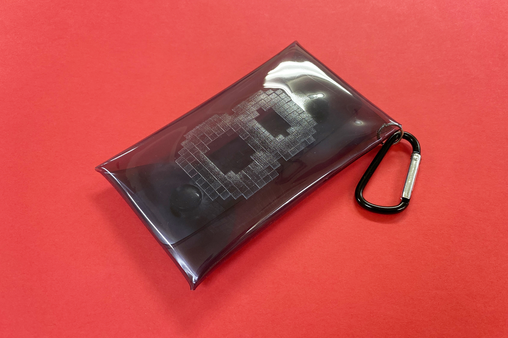

  

### **材料**
* クリアカラーポーチ（DAISO）
* 材質：塩化ビニル樹脂
* サイズ：約70mm × 110mm × 10mm
* JANコード：455480575582

 

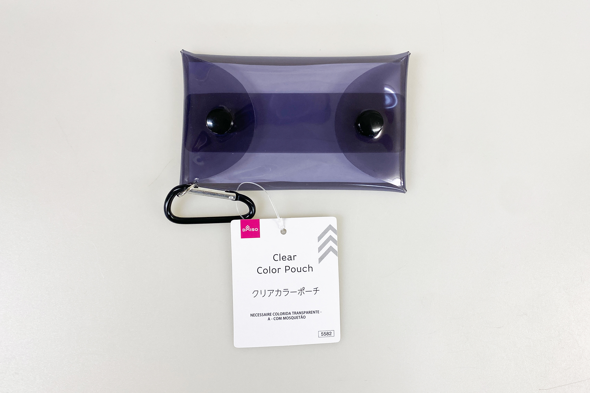

  

### **技術**
* データ作成：Adobe Illustrator
* UVプリント：roland LEF-12

  

### **作り方**

### **1.** 
今回は透明インクのみを使用しましたが、インクで凹凸を表現したかったので、6つのデータを重ねて印刷することにしました。 

    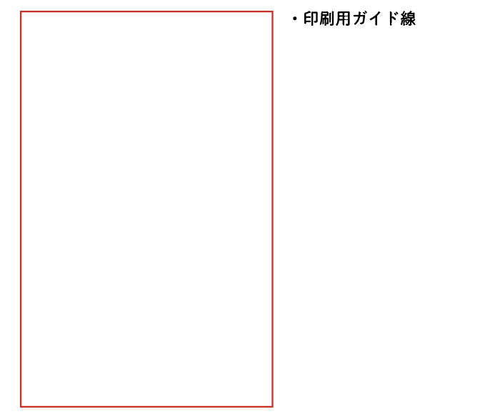
    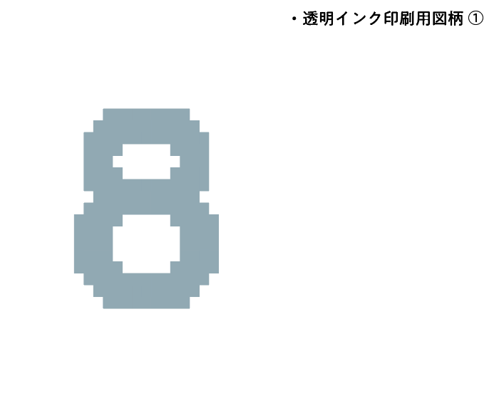

    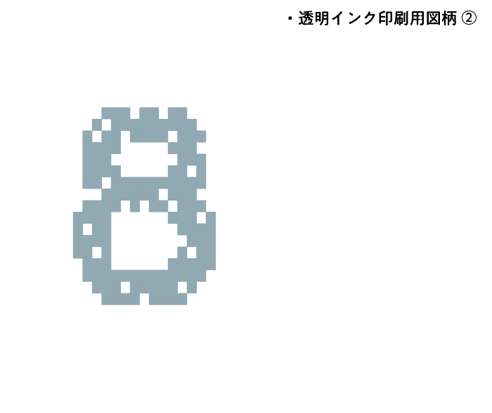
    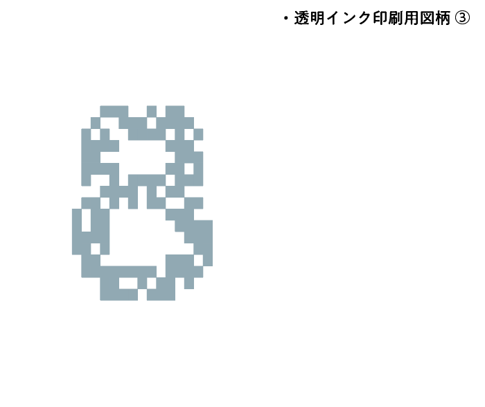

    
    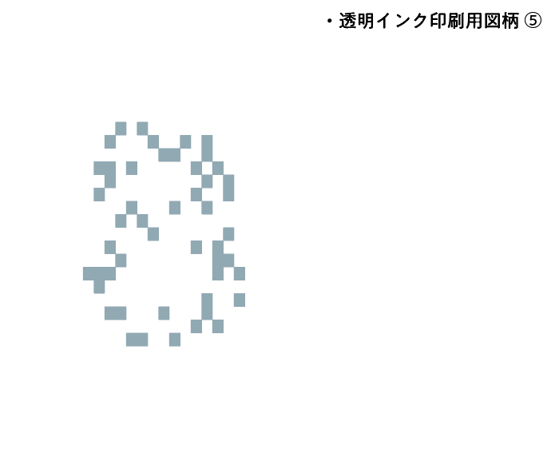

    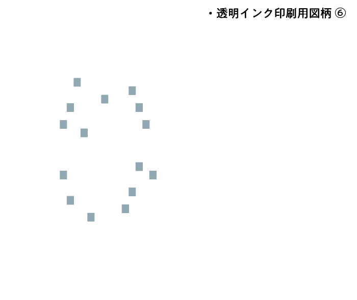

  

### **2.** 
UVプリンタは平らな面にのみ印刷が可能です。今回使用したポーチは表面がうねっていたため、裏側にマスキングテープを貼り、その上に厚紙を両面テープで貼って平らにしようとしました。 
ですが、平らにはなったものの、マスキングテープと塩化ビニル樹脂の食いつきがとても良く、テープのベタベタがポーチにとても残ってしまうという結果に..。ベタつきは消しゴムである程度は落ちますが、テープ類の使用は控えたほうが良さそうです。 

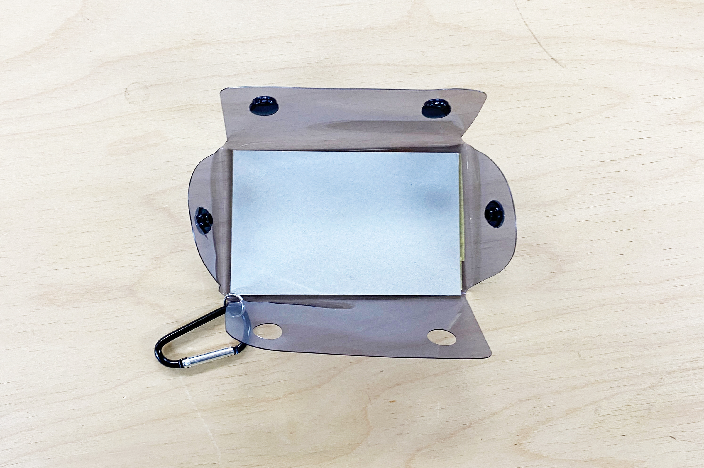

  

### **3.** 
ポーチをUVプリンタのテーブルにそのまま置くと安定しないため、手頃なサイズの木材を積んで、その上に開いたポーチをのせてプリントしました。 

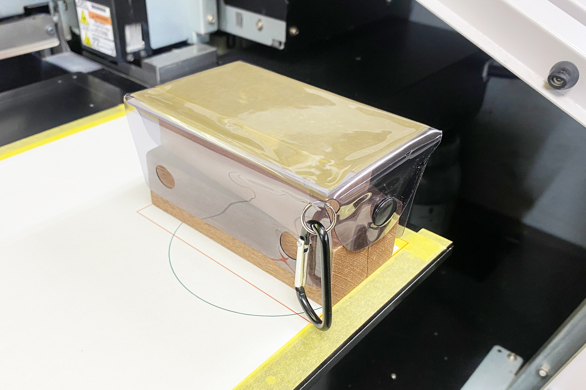

  

### **4.** 
加工が完了したら完成！ 

  

それぞれの画像をマットグロスで2回ずつプリントしました。写真では分かりにくいですが、凹凸がはっきりと出ています。 

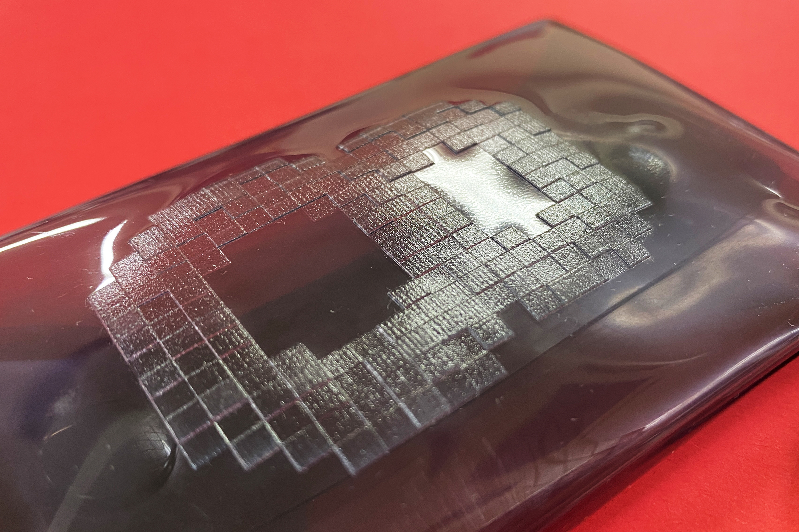

  

今回はマットグロスのみで仕上げましたが、最後にツヤありのグロスインクをのせると、また違った表情になりそうですね。また、素材の全面にグロスインクでテクスチャを印刷して、フェイクレザーなどのようなフェイクマテリアルを作るのも楽しいかもしれません。

  

（Last Updated: 2025.11.13）
