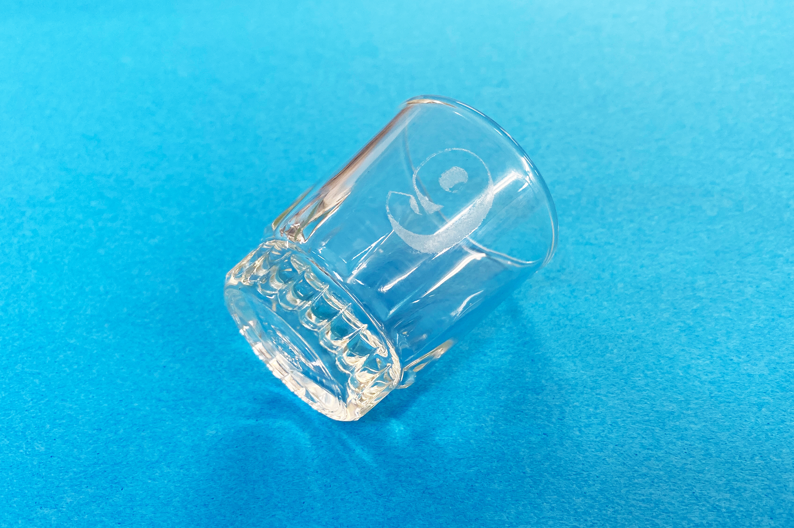
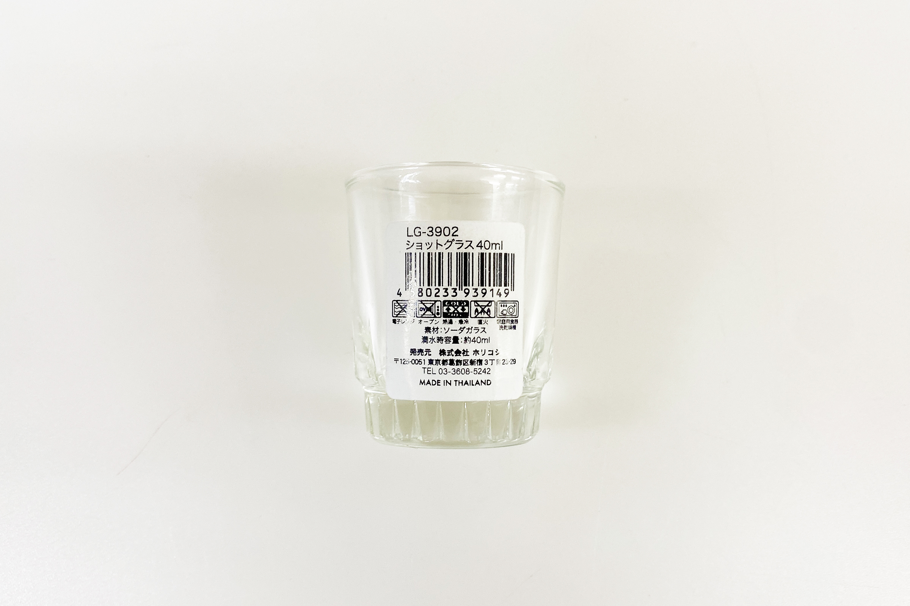
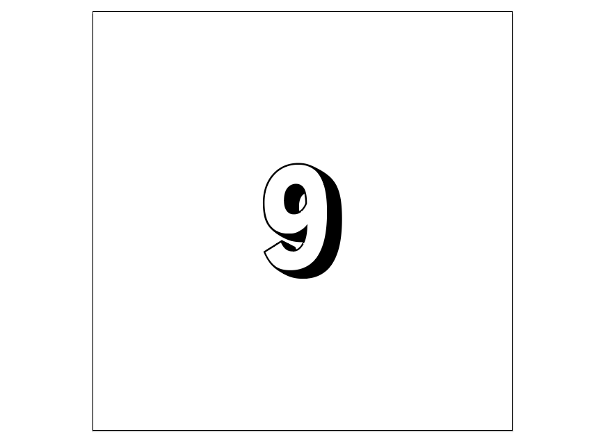
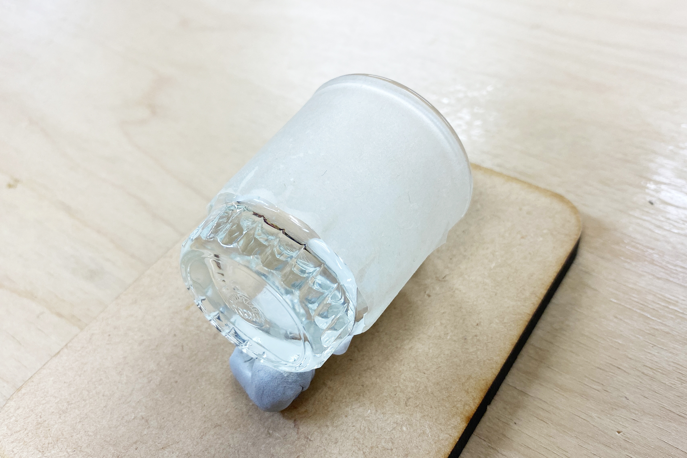
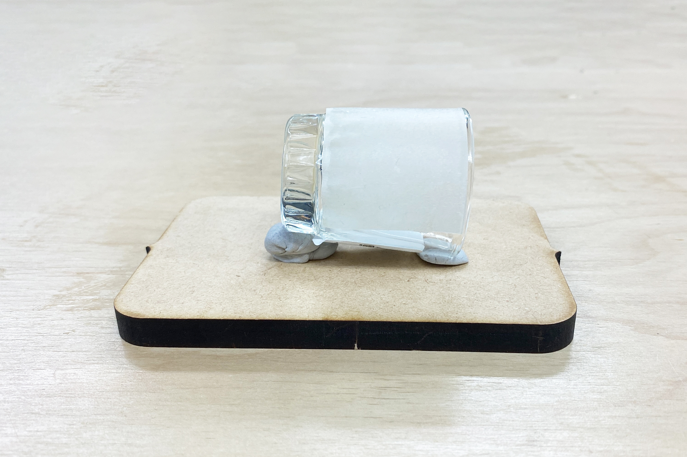
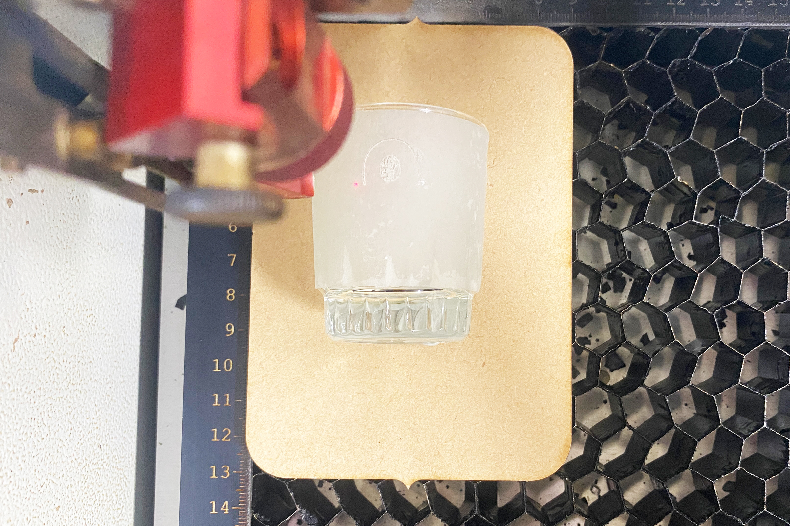
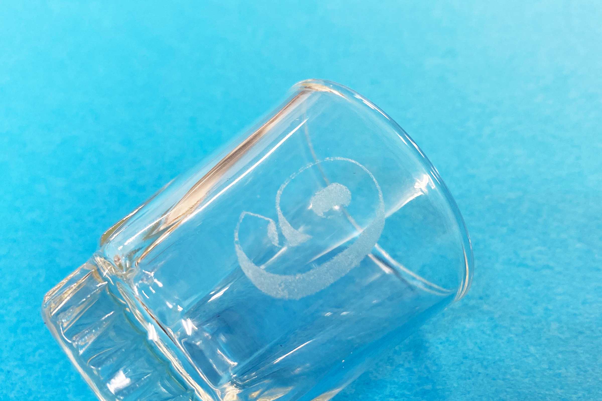

 

## **#09/25 [ 2024/12/09 ]** 
### by Shino ONODERA (FabLab SENDAI - FLAT)
  

  

### **材料**
* LG-3902 ショットグラス 40ml（セリア）
* 材質：ソーダガラス
* サイズ：40ml
* JANコード：4580233939149

 

  

### **技術**

* データ作成：Adobe Illustrator
* レーザーカッター：trotec speedy100

  

### **作り方**

### **1.** 
今回は彫刻加工のみを行うので、以下のような黒一色の画像データを作成しました。 

  

### **2.** 
[ガラスに彫刻加工を行う際は、表面に濡らした紙を貼っておくと仕上がりが綺麗になる](https://trotec-m.blogspot.com/2018/06/blog-post.html)とのことでしたので、半紙を水で濡らして貼り付けました。 

  

また、グラスは下にすぼまった形をしているため、彫刻加工を行う面が平らになるように平らな板に固定しました。（コクヨ ひっつき虫を使用しています。） 

  

### **3.** 
レーザーカッターにセットし彫刻加工を行います。今回は、パワー25、スピード30、エアアシストオフで、2回加工しました。 

  

### **4.** 
加工が完了し、半紙を剥がして表面を拭いたら完成！ 

  

レーザーのパワーが甘かったのか、表面にムラができてしまいましたが、細いラインもしっかり彫刻されています。 

  

今回はグラスの一部にのみ彫刻加工を行いましたが、加工が完了する度にグラスの向きを変えていけば、グラスの全面に模様をつけることも可能です。また、ソーダガラスはレーザー彫刻向きとのことですが、グラスの材質によってはレーザー加工しても模様が彫られない可能性もあるので、加工を行う際には材質までチェックするのを忘れないでください。

  

（Last Updated: 2025.11.13）
