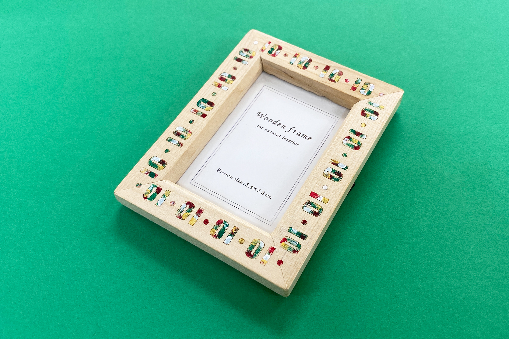
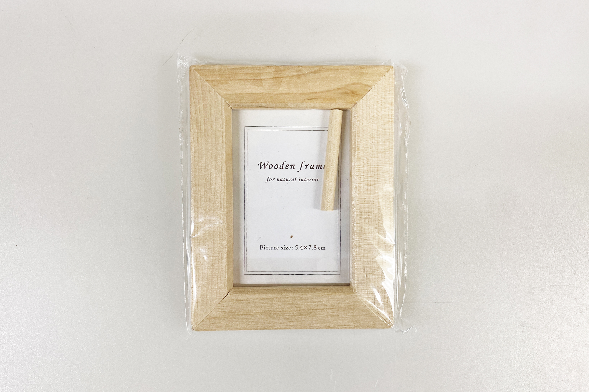
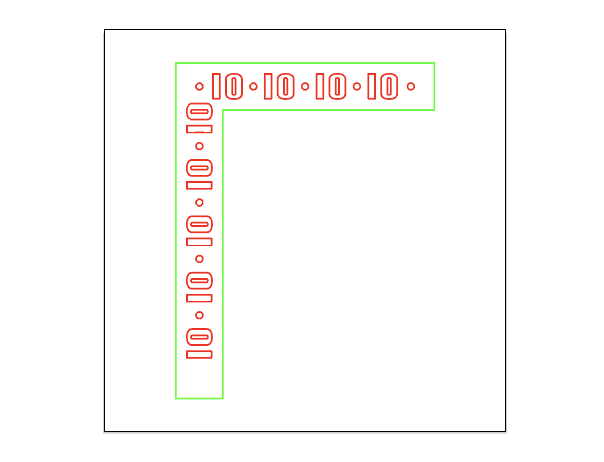
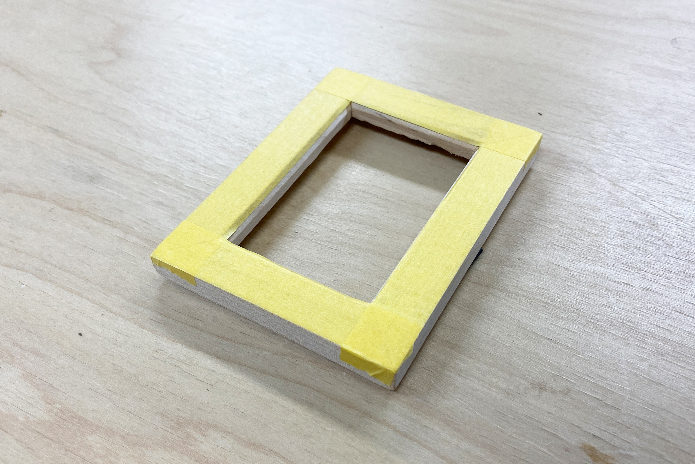
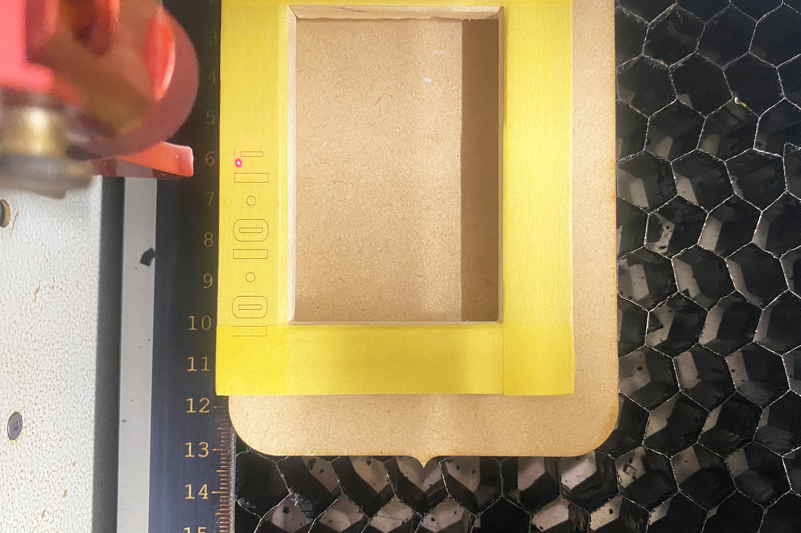
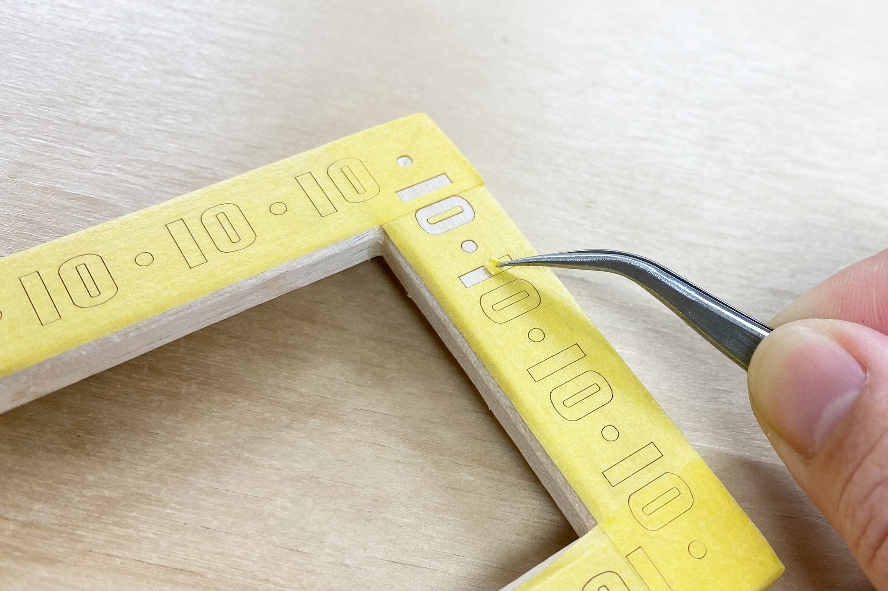
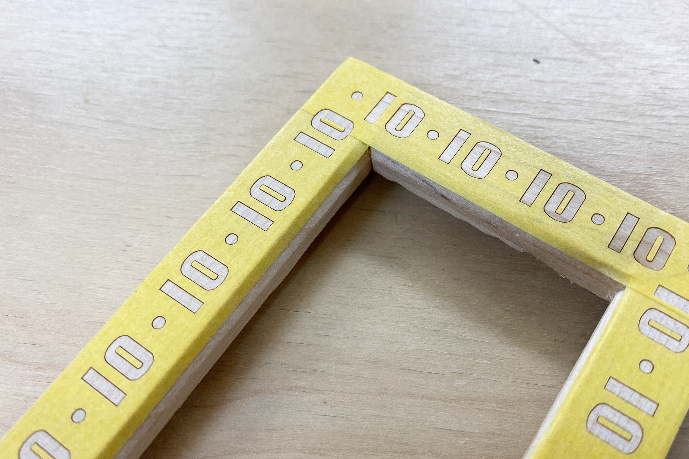
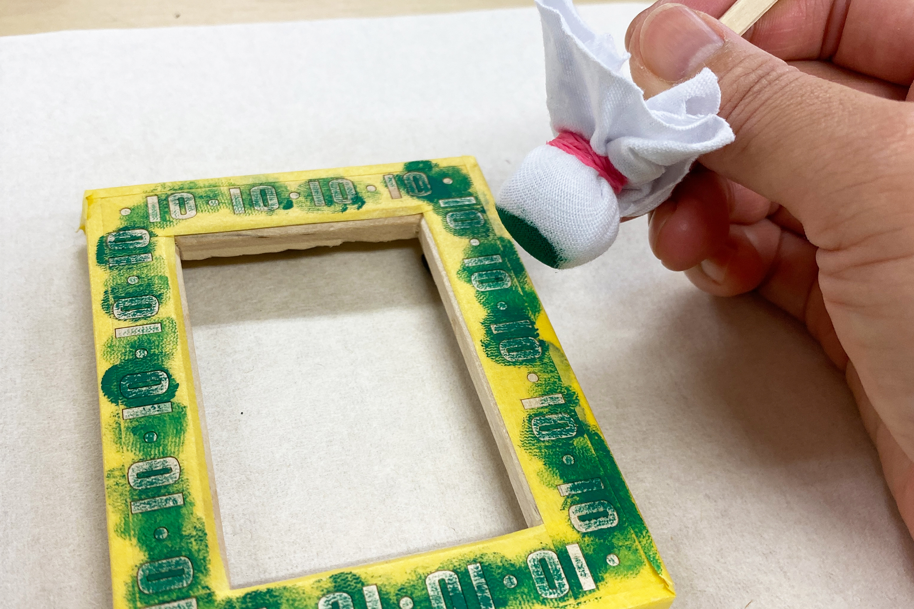
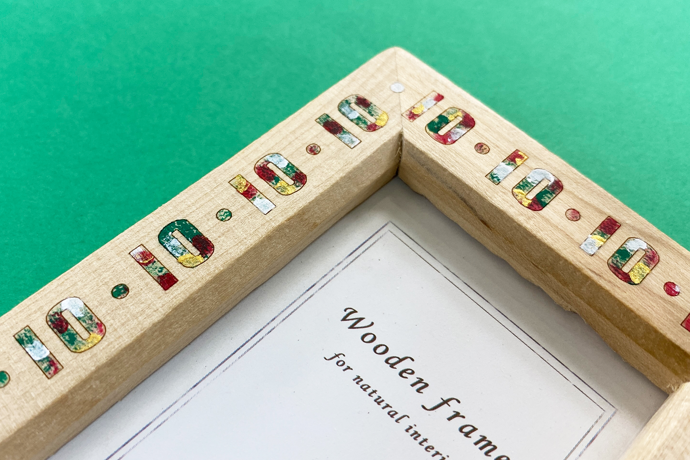

 

## **#10/25 [ 2024/12/10 ]** 
### by Shino ONODERA (FabLab SENDAI - FLAT)
  

  

### **材料**
* 2894 木製フレーム Mサイズ ナチュラル（セリア）
* 材質：フレーム 天然木／その他 MDF、アクリル、PVC、鉄
* サイズ：およそ横10cm × 縦7.5cm × 厚さ1cm
* JANコード：4977794096679

 

  

### **技術**
* データ作成：Adobe Illustrator
* レーザーカッター：trotec speedy100

  

### **作り方**

### **1.** 
赤は切り抜き線、緑はデータと素材の位置合わせ用のガイド線です。 
はじめに上と左を加工したら、素材を180度回転させて再度同じデータで加工をするという方法をとりました。 

  

### **2.** 
フレームの前面にマスキングテープを貼ります。このとき、気泡やシワが入らないよう注意します。 

  

### **3.** 
フレームをレーザーカッターにセットし、マスキングテープのカットを行います。今回はマスキングテープのみを切り抜きたいので、パワー4、スピード1で加工しました。また、フレームの裏面に金具が付いており、そのままレーザーカッターの加工テーブルに置くと不安定なため、平らな板にのせています。 

  

### **4.** 
色付けをしたい箇所のマスキングテープをピンセットで慎重に剥がします。 

  

### **5.** 
筆などで強く擦るとマスキングテープが剥がれる可能性があったため、今回は布や綿棒で色付けを行いました。 

  

### **6.** 
色付けをし、マスキングテープを剥がしたら完成！ 

  

図柄をプリントするというだけであればUVプリンタでも行えますが、自分の手で仕上げるという楽しみがあるのがこの方法の良いところかなと思います。 

  

今回は模様部分に色を付けましたが、周囲のマスキングテープを剥がせば模様のみ木目を残すことももちろん可能です。色付けの順序やマスキングテープの剥がし方によって様々な仕上がりになるので、ワークショップのコンテンツとしても活用できそうです。

  

（Last Updated: 2025.11.13）
