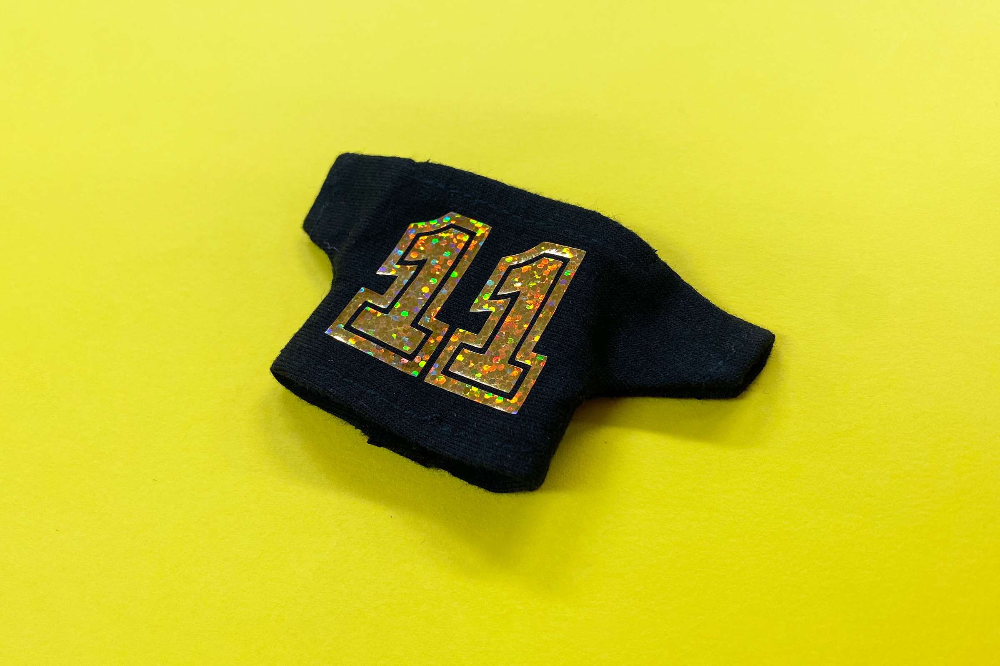
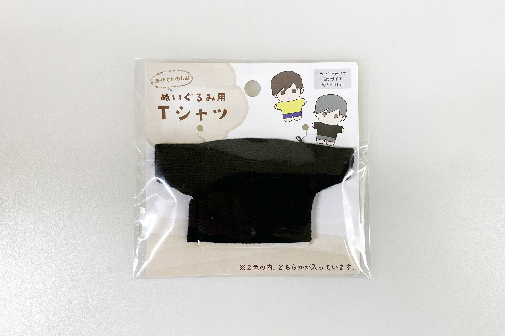
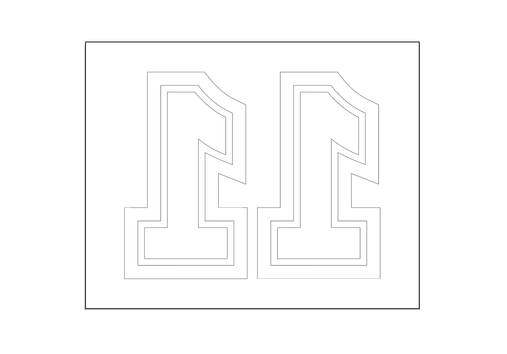
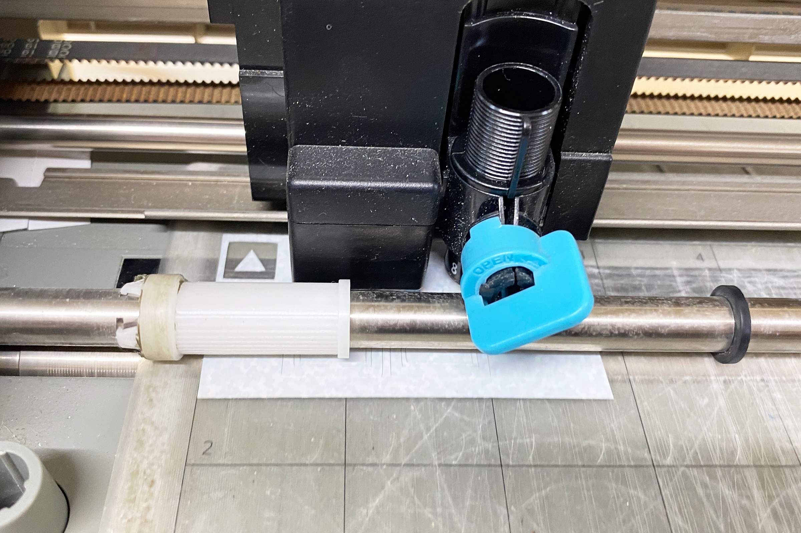
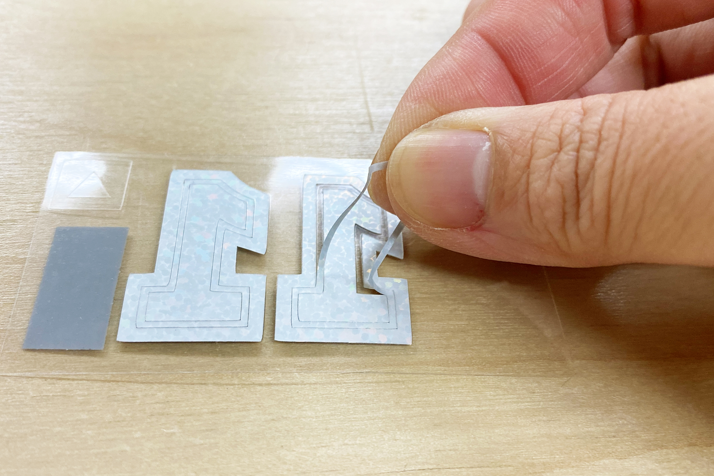
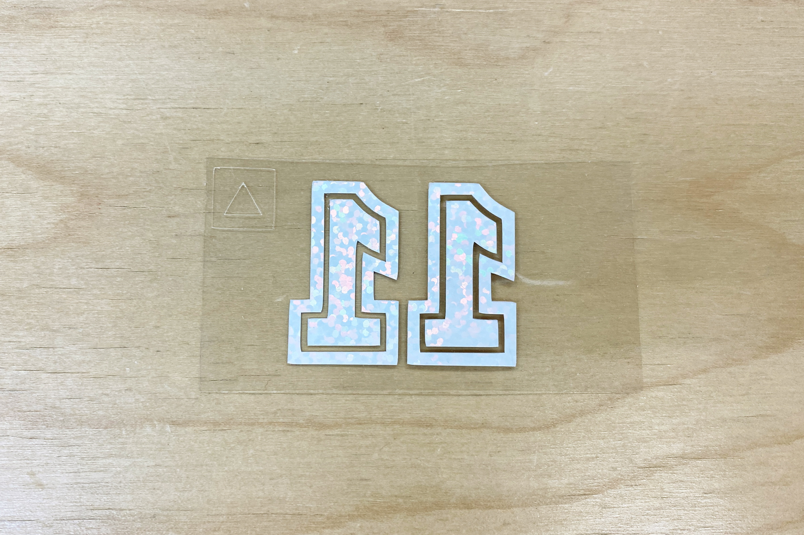
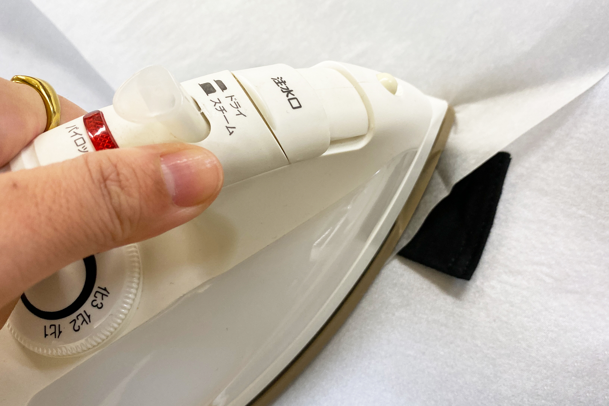
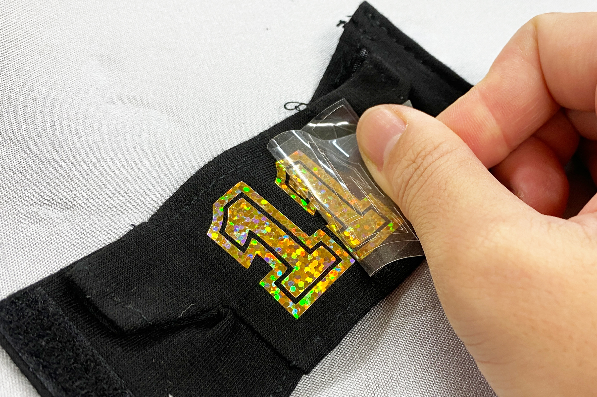
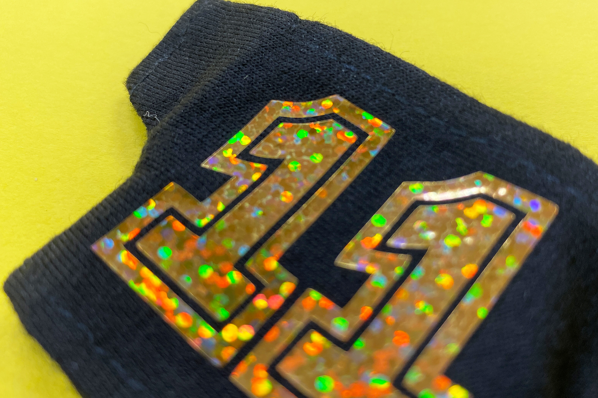

 

## **#11/25 [ 2024/12/11 ]** 
### by Shino ONODERA (FabLab SENDAI - FLAT)
  

  

### **材料**
* 着せてたのしむ ぬいぐるみ用 Tシャツ（セリア）
* 材質：ポリエステル
* サイズ：およそ横55 × 縦95 mm
* JANコード：4539314530881

 

  

### **技術**
* データ作成：Adobe Illustrator
* カッティングマシン： Silhouette CAMEO

  

### **材料**
* [カッティング用アイロンシート ホログラムミニドット RHM](https://europort.jp/products/iron-sheet/swz/a4-rhm-c)

  

### **作り方**

### **1.** 
今回は切り抜きのみを行うので、以下のように黒1色の線で図柄を描きました。 

  

### **2.** 
使用したアイロンシートは、表面に透明なフィルムが貼られています。そのため、アイロンシートは透明フィルムが下に来るように（糊面が上に来るように）カッティングマシンにセットして加工を行います。 

  

### **3.** 
カットが完了したら、転写したくない不要な部分のアイロンシートを、透明フィルムから剥がします。 

  

このように、転写したい図柄のみが透明フィルムに貼り付いた状態にします。こうすることで、いくつかの独立したパーツによって構成された図柄でも、パーツの位置がズレることなく熱転写を行うことができます。 

  

### **4.** 
素材→アイロンシート→シリコンペーパーの順で重ね、アイロンで熱と圧を加えます。（今回はシリコンペーパーの代わりにクッキングシートを使用しました。） 

  

### **5.** 
アイロンシートが素材に貼り付き、触れるくらいの温度になったら透明フィルムを慎重に剥がします。透明フィルムを剥がしたら、再度シリコンペーパーを重ねてアイロンでプレスします。 

  

### **6.** 
触れるほどの温度になったら完成！ 

  

位置ズレすることなく、綺麗に転写されています。 

  

今回は1色で作りましたが、ものによっては重ね貼りできるアイロンシートもあるので、多色で図柄を表現することもできます。布物に図柄を入れる方法は色々ありますが、今回のようにカッティング用アイロンシートを使用すると、ラメや蓄光など様々な材質の図柄を入れられるのも面白いところです。

  

（Last Updated: 2025.11.13）
