 

## **#12/25 [ 2024/12/12 ]** 
### by Shino ONODERA (FabLab SENDAI - FLAT)
  

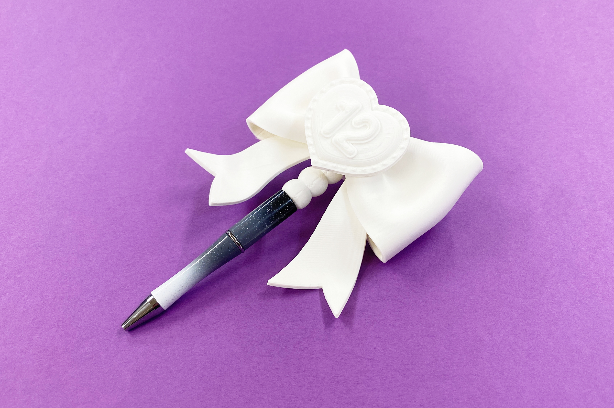

  

### **材料**
* 作ってたのしい！ビーズボールペン（セリア）
* 材質：ABS樹脂、スチール
* サイズ：長さ約144mm
* JANコード：4954939029471

 

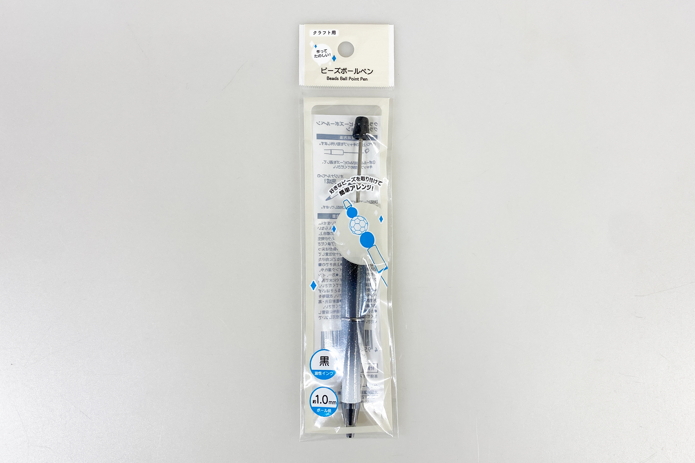

  

### **技術**
* データ作成：Adobe Illustrator
* 3Dプリント： makerbot Replicator2

  

### **材料**
* PLA

  

### **作り方**

### **1.** 
今回は、Adobe Illustraotrの3D画像作成機能を使って、3Dモデルを作成しました。（押し出し：左上の濃い四角形、右上のピンク、水色の棒とハート型／回転：黄色／膨張：数字、紫色のハート、黄色いドットのハート） 

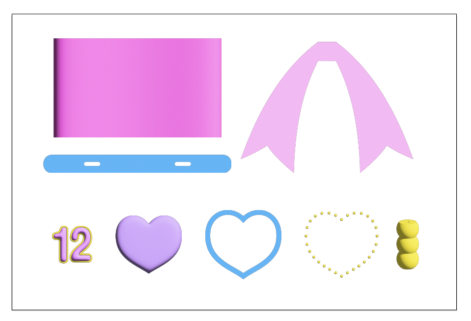

  

### **2.** 
Illustrator上では単体の3Dモデルの作成しかできないため、3Dプリンタ用のソフトウェア上で各パーツの位置調整を行いました。 

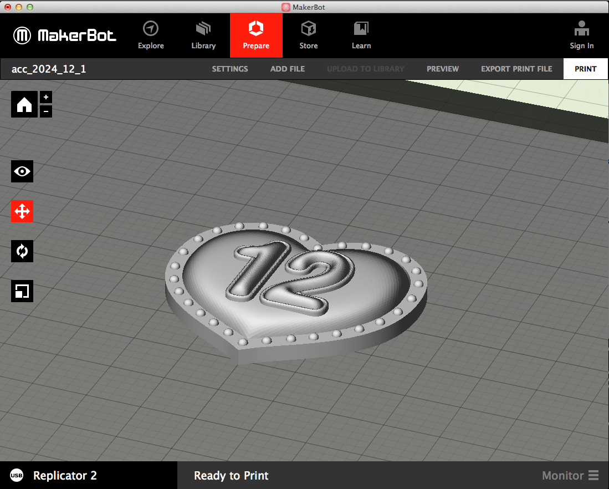

  

### **3.** 
全てのパーツのプリントが完了したら仕上げです。 
1.の左上 濃いピンクの四角形をヒートガンで加熱します。 

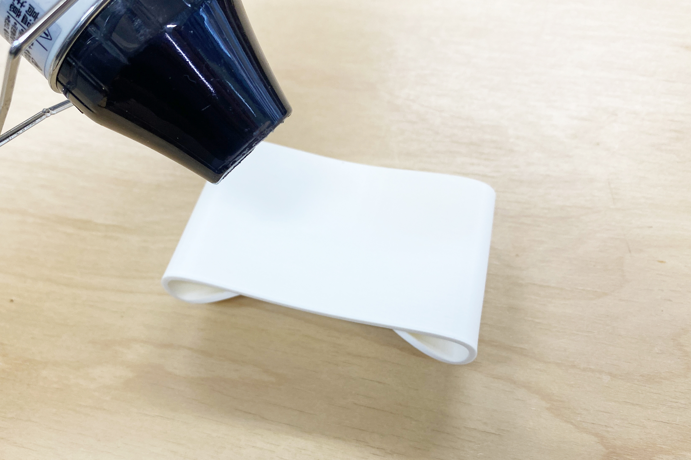

  

パーツが柔らかくなったら中心をつまんで形を整え、固定したまま冷まします。 

    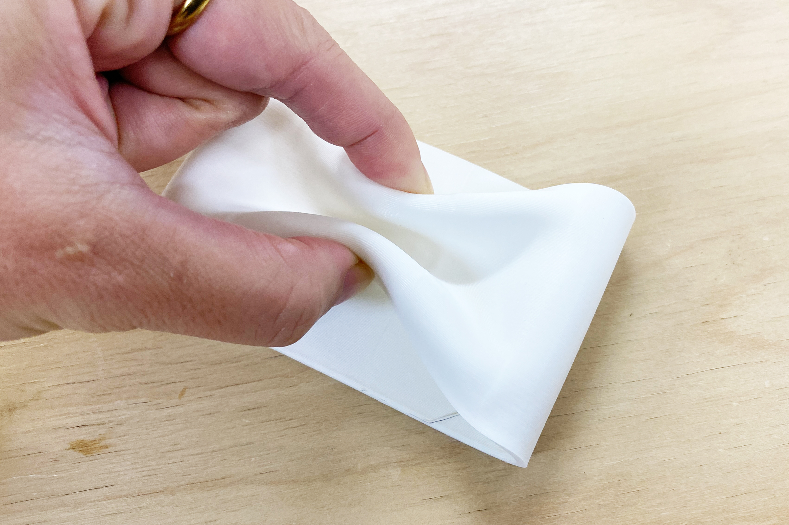
    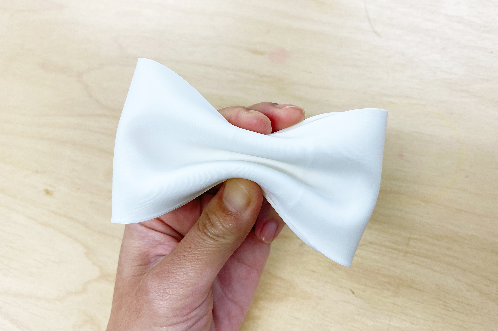

  

### **4.** 
今回使用するボールペンは、キャップを外すと軸にビーズなどを通すことができるようになっているので、3Dプリントしたパーツを取り付けていきます。 

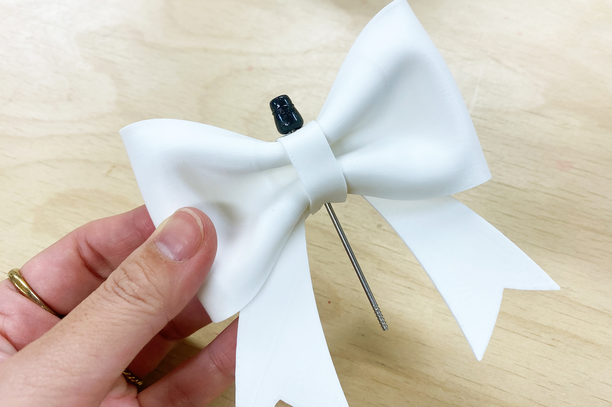

  

### **5.** 
3Dプリントした全てのパーツを軸に挿したら完成！ 

  

リボンの先も加熱してウェーブを付けてみました。数字周りはプリントの荒さが見えますが、やすりがけをしたり下地をのせれば問題なさそうです。 

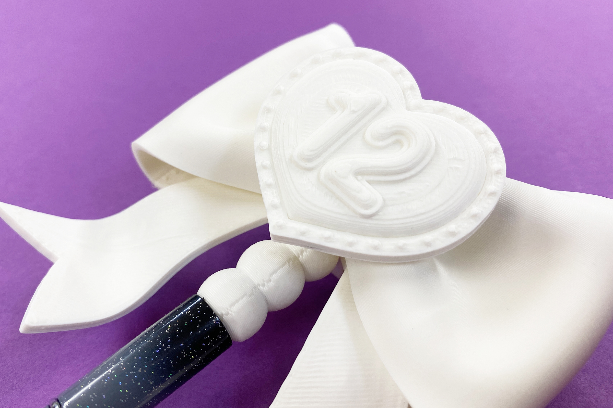
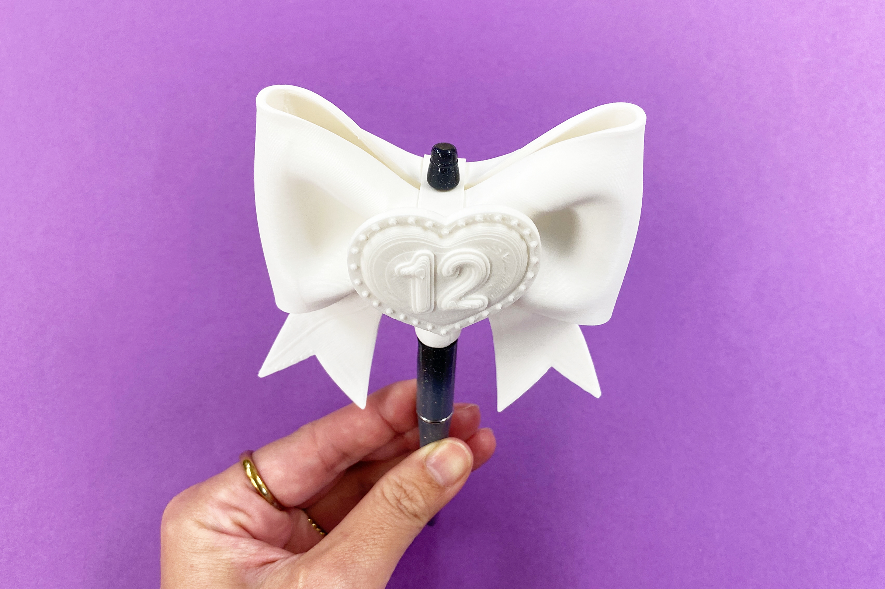
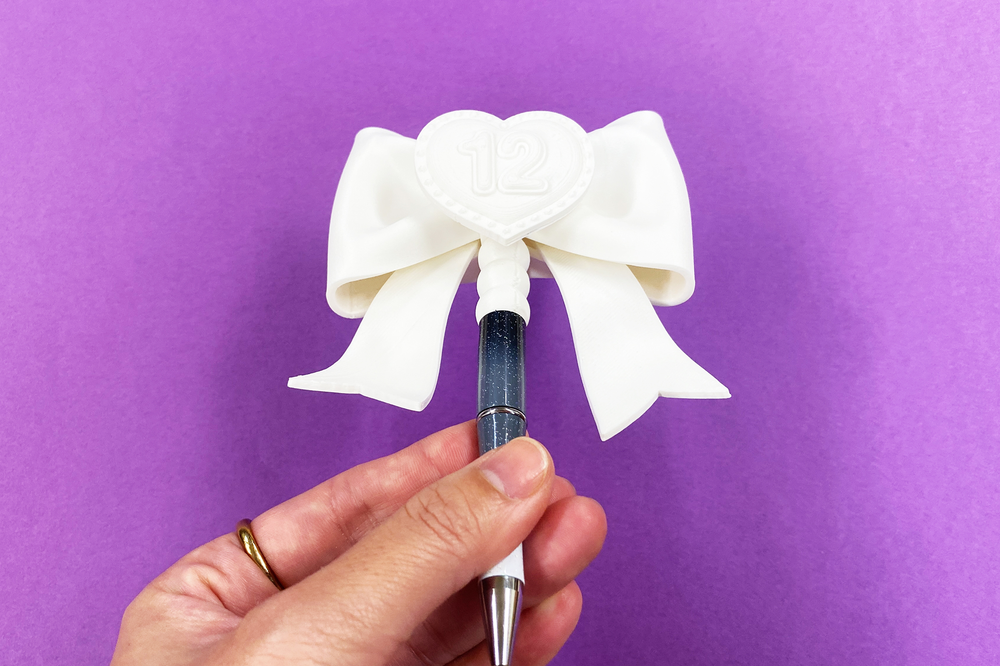

  

今回は白のみで作りましたが、色付きの材料を使ったり後で塗装したりすれば、よりそれっぽい仕上がりになりそうです。また、3DCADなどで3Dモデリングを行えなくても、イラレの機能や後加工をすればこういった立体物を作ることが可能です。ぜひぜひチャレンジしてみてください！

  

（Last Updated: 2025.11.13）
