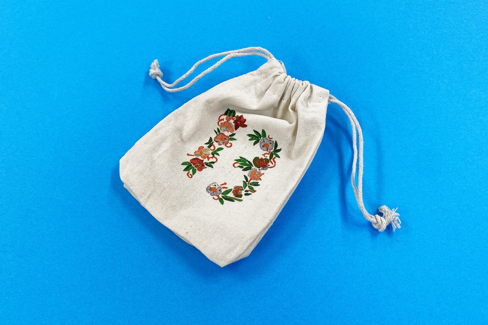
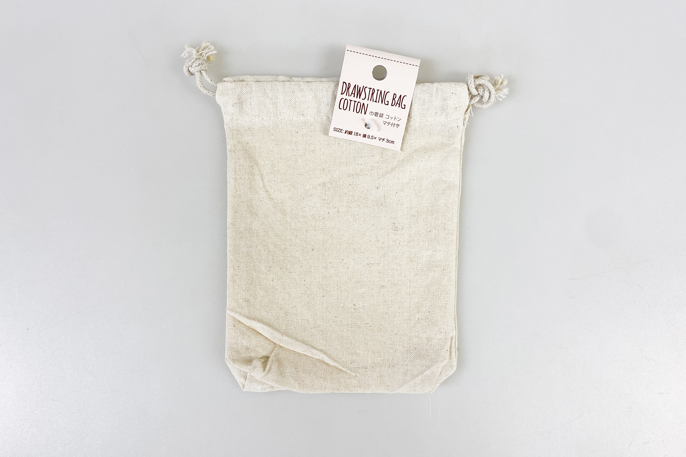
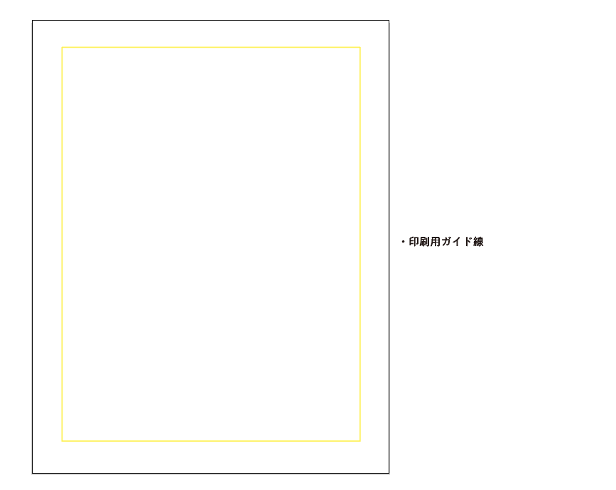
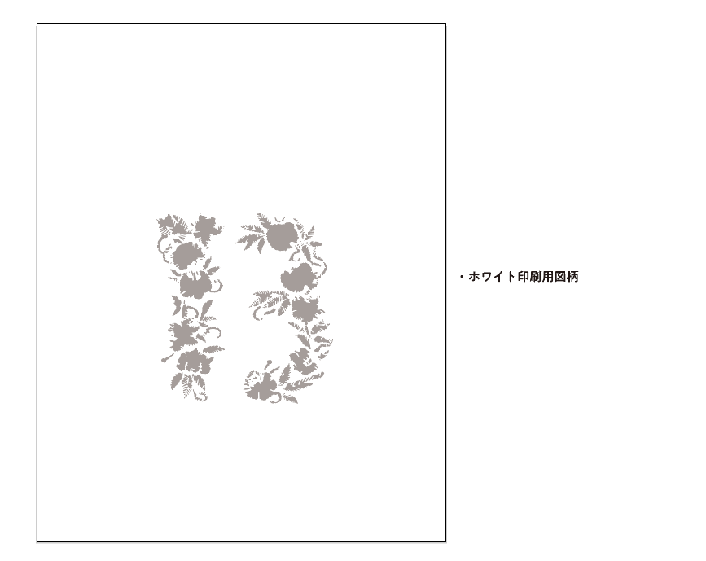
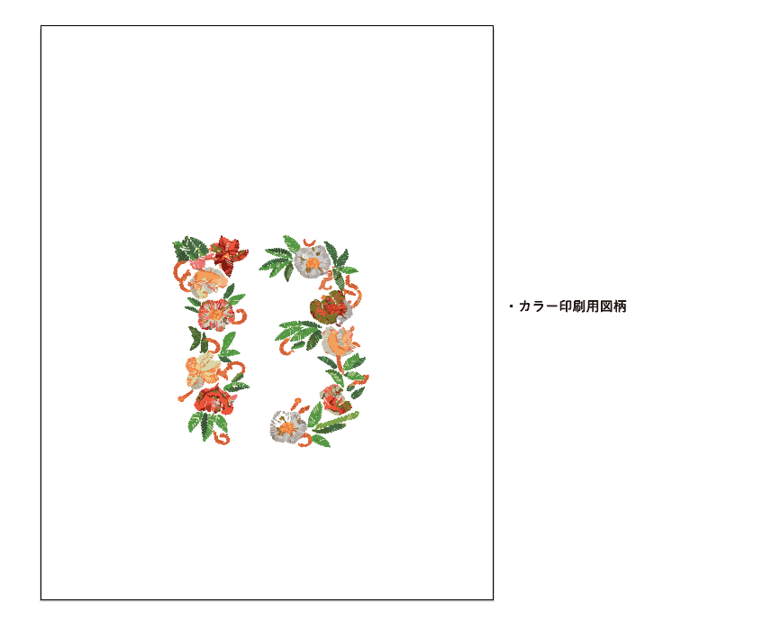
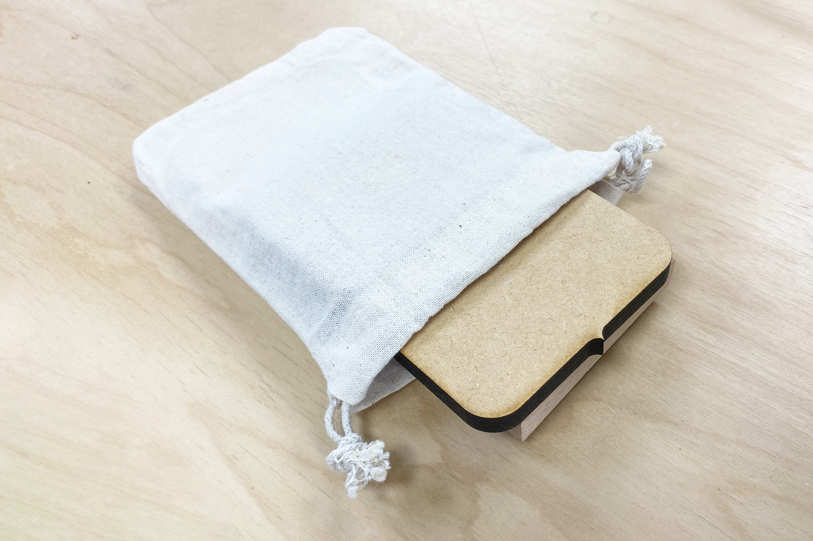
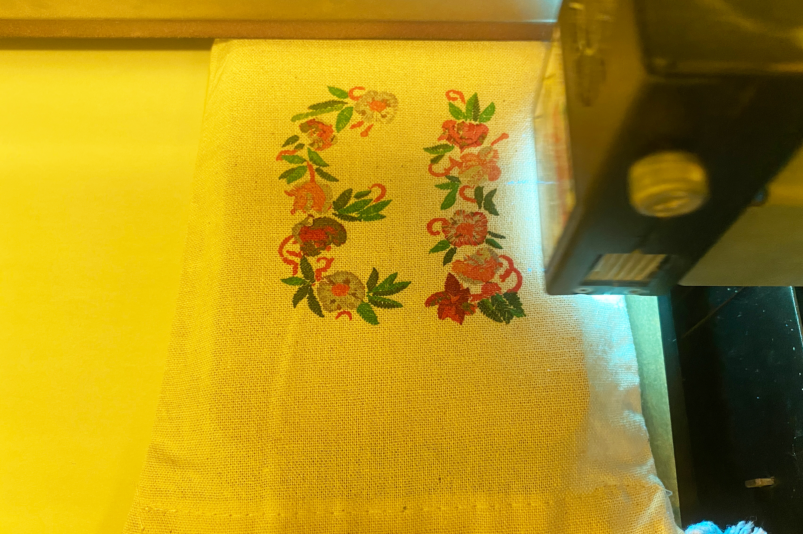
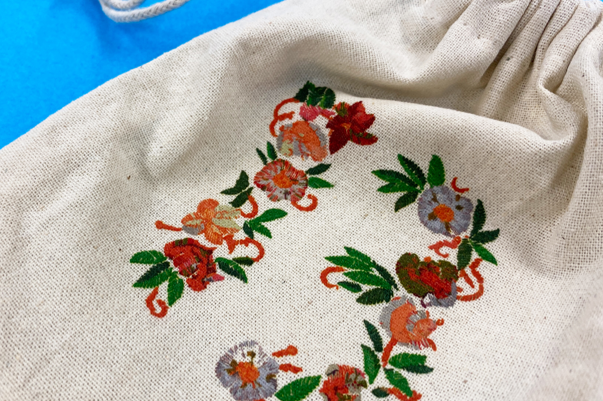

 

## **#13/25 [ 2024/12/13 ]** 
### by Shino ONODERA (FabLab SENDAI - FLAT)
  

  

### **材料**
* 巾着袋 コットン マチ付き（セリア）
* 材質：綿95%、ポリエステル5%
* サイズ：約 縦18 × 横 9.5 × マチ3 cm
* JANコード：4968583177631

 

  

### **技術**
* データ作成：Adobe Illustrator
* UVプリント： Roland LEF-12

### **作り方**

### **1.** 
今回は、刺繍のようなはっきりとした見た目にしたかったので、発色の向上と布へのインクの染み込みを防ぐために、ホワイトインクでも下地をプリントすることにしました。 

    
    

    

  

### **2.** 
巾着袋は、平らにしたときに袋部分よりも口部分が盛り上がっています。UV印刷ではインクのノズルと印刷面を近づける必要があるため、そのままUV印刷しようとすると口部分が邪魔になります。また、印刷面は平らにする必要もあるため、巾着袋の中に適当な板材を入れておきました。 

  

### **3.** 
今回は、ホワイトは1回、カラーは2回重ねてプリントしました。 

  

### **4.** 
UVプリントが完了したら完成！ 

  

写真ではわかりにくいですが、インクの盛り上がりと細かい線での描画によって刺繍っぽい見た目になったように思います。 

  

UVプリントの場合はインクを重ねるほど色が濃くなってやや沈んだ色味になっていきますが、もっと重ねの回数を増やすとより立体感が出て刺繍らしくなるかもしれません。刺繍ミシンと違って色に制限がなく手軽なので、簡易的な刺繍を表現するのにおすすめです。（口に入る可能性のあるものにはUVプリントを行うことはできないのでご注意ください。）

  

（Last Updated: 2025.11.13）
