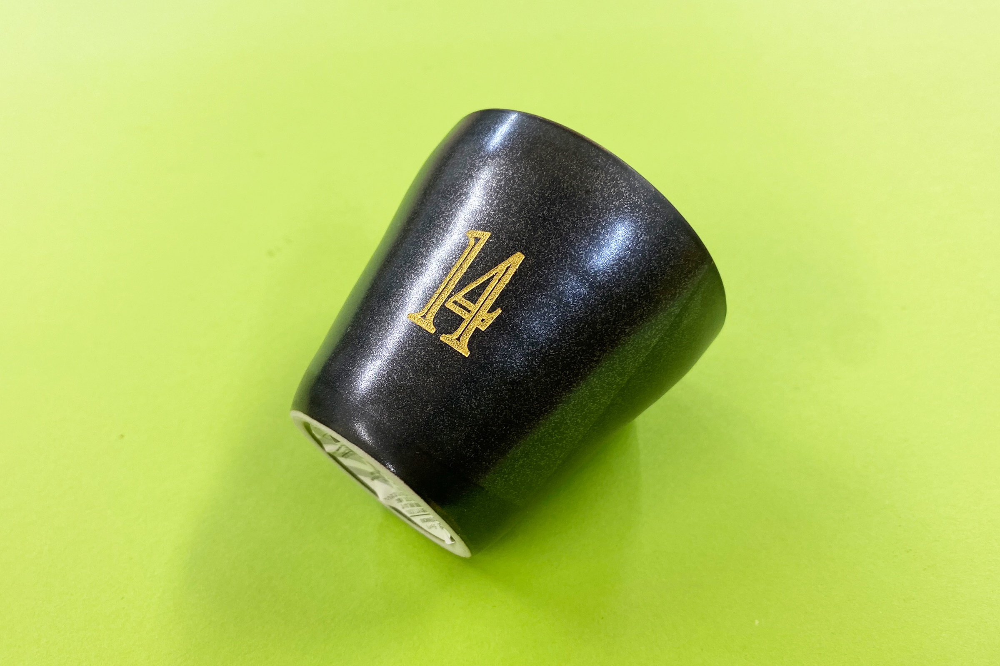
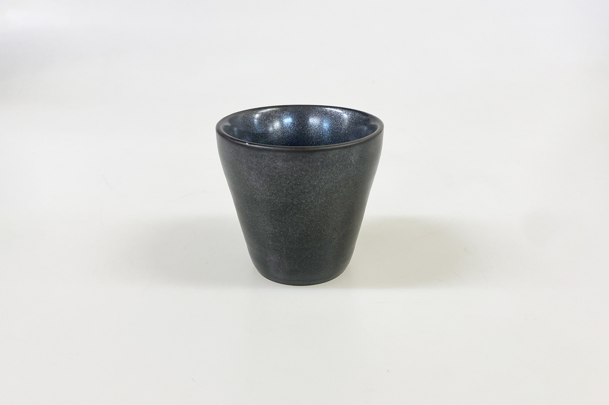
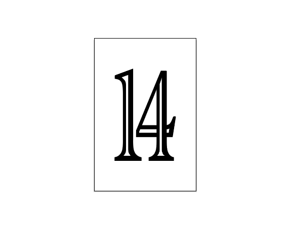
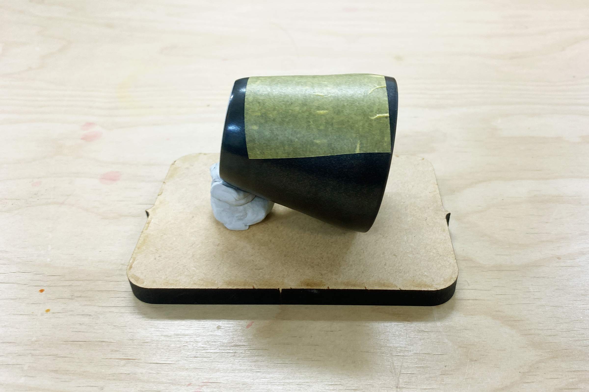
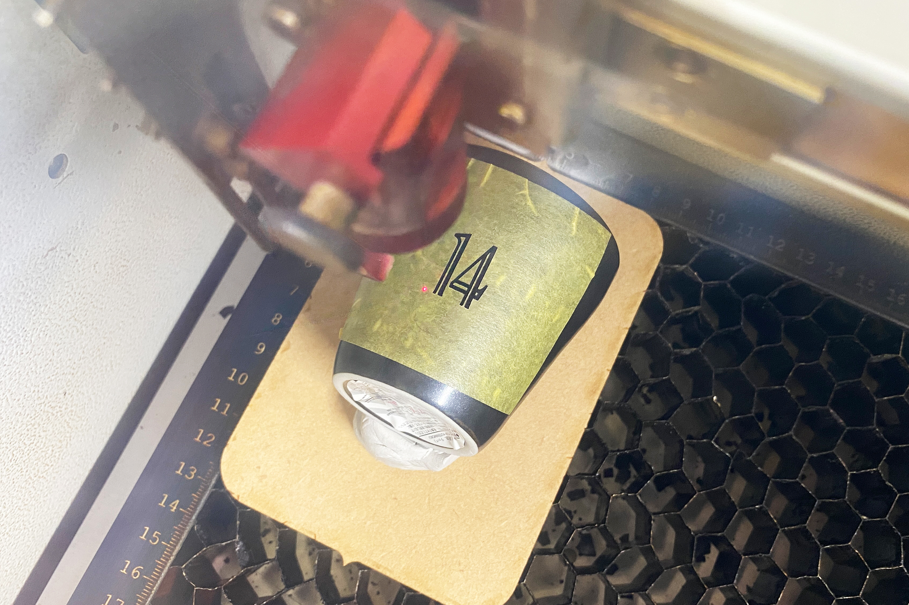
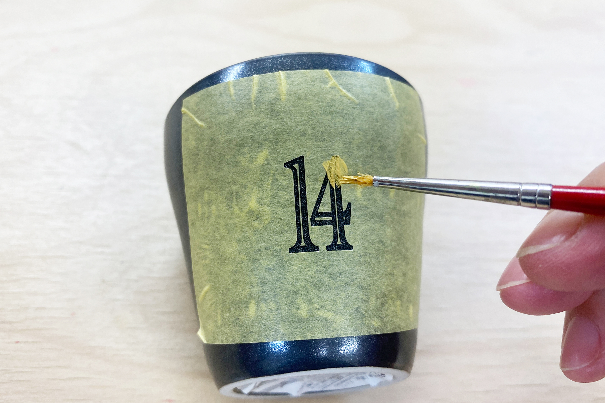
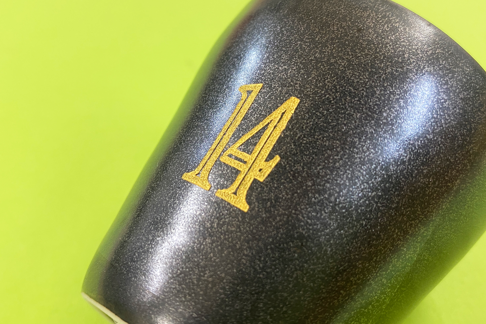

 

## **#14/25 [ 2024/12/14 ]** 
### by Shino ONODERA (FabLab SENDAI - FLAT)
  

  

### **材料**
* ぐい呑み（油天目、ラッパ）（DAISO）
* 材質：磁器
* サイズ：約 直径63 × 高さ60mm
* JANコード：4550480035611

 

  

### **技術**
* データ作成：Adobe Illustrator
* レーザーカッター：trotec speedy100

  

### **作り方**

### **1.** 

今回は彫刻加工のみを行うので、黒塗りの画像を使用します。このような加工の場合は、わざわざIllustratorなどのグラフィック作成ソフトではなく、PowerPointやGoogleスライドのように何らかの図が描けるソフトを使用して加工用データを作成しても問題ありません。 

  

### **2.** 

彫刻加工を行う面にマスキングテープを貼ります。また、彫刻面が平らになるようにひっつき虫（コクヨ）を使って角度を調整し台座に固定しました。 

  

### **3.** 

レーザーカッターにセットし彫刻加工を行います。今回は、パワー25、スピード10、エアアシストオフで、4回加工しました。 

  

### **4.** 

マスキングテープを貼ったまま、彫刻をした部分に絵の具を塗ります。今回は見本品の制作なので、アクリル絵の具を水で薄めずに使用しました。 

  

### **5.** 

マスキングテープを剥がしたら完成！ 

  

彫刻加工をして凹んだところに絵の具が入っているので、擦れによるインクの剥がれが起こりにくいのがこの方法のメリットです。 

  

今回は磁器を使用しましたが、アクリル板や木材などにもこの方法で色付けを行うことができます。尚、食器類に色付けを行う場合は、食品衛生法に適合した塗料の使用がおすすめです。

  

（Last Updated: 2025.11.13）
