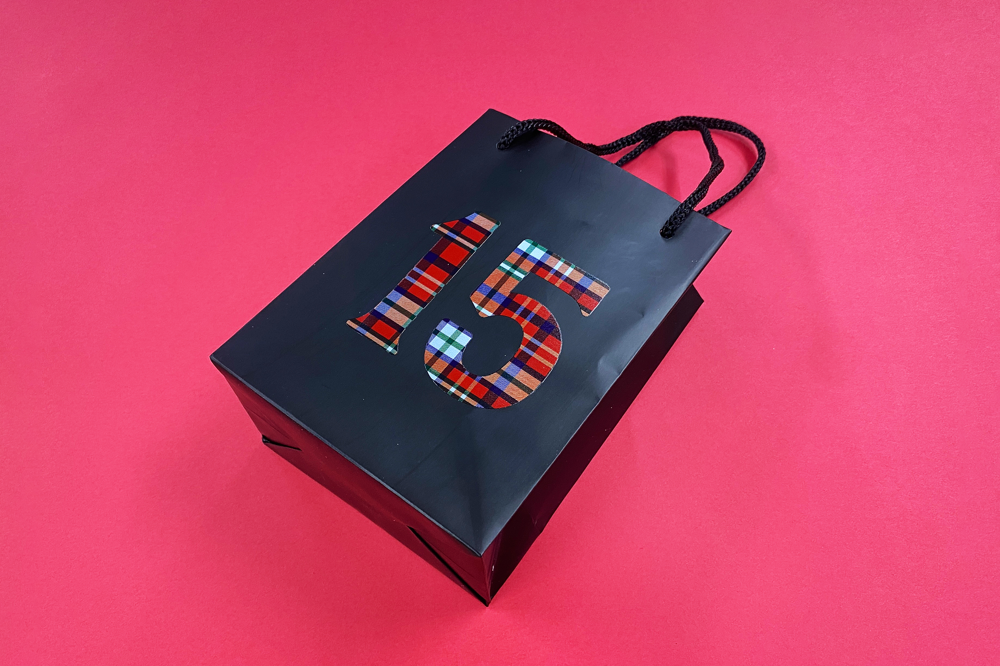
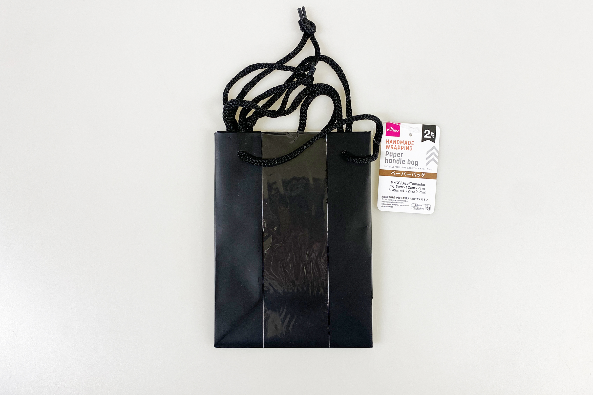
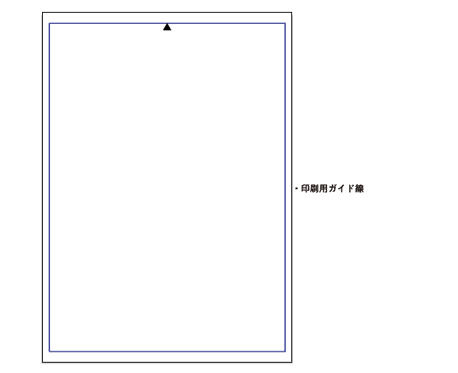
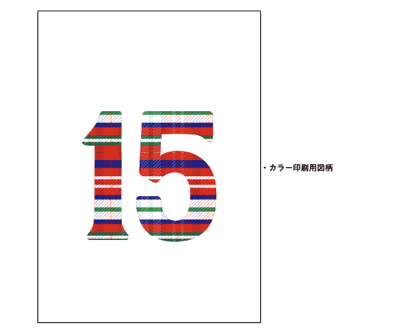
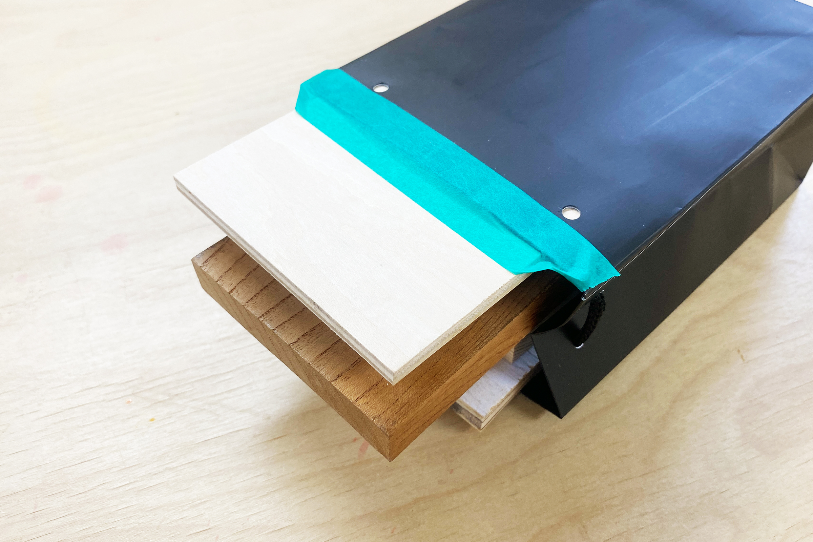
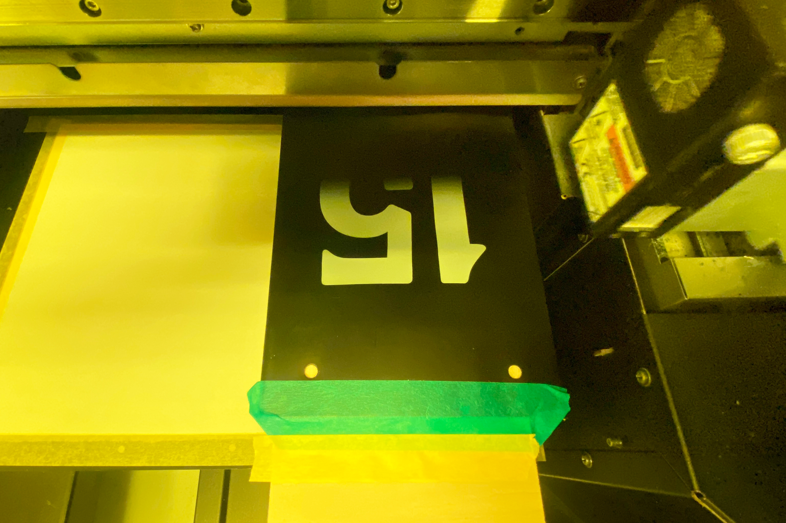
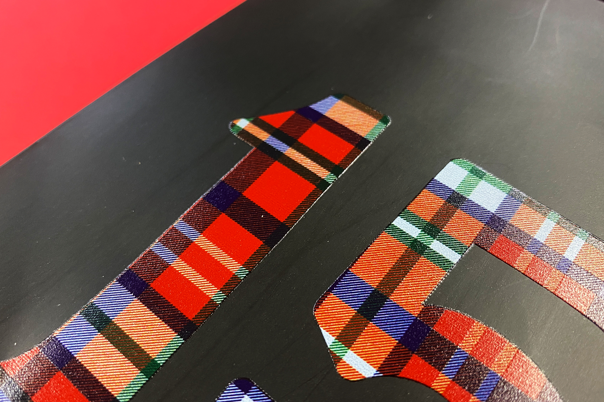

 

## **#15/25 [ 2024/12/15 ]** 
### by Shino ONODERA (FabLab SENDAI - FLAT)
  

  

### **材料**
* ペーパーバッグ（DAISO）
* 材質：紙、ポリエステル
* サイズ：約 縦16.5 × 横12 × マチ7cm
* JANコード：4997642171334

 

  

### **技術**
* データ作成：Adobe Illustrator
* UVプリント： Roland LEF-12

### **作り方**

### **1.** 
地の色が濃い場合、図柄を綺麗に発色させるためにはホワイトインクでの下地のプリントが必須です。（カラー印刷用画像で白色になっている部分は、カラーインクでは印刷されません。） 

    
    

    

  

### **2.** 
UV印刷ではインクのノズルと印刷面を近づける必要があり、できるだけ印刷面全体を平らにしたいため、紙袋の紐を取り外して板材を入れました。 

  

### **3.** 
今回は、ホワイトは1回、カラーは2回重ねてプリントしました。 

  

### **4.** 
UVプリントが完了したら完成！ 

  

細かな線まで綺麗に発色しています。 

  

白を印刷できるプリンターはあまり無いので、濃い色の素材に印刷をしたいという場合にもUVプリンタはとてもおすすめです！

  

（Last Updated: 2025.11.13）
