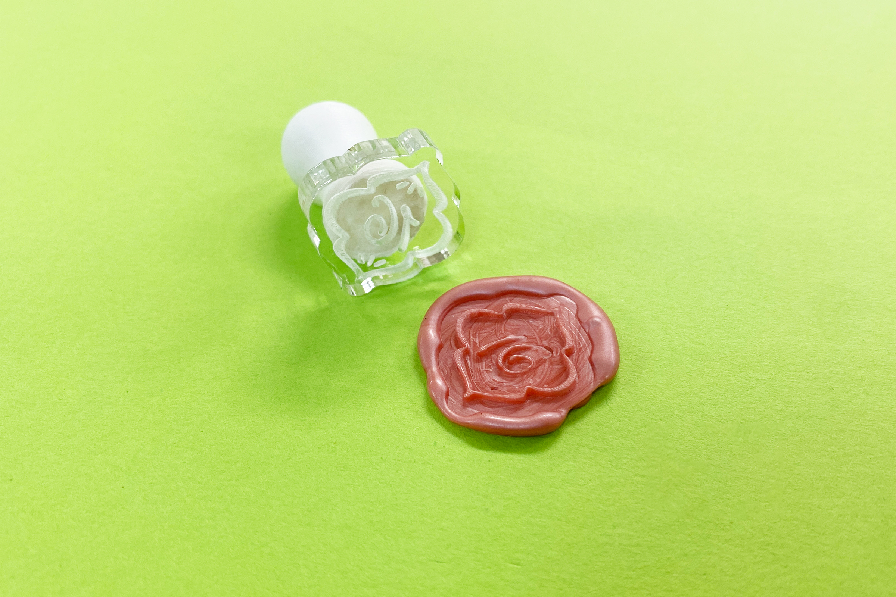
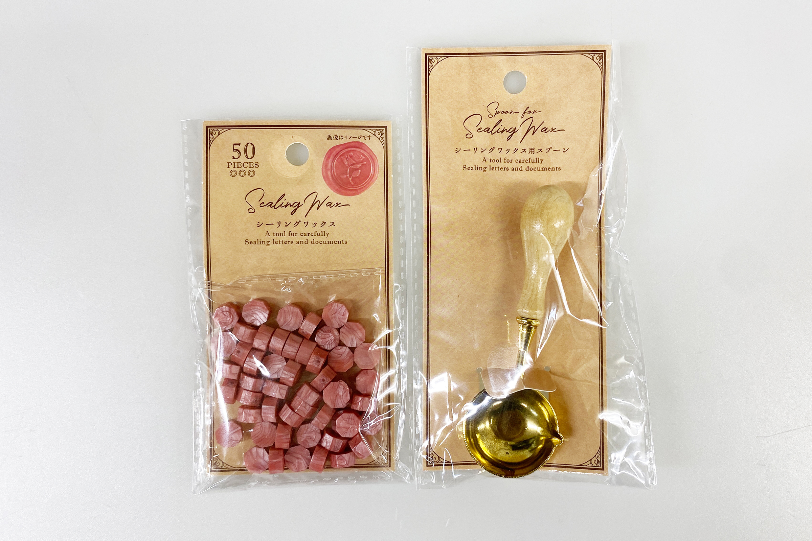
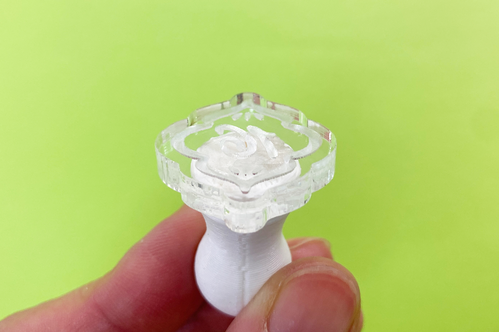
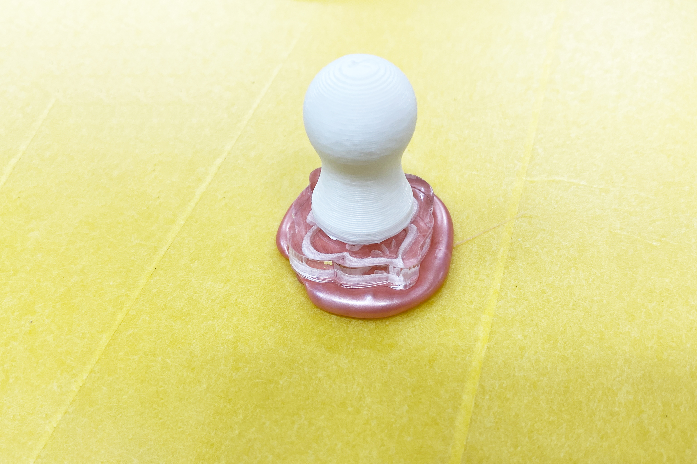
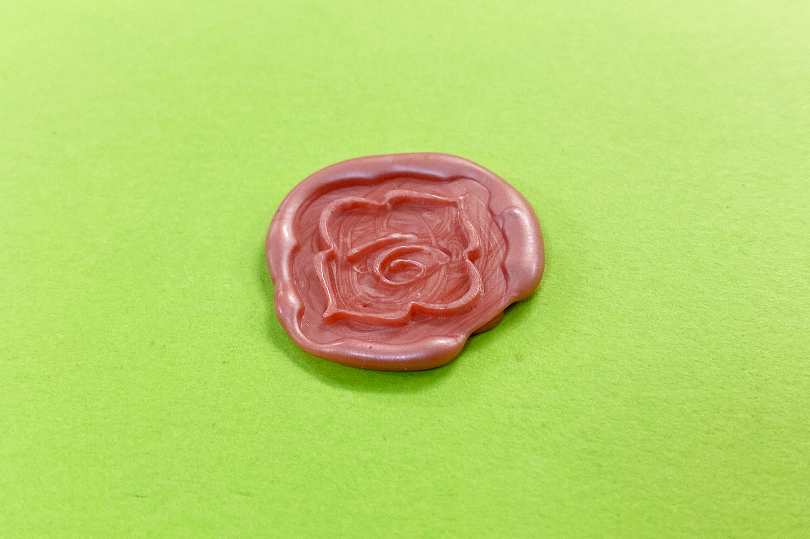

 

## **#16/25 [ 2024/12/16 ]** 
### by Shino ONODERA (FabLab SENDAI - FLAT)
  

  

### **材料**
* シーリングワックス、シーリングワックス用スプーン（セリア）
* JANコード：4978929912956、4978929912963

 

  

### **技術**
* データ作成：Adobe Illustrator
* レーザーカッター：trotec Speedy100
* 3Dプリント：makerbot Replicator2

  

### **材料**
* アクリル板（5mm厚）
* PLA

  

### **作り方**

### **1.** 
左がレーザー加工用のスタンプ面データ、右が3Dプリント用の持ち手データです。3Dプリント用のデータは、Adobe Illustratorの3D画像作成機能（回転）で作成しました。 

  

### **2.** 
レーザーカットしたスタンプ面と、3Dプリントした持ち手パーツを貼り合わせます。 

  

### **3.** 
マスキングテープを貼った板にシーリングワックスを垂らし、スタンプを押します。 

  

### **4.** 
ワックスが冷えて固まったら完成！ 

  

数字上下の細かな点模様は小さすぎたためか上手く転写されませんでしたが、それ以外の図柄はくっきり盛り上がりました。 

  

今回は普通のレーザー彫刻を行いましたが、彫刻の深さを場所によって変えたり写真彫刻モードを使用すれば、より複雑な模様を作ることもできそうです。

  

（Last Updated: 2025.11.13）
