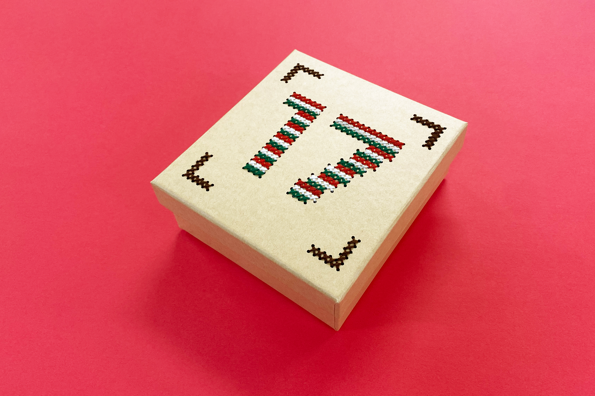
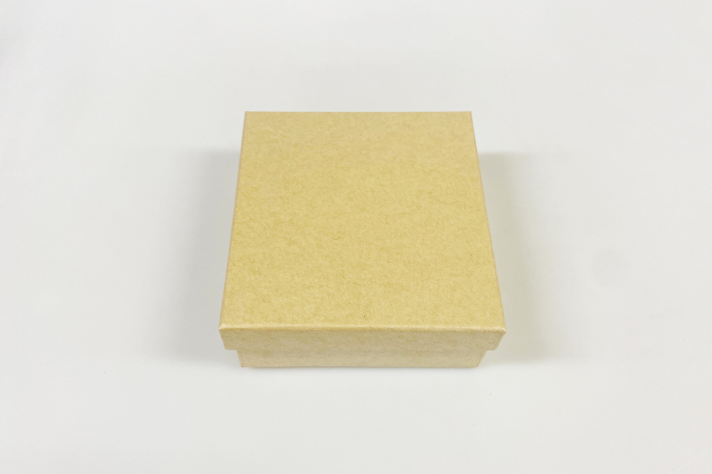
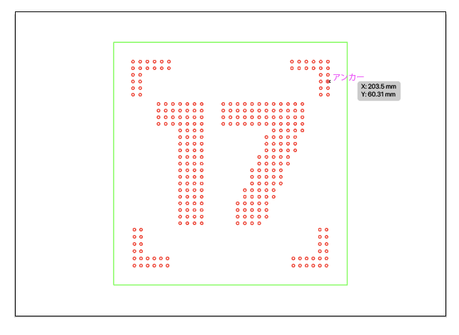
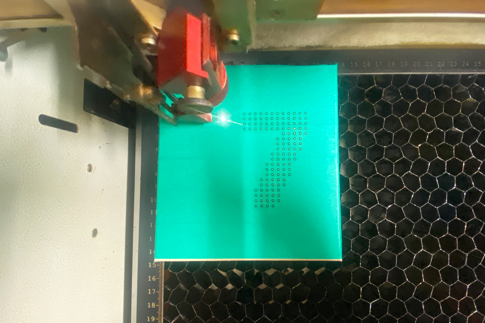
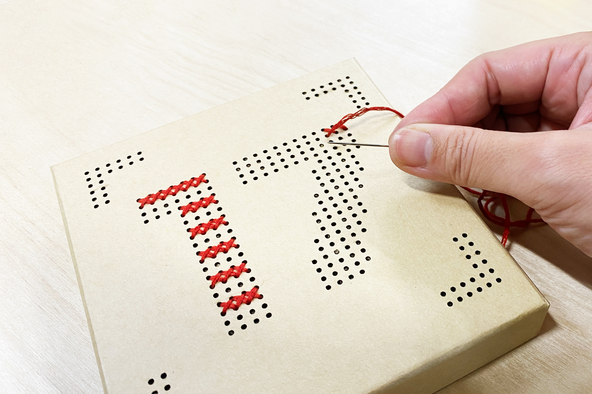
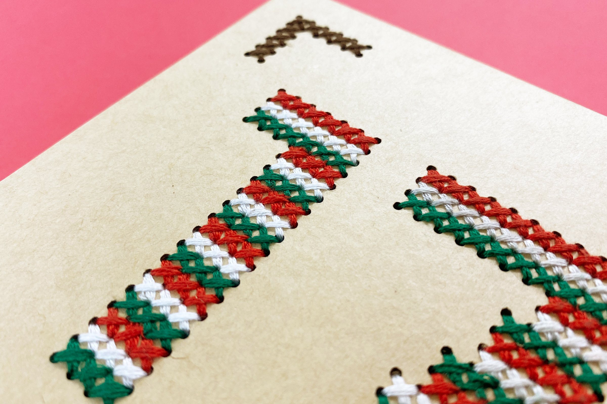

 

## **#17/25 [ 2024/12/17 ]** 
### by Shino ONODERA (FabLab SENDAI - FLAT)
  

  

### **材料**
* クラフト紙ボックス（DAISO）
* 材質：クラフト紙
* サイズ：約 横13 × 縦14 × 高さ5.1cm
* JANコード：4549131672398

 

  

### **技術**
* データ作成：Adobe Illustrator
* レーザーカッター： trotec Speedy100

  

### **材料**
* 刺繍糸

  

### **作り方**

### **1.** 
赤は切り抜き線、緑はデータと素材の位置合わせ用のガイド線です。穴の大きさは直径1.5mmにしました。 

  

### **2.** 
焦げやヤニの付着防止のために、蓋の全面にマスキングテープを貼ってレーザーカットします。 

  

### **3.** 
レーザーカットが完了したら、マスキングテープを剥がして刺繍をしていきます。 

  

### **4.** 
刺繍が完了したら完成！ 

  

穴に合わせて糸を通していくので、縫い目のズレなどを気にする必要なくとてもスムーズに作業を行うことができました。 

  

今回はクロスステッチで刺繍をしましたが、もちろん穴のあけ方次第で色々な縫い方が可能です。また、紙以外にもレーザーカットできるものであればこのような穴あけができるので、ぜひ色々な素材で試してみてください！

  

（Last Updated: 2025.11.13）
