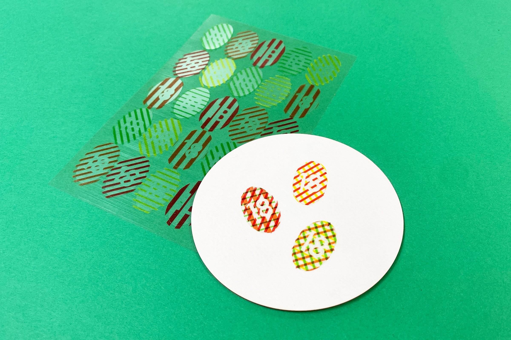
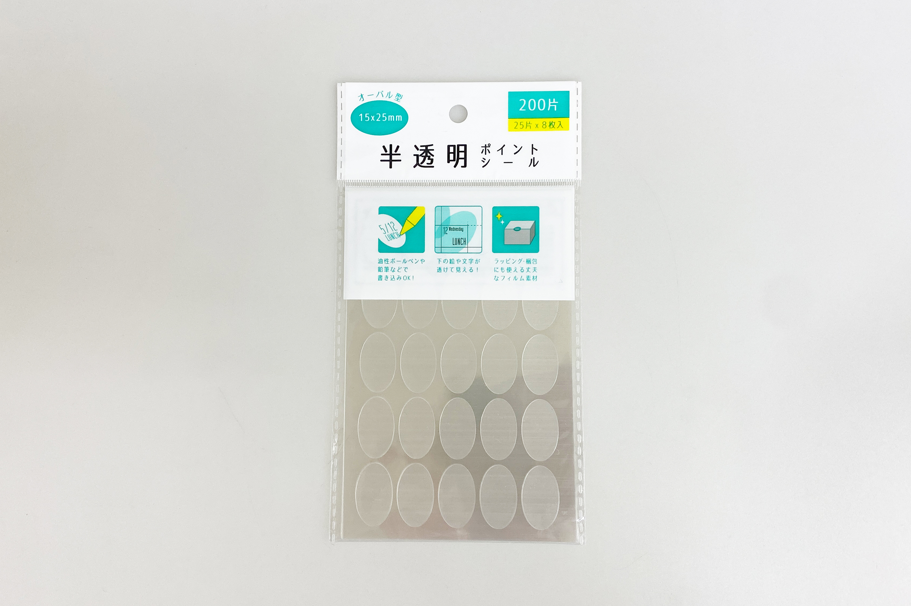
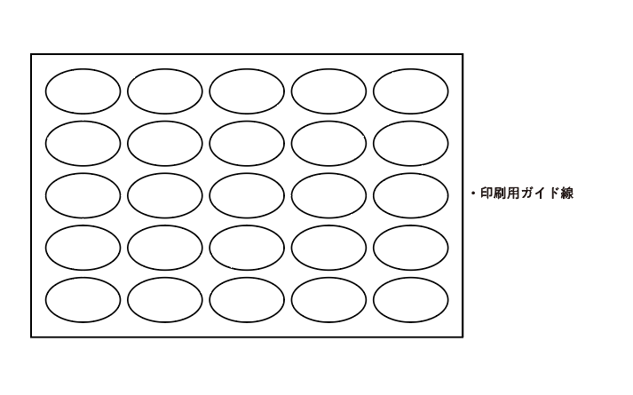
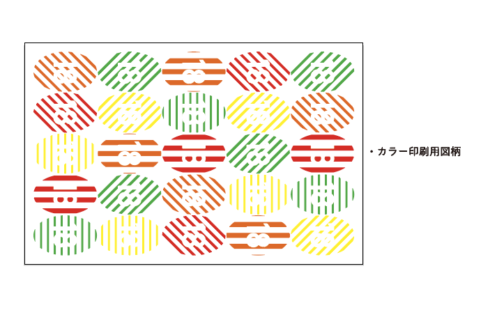
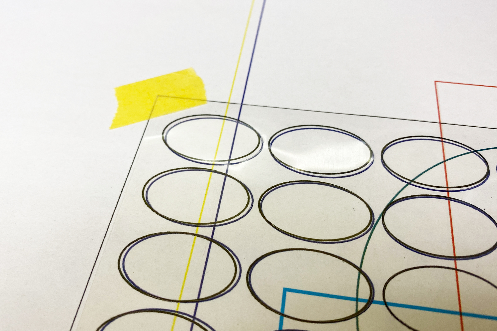
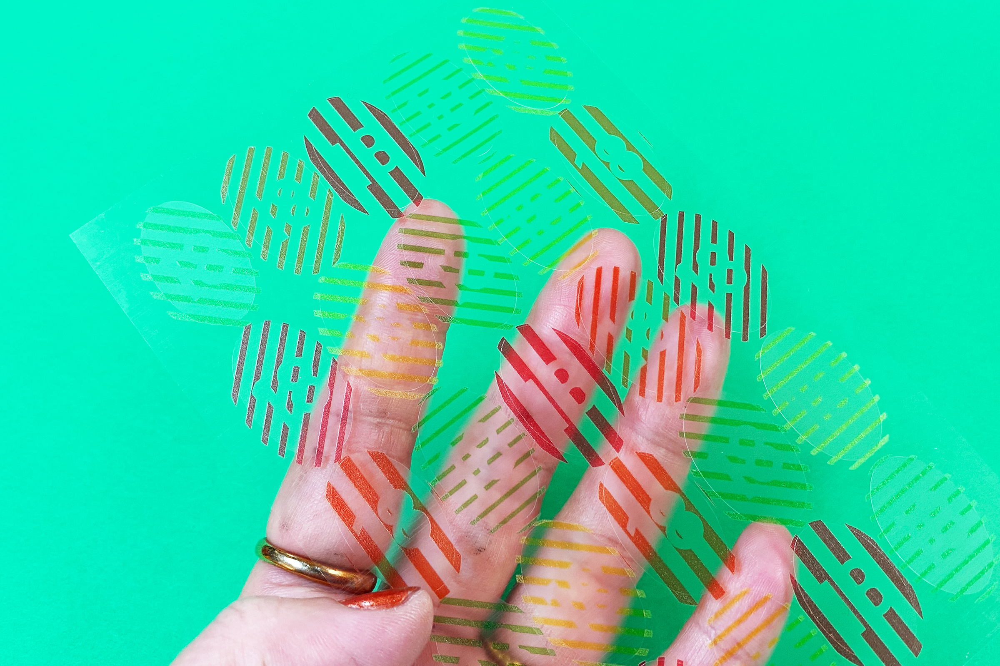
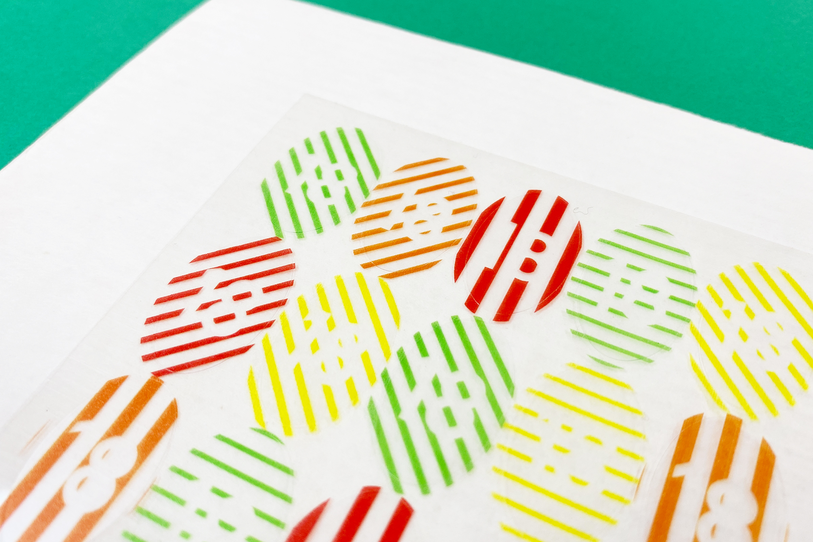
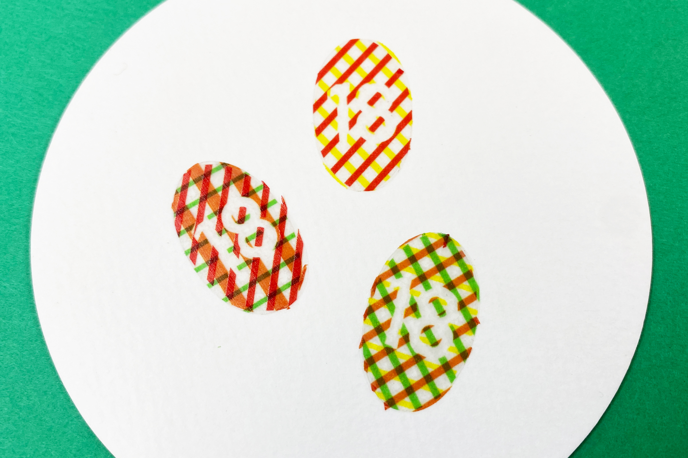

 

## **#18/25 [ 2024/12/18 ]** 
### by Shino ONODERA (FabLab SENDAI - FLAT)
  

  

### **材料**
* 半透明ポイントシール オーバル型（セリア）
* 材質：PET
* サイズ：シール1片 15 × 25mm（200片入り）
* JANコード：4904342996286

 

  

### **技術**
* データ作成：Adobe Illustrator
* UVプリント： Roland LEF-12

  

### **作り方**

### **1.** 
今回はカラーインクのみを使用するので、データはとてもシンプルです。シールの面いっぱいに図柄をプリントしたかったので、カラー印刷用の図柄はシールよりも周囲に1mmはみ出すように大きめに作成しています。 

    
    

  

### **2.** 
今回のように薄い素材や軽い素材は、UVプリンタでの印刷中にノズルの動きによって位置がズレる可能性があるため、UVプリンタの印刷代にマスキングテープ等で固定しておく必要があります。 

  

### **3.** 
印刷が完了したものがこちらです。白いインクを使用していないので、カラー印刷した箇所も向こう側が透けて見えます。 

  

シールの下に白い紙を敷くとこんな感じです。 

  

単品では中心の数字がかなり見えにくいので、好きなシールを重ねて貼っていきます。 

  

### **4.** 
シールを好きなだけ貼ったら完成！ 

  

模様が重なり合った部分の色の出方や、ちょっとした図柄の位置ズレも可愛く見えますね。 

  

今回は格子柄にしましたが、着せ替え人形のようなイラストや風景画など、様々な図柄で展開しても面白そうです。

  

（Last Updated: 2025.11.13）
