 

## **#19/25 [ 2024/12/19 ]** 
### by Shino ONODERA (FabLab SENDAI - FLAT)
  

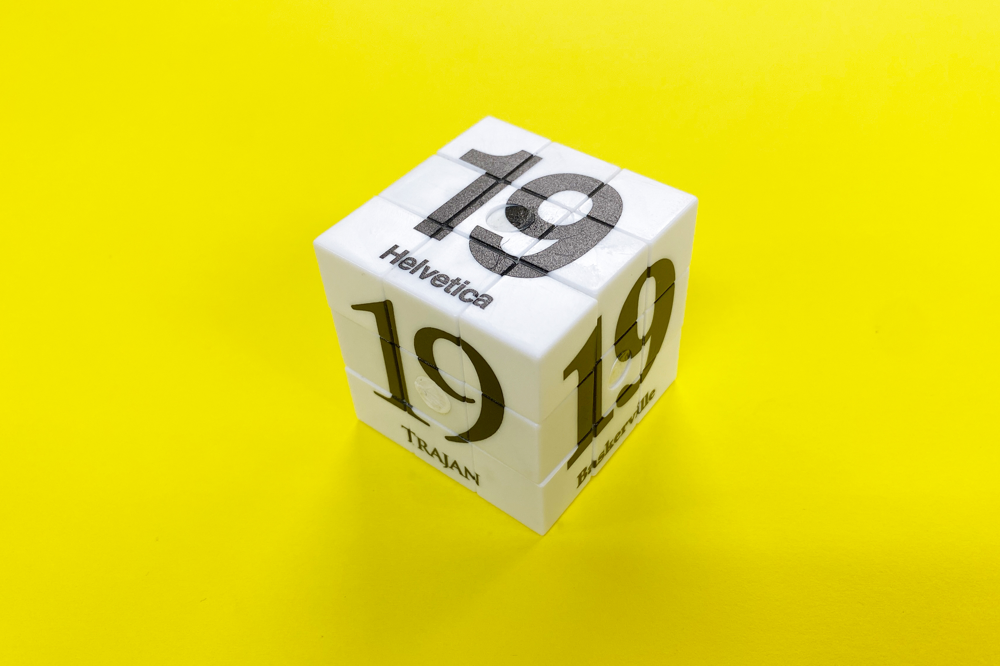

  

### **材料**
* 6面パズル（セリア）
* 材質：ポリスチレン
* サイズ：約4.5cm
* JANコード：4513750146660

 

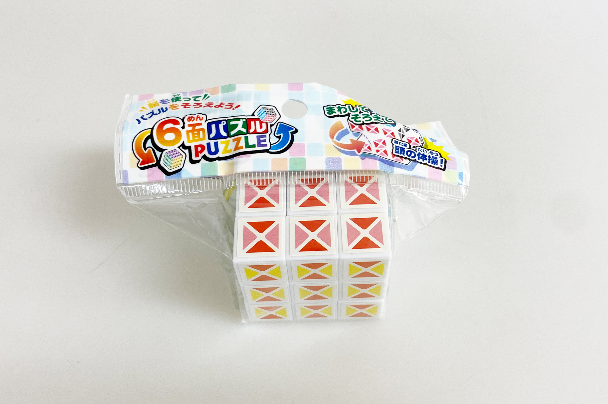

  

### **技術**
* データ作成：Adobe Illustrator（図柄）, Rhinoceros（穴を塞ぐためのパーツ3Dモデリング）
* UVプリント： Roland LEF-12
* 3Dプリント：makerbot Replicator2

  

### **作り方**

### **1.** 
様々なフォントによる「19」をプリントすることにしました。尚、今回使用する素材は元々白いため下地は不要です。 

    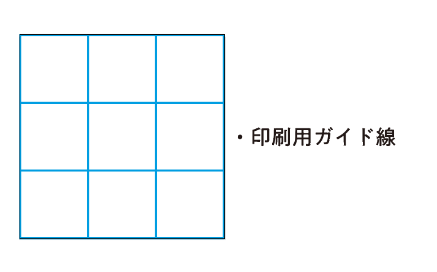
    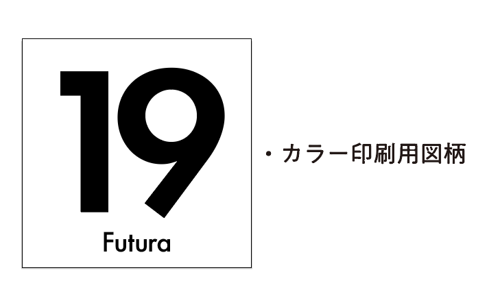

    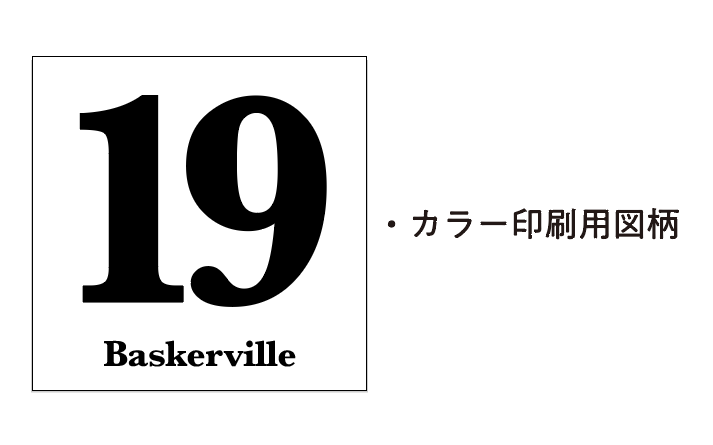
    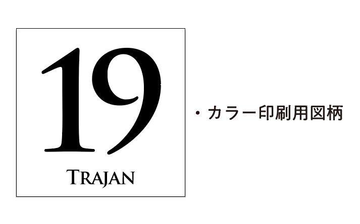

    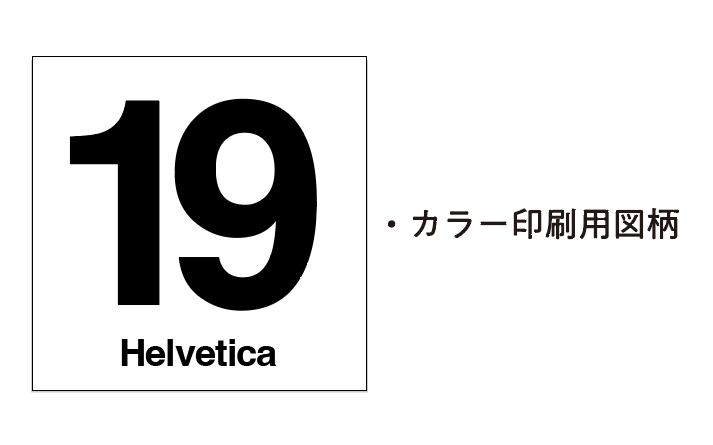
    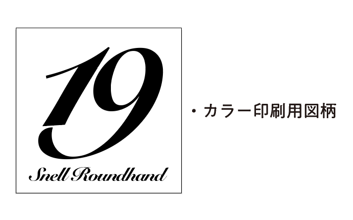

    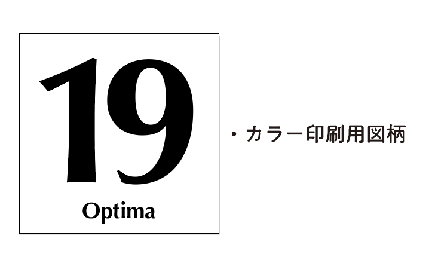

  

### **2.** 
パズル本体にはシールが貼られていたため、まずはそれを剥がすところから。カッターやピンセットでコツコツ剥がし、残った部分は消しゴムで落とすという方法も可能ですが、今回はより早く作業を済ませたかったのでソルベントという剥離剤を使用しました。 

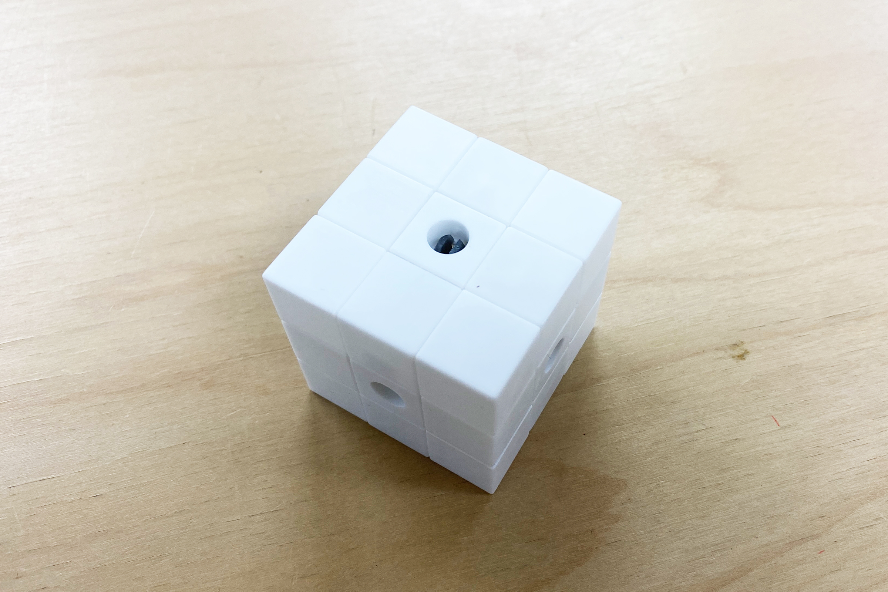

  

### **3.** 
更に、各面の中心に穴が空いていたため、それを塞ぐためのパーツを3Dプリントして使用しました。 

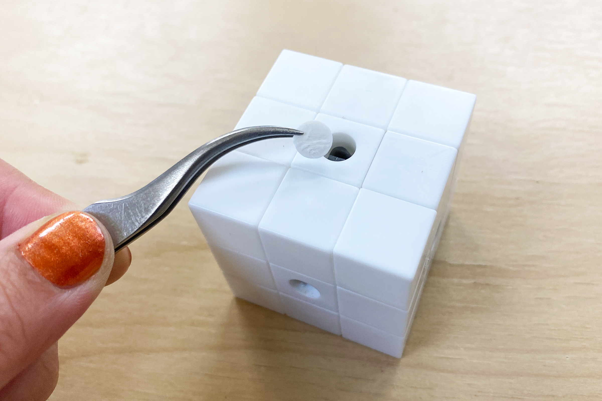

  

### **4.** 
UVプリントをしたら完成！ 

  

作業自体は非常にシンプルですが、写真などをプリントしたらちょっとしたギフトなどにも良さそうです。 

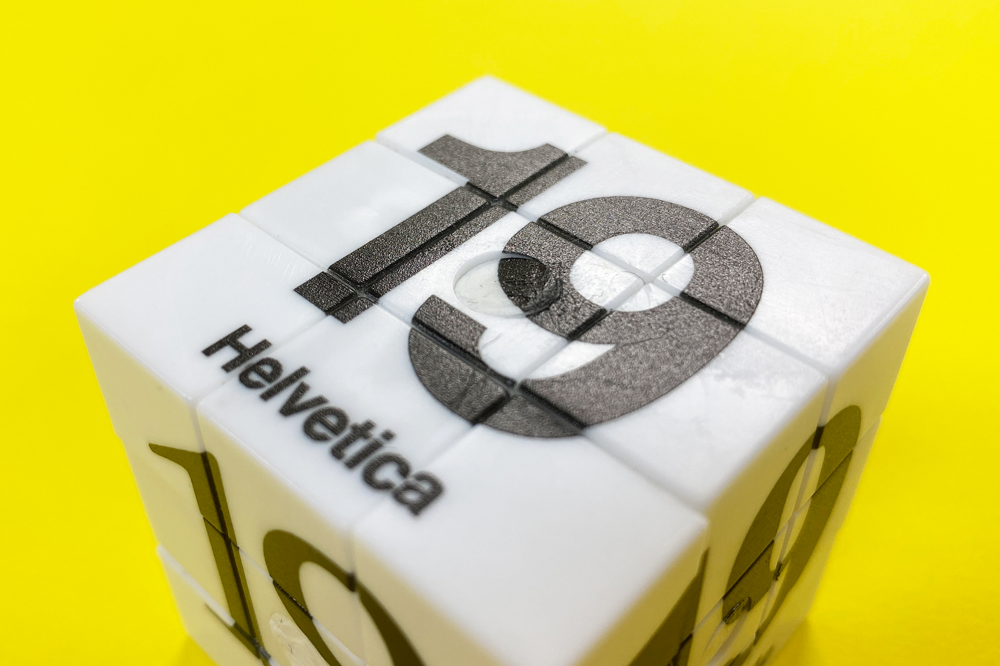

  

今回は各面の内側に図柄を印刷しましたが、縁まで図柄を印刷したい場合は、余計なインクの付着を防ぐために側面にマスキングテープを貼っておくと安心です。

  

（Last Updated: 2025.11.13）
