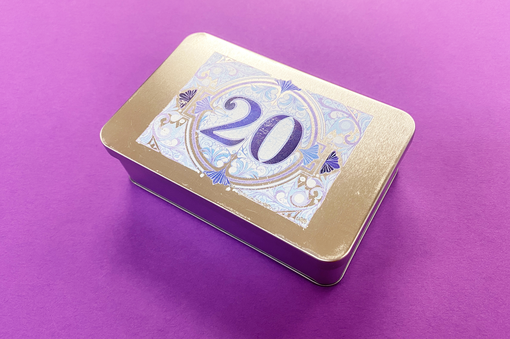
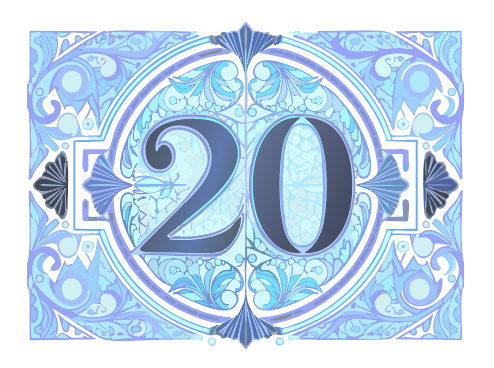
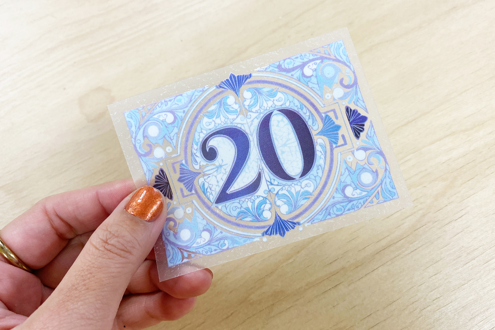
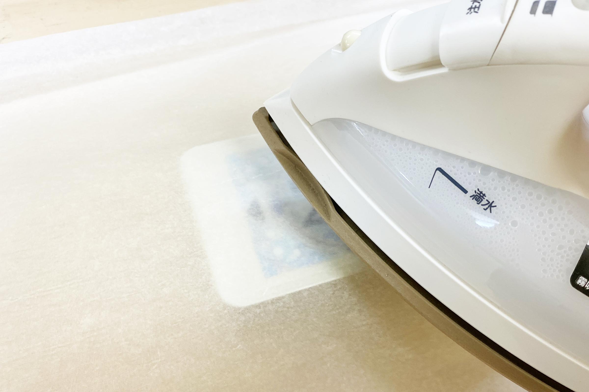

 

## **#20/25 [ 2024/12/20 ]** 
### by Shino ONODERA (FabLab SENDAI - FLAT)
  

  

### **材料**
* ギフト缶 長方形（セリア）
* 材質：スチール（スズメッキ）
* サイズ：縦7.9 × 横12.3 × 高さ3.7cm（フタ含む）
* JANコード：4562353733296

 

  

### **技術**
* データ作成：Adobe Illustrator
* DTFプリント用シート印刷： OKI C824dn

  

### **作り方**

### **1.** 
DTFプリント用のシートを印刷する場合は、一般的なインクジェットプリンタで印刷するデータと同じカラーの図柄のみ用意すればOKです。 

  

### **2.** 
シートに図柄をプリントし、ヒートプレスして図柄の裏に糊を付けます。 
※DTFプリントは、特殊なシートに印刷した図柄を熱転写する方法です。[詳しい情報はこちらをご覧ください。](https://fablabsendai-flat.com/dtfprinter/) 

  

### **3.** 
転写シートを缶の上にのせ、シリコンペーパー（クッキングシートのような紙）を被せて、アイロンで加熱&プレスします。 

  

### **4.** 
図柄が定着し、缶が冷めたら、シート表面のフィルムを剥がします。 

  

### **5.** 
フィルムを全て剥がしたら完成！ 

  

DTFプリントでは、図柄のみが対象物に転写されます。そのため、細かな透かし模様でも自分で切り抜き等を行う必要がありません。 

  

今回は缶にプリントしましたが、他にも布はもちろん、木材や樹脂板にも図柄を転写することができます。アイロンなどで加熱とプレスすることができれば良いので、マシンに入らないような大きなものなどにも図柄を転写可能なのが、DTFプリントの面白いところです。

  

（Last Updated: 2025.11.13）
