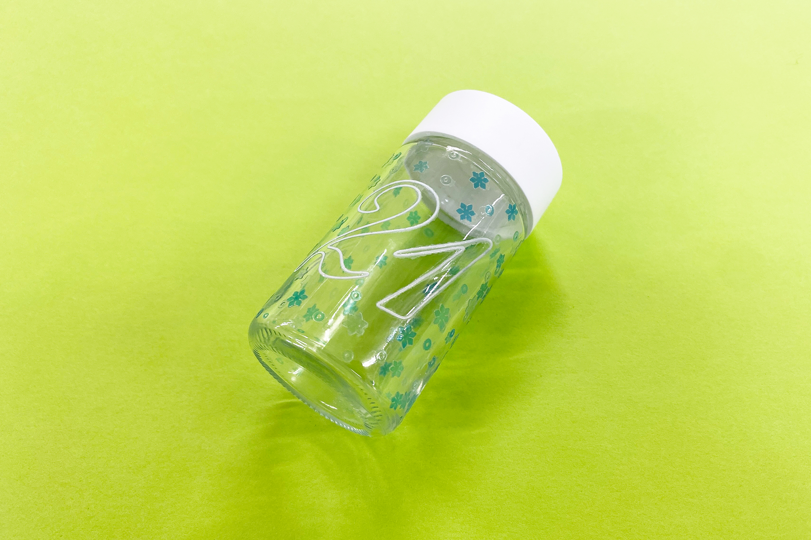
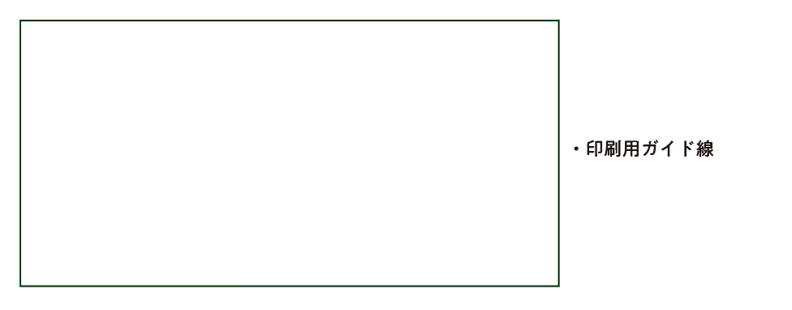
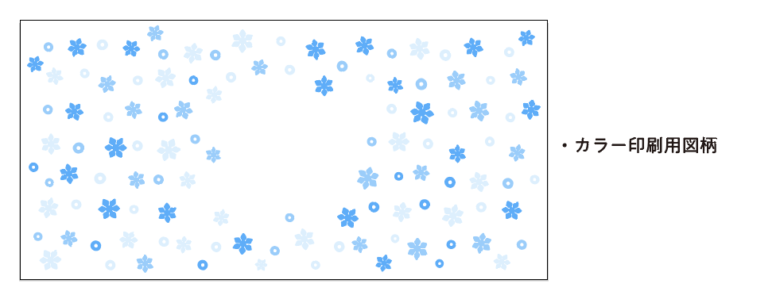
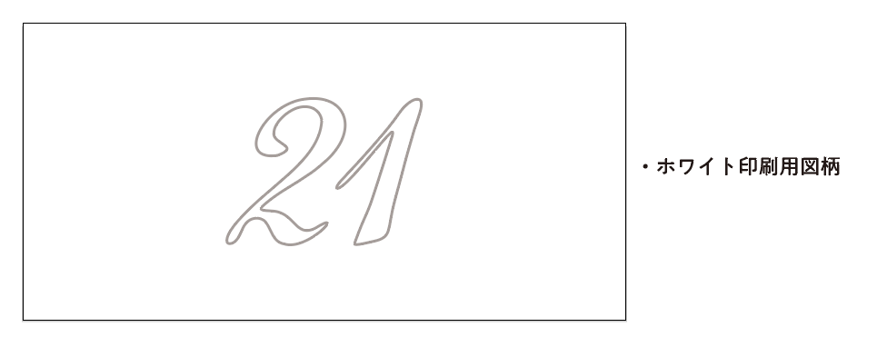
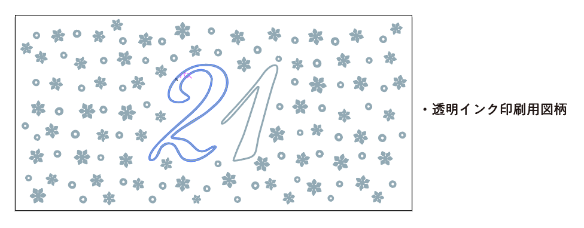
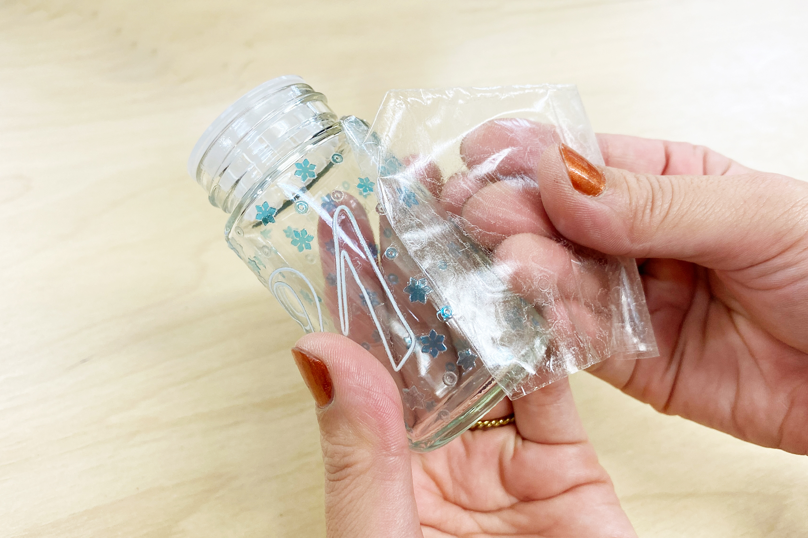
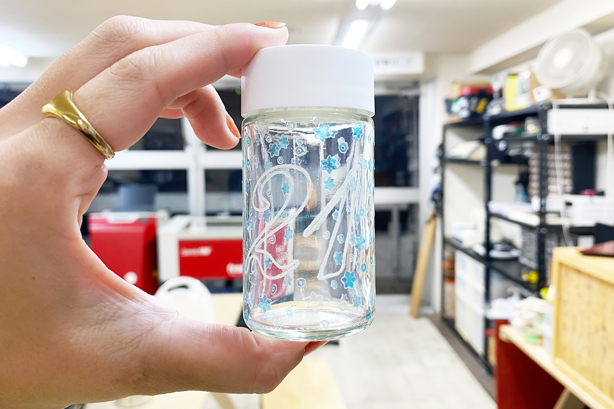

 

## **#21/25 [ 2024/12/21 ]** 
### by Shino ONODERA (FabLab SENDAI - FLAT)
  

  

### **材料**
* ガラス調味料入れ（セリア）
* 材質：ガラス（容器）／ポリプロピレン（外ふた、内ふた）
* サイズ：φ4.2 × 8.5cm
* JANコード：4991203187628

 

  

### **技術**
* データ作成：Adobe Illustrator
* UVプリント： Roland LEF-12

  

### **道具**
* [インレタシート](https://europort.jp/products/uv/q-sil-nh)

  

### **作り方**

### **1.** 
今回は転写シートの制作に[インレタシート](https://europort.jp/products/uv/q-sil-nh)を使用しました。こちらは、クリアインク（マット）→ホワイト or カラー→クリアインク（グロス or マット）の順に印刷する必要があるため、以下のようなデータを作成しました。 

    
    

    
    

  

### **2.** 
インレタシートの糊が付着したシートにUVプリンタで図柄を印刷したら、転写用のアプリケーションシートを貼り付けます。 

  

### **3.** 
アプリケーションシートに図柄を移したら、素材に貼り付けてよく密着させます。 

  

端からゆっくりと慎重にアプリケーションシートのみを剥がします。 

  

### **4.** 
アプリケーションシートを全て剥がしたら完成！ 

  

糊が少し残ってしまいましたが、これは消しゴムでこするなどすれば綺麗に剥がれます。 

  

数字には白色インクを使用していますが、周りの柄はカラーインクのみなので透け感があって綺麗です。 

  

インレタシートを使用すると、普通はUVプリントできない材質や形状のものにも図柄を転写することができるのでおすすめです。

  

（Last Updated: 2025.11.13）
