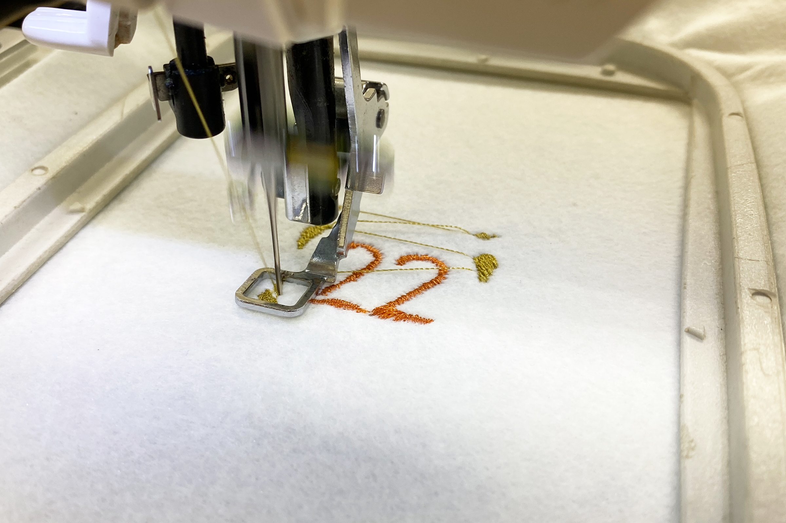

 

## **#22/25 [ 2024/12/22 ]** 
### by Shino ONODERA (FabLab SENDAI - FLAT)
  

  

### **材料**
* 手洗いOKフェルト 白（DAISO）
* 材質：ポリエステル100%
* サイズ：約60 × 65cm
* JANコード：4550480321448

 

  

### **技術**
* データ作成：Adobe Illustrator, 刺しゅうプリンター
* 刺繍：JAGUAR SP4000
* レーザーカット：trotec speedy100

  

### **作り方**

### **1.** 
今回は、フェルトに刺繍をした後に周辺等をレーザーカットするため、以下のように刺繍用図柄データと、レーザーカット用のラインデータを作成しました。 

  

### **2.** 
データができたら、まずは刺繍から。フェルトは伸びやすい素材なので、裏に接着芯を貼り付けました。 
しかし、刺繍ミシンの機嫌が非常に悪く、何度チャレンジしても途中で糸が絡まってしまうという結果に…。 

  

### **3.** 
そこで、刺繍はできたところまでで完了とし、できなかった部分はレーザーカットして模様を加えることにしました。フェルトなどの化学繊維で作られた布類をレーザーカットする場合は、裏にアクリル板を敷いて加工すると、裏面に焦げが付着しにくいです。 

  

### **4.** 
余計な糸を切ったら完成！ 

  

今回は白いフェルトを使用しましたが、濃い色の素材を使用すると、よりレーザーカット時の焦げが目立ちにくくなります。 

  

当初の予定とは異なる仕上がりとなりましたが、デジタルデータを使ったものづくりは、こんなふうにすぐに他の方法に方向転換できるのが大きなメリットです。

  

（Last Updated: 2025.11.13）
