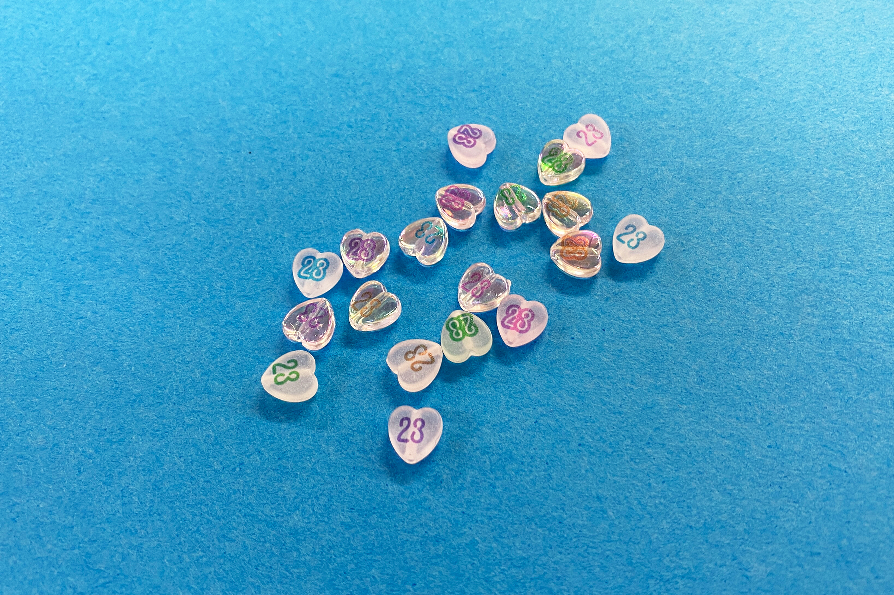
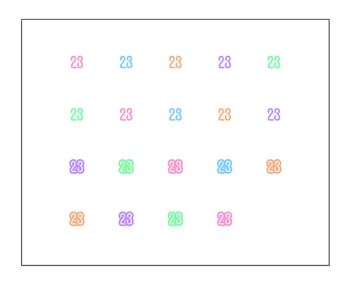
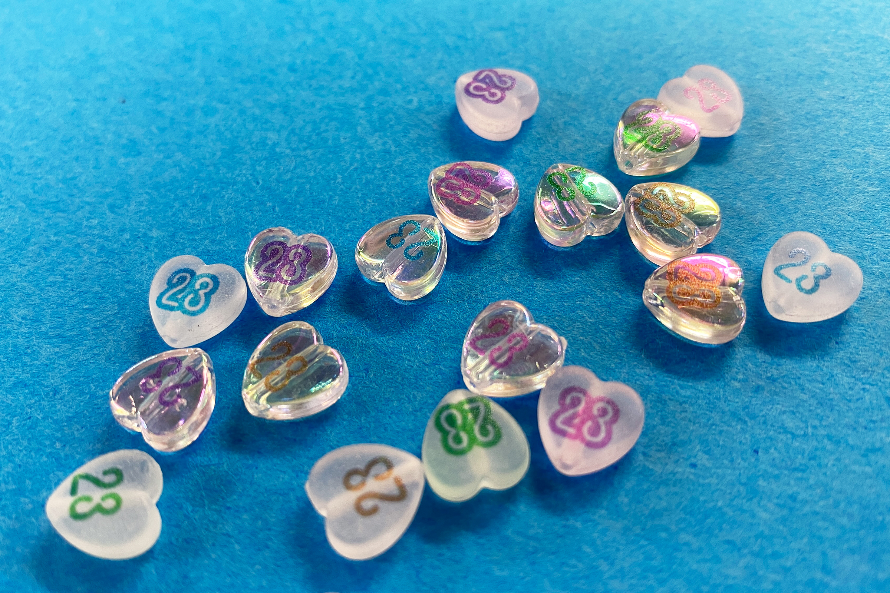

 

## **#23/25 [ 2024/12/23 ]** 
### by Shino ONODERA (FabLab SENDAI - FLAT)
  

  

### **材料**
* 推しカラー HEART MIX WHITE 38pcs.（ビーズ）（DAISO）
* 材質：ポリスチレン
* サイズ：約 縦9 × 横8mm
* JANコード：4550480347790

 

  

### **技術**
* データ作成：Adobe Illustrator
* UVプリント： Roland LEF-12
* レーザーカット：trotec Speedy100

  

### **作り方**

### **1.** 
今回は小さなビーズをUVプリンタの印刷台にたくさん並べる必要があるため、それを効率的に行うための型を作ることにしました。 
左の赤いラインの画像は、型のレーザー加工用データとUVプリンタのガイド用データを兼ねています。また、今回はカラー画像のみを印刷していきます。 

    
    

  

### **2.** 
ビーズの厚さが約3mmだったので、厚さ2.5mmの板材をレーザーカットして型を作りました。 

  

### **3.** 
印刷中の位置ズレ防止のために、型の裏側にマスキングテープを貼り、各穴にビーズを入れました。それをUVプリンタの印刷台にセットして、プリントを行います。 

  

### **4.** 
印印刷が完了して型からビーズを取り外したら完成！ 

  

図柄とビーズの位置合わせがちょっと難しかったですが、綺麗に印刷されています。 

  

UVプリンタを使用すると、こんなふうに透け感を残したまま図柄を加えることもできます。ぜひぜひオリジナルグッズの制作に活用してみてください！

  

（Last Updated: 2025.11.13）
