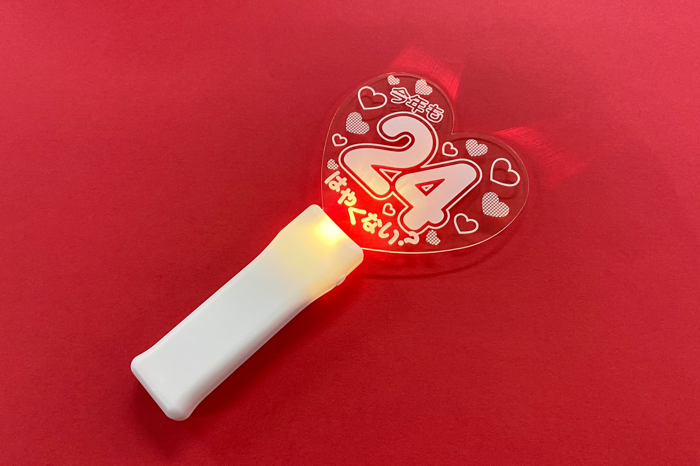
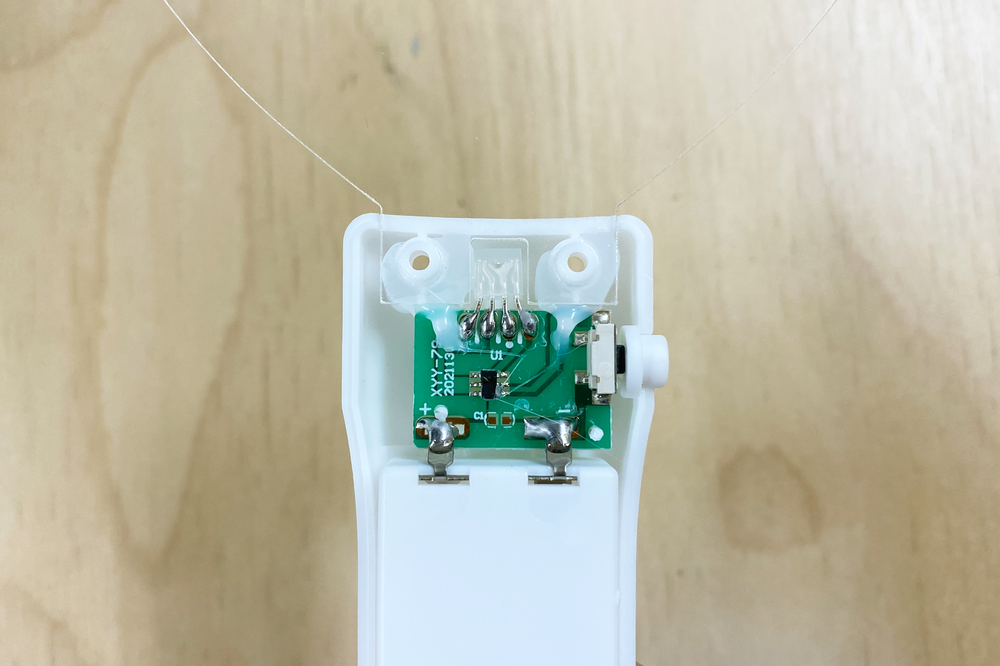
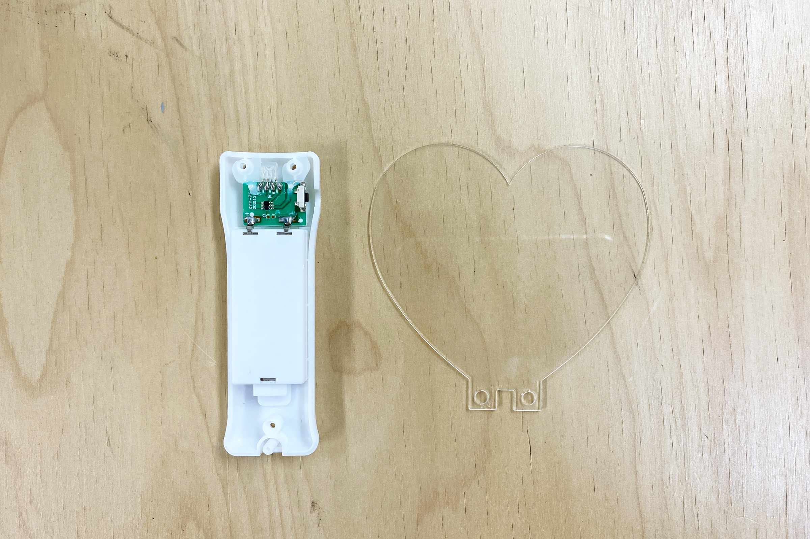
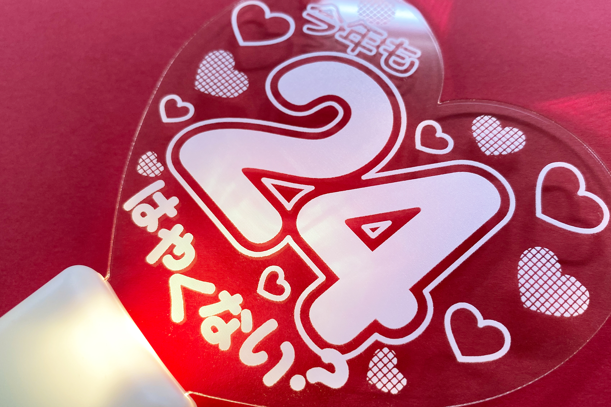
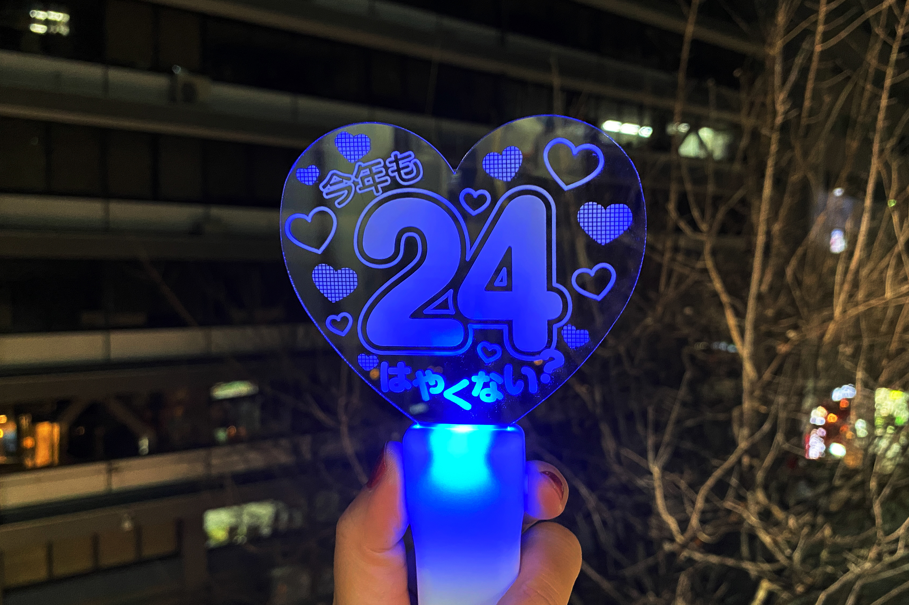

 

## **#24/25 [ 2024/12/24 ]** 
### by Shino ONODERA (FabLab SENDAI - FLAT)
  

  

### **材料**
* EM-15 LEDライブライト ハート形 7color（DAISO）
* 材質：アクリル（パネル）／ポリスチレン（スティック）
* サイズ：約181 × 95mm
* JANコード：4962242521148

 

  

### **技術**
* データ作成：Adobe Illustrator
* UVプリント： Roland LEF-12

  

### **道具**
* プラスドライバー
* ヒートガン

  

### **作り方**

### **1.** 
今回はホワイト印刷のみ行うため、以下のようなガイド線とホワイト印刷用図柄を作成しました。 

    
    

  

### **2.** 
UVプリントを行うには、ハート形パネルをスティックから取り外す必要があるため、スティック背面のネジを外して分解します。 

  

### **3.** 
スティックの中を見てみると、スティックの突起とパネルがグルーで接着されていたため、ヒートガンで軽く加熱しました。 

  

グルーは加熱すると柔らかくなるため、このようにスティックとパネルをバラバラにすることができます。 

  

### **4.** 
パネルにUVプリントし、全て組み立て直したら完成！ 

  

元々は白色マーカーで好きな図柄を描いて使用するものですが、UVプリンタを使用するともっと細かい図柄を正確にプリント可能です。 

  

暗い場所で点灯すると、こんな感じでより模様がしっかり色付いて見えます。 

  

今回はパネルにのみUVプリントしましたが、このライトのスティックはポリスチレン製なので、こちらにも好きな図柄をUVプリントすることができます。ポリプロピレンなど、UVプリントができない材質のものもありますので、プリントを検討される場合はご注意くださいね。

  

（Last Updated: 2025.11.13）
