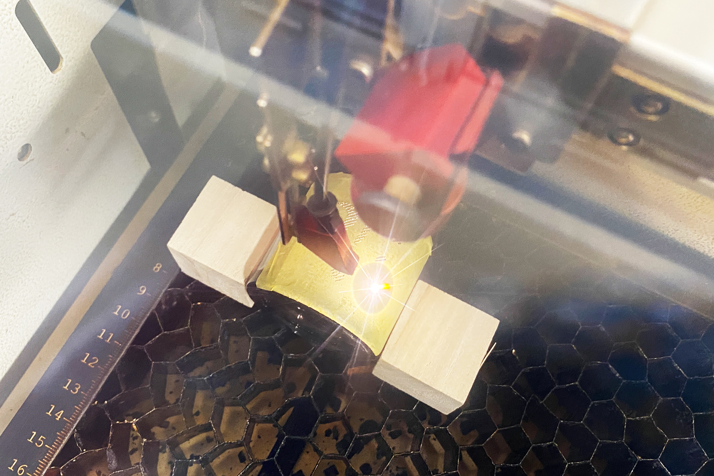

 

## **#25/25 [ 2024/12/25 ]** 
### by Shino ONODERA (FabLab SENDAI - FLAT)
  

  

### **材料**
* ガラス花瓶（ミニバイアル型）（DAISO）
* 材質：ソーダガラス
* サイズ：約 横4.9 × 縦4.9 × 高さ6.9cm
* JANコード：4550480304243
–--
* Wrapping Ribbons サテンリボン（DAISO）
* 材質：ポリエステル100%
* サイズ：幅 約1.6cm × 長さ10m
* JANコード：4550480155180

 

  

### **技術**
* データ作成：Adobe Illustrator
* レーザーカッター： trotec Speedy100

  

### **作り方**

### **1.** 
今回は以下のようなデータを使って、ガラス瓶へのレーザー彫刻とリボンのレーザーカットを行いました。 

    
    

  

### **2.** 
まずはガラス瓶へのレーザー彫刻から。表面にマスキングテープを貼り、加工中に動かないように両側にブロックを置いて位置を固定しました。 

  

レーザーカッターで素材に図柄を彫る方法としては彫刻加工が用いられることが多いですが、細い線画などラインで構成されている図柄の場合は、弱めのパワーでレーザーカットする“ケガキ”加工のほうが、加工のスピードやクオリティが高い場合があります。 

  

### **3.** 
ガラス瓶の加工が完了したら、リボンのレーザーカットを行います。リボンは薄くてうねりやすいため、アクリル板の上に敷いて加工を行いました。 

  

### **4.** 
ガラス瓶にリボンを結んだら完成！ 

  

ガラス瓶のレーザーの焦点距離が遠かった彫刻部分は、ややクラック（ヒビ）が入ってしましました。 

  

リボンはポリエステル100%のものを使用したため、細かな部分もほつれなく綺麗に仕上がりました。 

  

なんとか1〜25日まで作り切ることができました！2024年はどれも手軽な方法ばかりなので、デジタル工作マシンを使ったものづくりにこれから取り組んでみたいという方にもおすすめです。ぜひぜひ参考にしてみてください！

  

（Last Updated: 2025.11.13）
